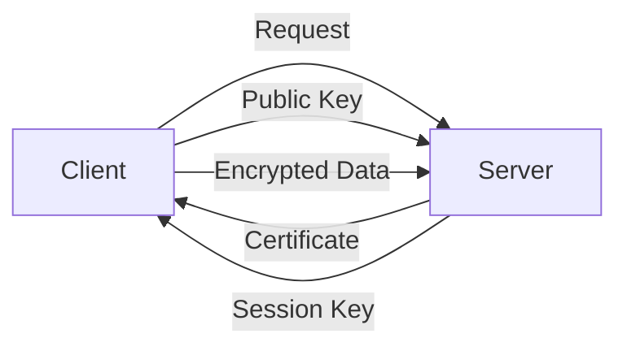

# NSCS Summary Test

## Table of Contents
- [Network Security](#network-security)
  - [Network Security Terms](#network-security-terms)
  - [Hacking Tools](#hacking-tools)
  - [Attack Types](#attack-types)
  - [Viren, Würmer, Trojaner, Ransomware](#viren-würmer-trojaner-ransomware)
- [Kryptographie](#kryptographie)
    - [Ziele von Verschlüsselung](#ziele-von-verschlüsselung)
    - [Symmetrische Verschlüsselung](#symmetrische-verschlüsselung)
    - [Asymmetrische Verschlüsselung](#asymmetrische-verschlüsselung)
    - [TLS/SSL](#tlsssl)
        - [Funktionsweise](#funktionsweise)
        - [Versionen](#versionen)
    - [CA](#ca)
    - [Hashfunktionen](#hashfunktionen)
    - [Digital Signatures](#digital-signatures)
\
\
\
---

# Network Security
## Network Security Terms
- **Assets:**: alle Nutzer, Geräte u. Ressourcen eines Netzwerks
- **Vulnerabilities:**: Schwachstellen, die von Angreifern ausgenutzt werden können
- **Mitigation:**: Maßnahmen zur Reduzierung von Risiken
- **Threats:**: Bedrohungen, die auf Assets einwirken
- **Risk:**: Wahrscheinlichkeit, dass eine Bedrohung eintritt
- **Exploit:**: Angriff, der eine Schwachstelle (Vulnerability) ausnutzt

## Hacking Tools
- **Passwort Cracker**: John the Ripper, Hashcat
- **Network Mapping**: Nmap
- **Packet Sniffer**: Wireshark
- **Wireless Sniffer**: Aircrack-ng
- **Vulnerability Scanner**: Nessus, OpenVAS
- **Exploitation Tools**: Metasploit
- **Web Application Scanner**: OWASP ZAP

## Attack Types
- **Denial of Service (DoS)**: Ziel ist es, die Verfügbarkeit von Ressourcen zu beeinträchtigen
- **Compromised Key Attack**: Angreifer hat Zugriff auf Schlüssel
- **Eavesdropping**: Abhören von Kommunikation (Sniffing)

## Viren, Würmer, Trojaner, Ransomware
- **Virus**: Programm, das sich in andere Programme einbettet und sich selbst repliziert (z.B. durch E-Mail-Anhänge)
    - **Bootsektorvirus**: infiziert den Bootsektor einer Festplatte
    - **Dateivirus**: infiziert Dateien
    - **Makrovirus**: infiziert Makros in Dokumenten
    - **Scriptvirus**: infiziert Skripte (z.B. JavaScript)
- **Wurm**: Programm, das sich selbstständig verbreitet (z.B. über Netzwerke)
- **Trojaner**: Programm, das sich als nützlich tarnt, aber Schadcode enthält (z.B. als legitime Software getarnt)
- **Ransomware**: Schadsoftware, die Dateien verschlüsselt und Lösegeld fordert
    - **Crypto-Ransomware**: verschlüsselt Dateien
    - **Locker-Ransomware**: sperrt den Zugriff auf das System

---
# Kryptographie
## Ziele von Verschlüsselung
- **Vertraulichkeit**: Schutz vor unbefugtem Zugriff
- **Integrität**: Schutz vor unbefugter Änderung
- **Authentizität**: Sicherstellung der Identität

## Symmetrische Verschlüsselung
- **Ein Schlüssel für Verschlüsselung und Entschlüsselung**
- **Beispiel**: DES, AES

## Asymmetrische Verschlüsselung
- **Öffentlicher und privater Schlüssel**
- **Beispiel**: RSA, ECC

## TLS/SSL
- Transport Layer Security/Secure Sockets Layer
- Verschlüsselung von Datenübertragungen
- **Zertifikate für Authentifizierung**

### Funktionsweise
    **SSL/TLS works on layers 3. and 4. (TCP/UDP)**

### Versionen
- **SSL 1.0**: nie veröffentlicht
- **SSL 2.0**: unsicher
- **SSL 3.0**: unsicher
- **TLS 1.0**: unsicher
- **TLS 1.1**: unsicher
- **TLS 1.2**: sicher
- **TLS 1.3**: sicher

## CA
- **Certificate Authority**
- **Aussteller von Zertifikaten**
- **Vertrauenswürdige Instanz**
Beispiele: VeriSign, Thawte, Comodo

## Hashfunktionen
- **Einwegfunktionen**
- **Beispiel**: MD5, SHA-1, SHA-256
- **Verwendung**: Integritätsprüfung, Passwort-Hashing
- **Kollisionsresistenz**: zwei unterschiedliche Eingaben erzeugen unterschiedliche Hashwerte
- **Beispiel**: SHA-256 (256 Bit Hashwert)

## Digital Signatures
- **Signatur mit privatem Schlüssel**
- **Verifikation mit öffentlichem Schlüssel**
- **Authentifizierung und Integritätsschutz**
- **Beispiel**: RSA, DSA

---