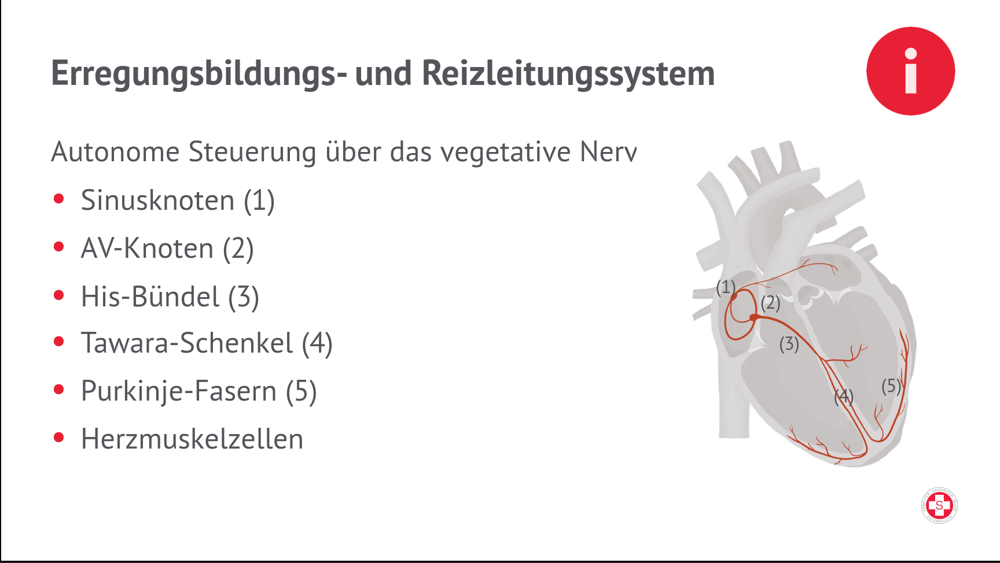

# Vitalfunktionen

## Vitalfunktionen 1. Ordnung

- Bewusstsein
- Atmung
- Kreislauf

### Nervensystem

**Anatomische Aufteilung**

- Zentrales Nervensystem
    - Gehirn
    - Rückenmark
- Peripheres Nervensystem
    - Hirnnerven
    - Periphere Nerven (Spinalnerven)

**Funktionale Aufteilung**

- Motorisch
- Sensibel
- Vegetativ
    - **Sympathikus**: Tiger
    - **Parasympathikus**: Faultier

## Bewusstseinsstörung

### Quantitativ

> Auswirkung auf **Wachheitsgrad**
-> Bewusstseins**trübung**

- Solmnolenz
- Sopor
- Koma

### Qualitativ

> Auswirkung auf die **Klarheit**
-> Bewusstseins**veränderung**

- Verwirrtheit
- Halluzinationen
- Demenz

> Liquor (Gehirnflüssigkeit) ist eine wasserklare, eiweiß- und zellarme, zuckerhaltige Flüssigkeit

---

- Pharynx (Rachen) - Verbindet Mund mit Speiseröhre & Luftröhre
- Larynx (Kehlkopf) - Verbindet Rachen mit Luftröhre
- Epiglottis (Kehldeckel) - verschließt Luftröhre beim Schlucken

## Puls

| Rythmus | Requenz Erwachsene | Qualität |
| --------- | ----------------- | -------- |
| Regelmäßig | Normofrequent | Gut tastbas |
| Unregelmäßig (arrhythmisch) | **Tachy**kardie (<60/Min) | Schwach tastbar |
| Unregelmäßig (arrhythmisch) | **Brady**kardie (>100/min) | Nicht tastbar |

## Arterien & Venen

**Arterien**: dickwandig, elastisch, muskulös, transportieren Blut vom Herzen weg

**Venen**: dünnwandig, transportieren Blut zum Herzen hin, besitzen Venenklappen

### Herzaktion

- Kontraktion (Systole):
    - Anspannungsphase
    - Auswurfphase
- Erschlaffungs-,Bluteinströmphase (Diastole)
