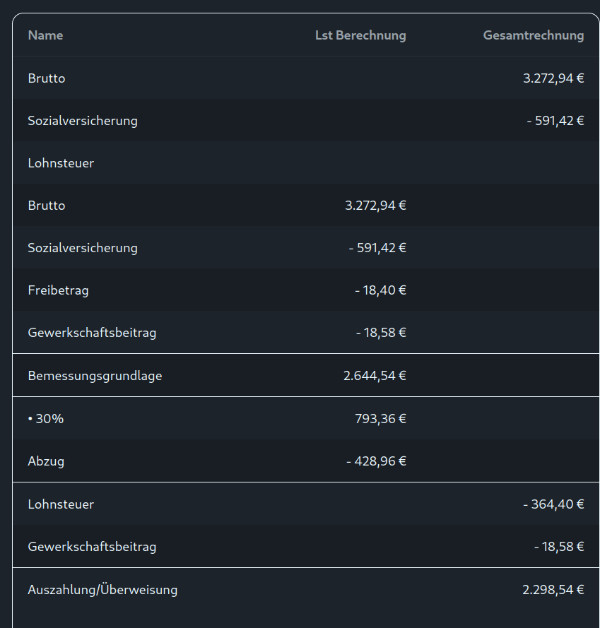

# Gruppe 2 (Kurzfassung)

---

## AUFGABE 1

**a) Geben Sie eine Übersicht über die Berechnung von Kennzahlen. Stellen Sie
dabei einen Bezug zur Bilanz und G&V, sowie auf weitere relevante Parameter
her.**

---

**b) Erstellung der multiplen Diskriminanzanalyse und Ermittlung der
Diskriminanzfunktion. Was bedeutet das Ergebnis?**

- Diskriminanzfunktion (Summe gewichteter Kennzahlen): **2,60**
- Interpretation laut Skala: **sehr gut** → **keine Insolvenzgefährdung**.

---

**c) Sind Ihnen weitere Methoden zur Unternehmensbeurteilung bekannt? Welche?
Erklären Sie diese kurz.**

- **SWOT:** Stärken/Schwächen/Chancen/Risiken systematisch erfassen.
- **Benchmarking:** Vergleich mit Vergangenheit/Wettbewerb → Verbesserungen ableiten.
- **Prüffragenkatalog (Schwachstellenkatalog):** Checklisten zur Mängelanalyse.
- **Quicktest:** 4 Kennzahlen → schnelle Grobbeurteilung (Notensystem).
- **Multiple Diskriminanzanalyse:** Frühwarnsystem (Insolvenzrisiko über Kennzahlmix).

---

## AUFGABE 2

**a) Treffen Sie eine rechnerische, nachvollziehbare Entscheidung auf Basis der
Kapitalwertmethode für eine Alternative.**

- Ergebnis laut Berechnung: **System Y** wählen (Endbarwert/Ergebnis positiv, System X bleibt negativ).

**b) Erläutern Sie den Einfluss des gewählten Kalkulationszinssatzes auf Ihr
Ergebnis.**

- **Zinssatz ↑** → künftige Zahlungen werden stärker abgezinst → **Kapitalwert ↓**.
- **Zinssatz ↓** → künftige Zahlungen zählen stärker → **Kapitalwert ↑**.

**c) Welche anderen statischen und dynamischen Verfahren kennen Sie?**

- **statisch:** Kostenvergleich, Rentabilitätsvergleich, statische Amortisation
- **dynamisch:** dynamische Amortisation, interner Zinsfuß, Kapitalwert

---

## AUFGABE 3

**a) Scheiden Sie zunächst alle Alternativen aus, die den Mindestanforderungen
nicht entsprechen.**

- **Typ 3** (zu teuer, geringe Handlichkeit) und **Typ 5** (zu teuer, zu reparaturanfällig) scheiden aus.

**b) Erstellen Sie eine neue, um die ausgeschiedenen Busse verminderte
Tabelle.**

- Übrig: **Typ 1**, **Typ 2**, **Typ 4**.

**c) Bewerten Sie die einzelnen Merkmale in Punkten (5-stufige Skala). Sie
müssen dazu die quantitativen Daten in Punkte umrechnen. Verwenden Sie dazu
folgende Angaben als Anhaltspunkte:**

- Gesamtpunkte: **Typ 1 = 18**, **Typ 2 = 12**, **Typ 4 = 12** → Typ 1 vorne.

**d) Überlegen Sie, wie man die einzelnen Merkmale gewichten könnte und führen
Sie mit Ihren eigenen Prioritäten die Gewichtung durch. Berechnen Sie den
Gesamtpunktewert und treffen Sie eine nachvollziehbare Entscheidung.**

- Gewichtung (Beispiel): Preis 35%, Diesel 25%, Service 20%, Handlichkeit 10%, Reparatur 10%
- Ergebnis: **Typ 1 = 4,05**, **Typ 2 = 2,55**, **Typ 4 = 2,75** → **Typ 1 wählen**.

**e) Erstellen Sie eine Profilanalyse.**

- Profil zeigt: **Typ 1** schneidet in den meisten Kriterien am besten ab.

**f) Welche anderen Techniken sind Ihnen bekannt, um derartige Entscheidungen
auf rechnerischer Basis zu treffen? Geben Sie eine Übersicht.**

- **statisch:** Kostenvergleich, Rentabilitätsvergleich, statische Amortisation
- **dynamisch:** Kapitalwert, dynamische Amortisation, interner Zinsfuß

---

## AUFGABE 4

**a) Sie erwarten Ihr erstes Gehalt. Da Sie jedoch die Höhe gleich jetzt wissen
möchten, errechnen Sie es schon einmal im Voraus.** Gehalt: Bruttogehalt €
3.272,94; ohne AVA(E)B; keine Kinder; Freibetrag € 18,40/Monat;
Gewerkschaftsbeitrag € 18,58/Monat. Berechnen Sie den Auszahlungsbetrag.

- SV lfd (18,12%): **593,06**
- Lohnsteuer lfd: **311,60**
- Gewerkschaft: **18,58**
- **Auszahlung: € 2.349,70**

---

**b) Sie haben im Mai einige Überstunden geleistet. Zur Kontrolle Ihrer
Abrechnung, die Sie von der Buchhaltung erhalten werden, berechnen Sie sich Ihr
Monatsgehalt bereits im Voraus. Dabei gehen Sie von folgenden Daten aus:**
Angestellter; Bruttogehalt € 3.272,94; ohne AVA(E)B; Freibetrag € 18,40/Monat;
Überstundenteiler 1/173; 26 Überstunden zu 50%; Gewerkschaftsbeitrag € 18,58
Durchführung Ihrer Gehaltsabrechnung inklusive Überstunden für Mai.

- Gesamtbrutto: **€ 4.010,77**
- SV lfd (18,12%): **€ 726,75**
- Lohnsteuer lfd: **€ 518,86**
- **Auszahlung: € 2.746,58**
- Hinweis: **18 ÜZ steuerfrei** (bis max. Betrag), restliche ÜZ steuerpflichtig.

---

**c) Ihr Kollege sieht Ihnen über die Schulter und erkundigt sich, warum Sie
unter den Begriff „Angestellter“ fallen, wohingegen er ein „Arbeiter“ ist.
Erläutern Sie die entsprechende gesetzliche Regelung. Außerdem interessiert er
sich für den Datenschutz und möchte wissen, ob es einen Unterschied in der
Bedeutung seiner persönlichen Daten gibt. (Er hat Diabetes). Geben Sie ihm eine
Übersicht und erläutern Sie, was im Fall eines Hackerangriffs dringend von
Unternehmerseite zu tun ist. Welches Gesetz kommt dabei zur Anwendung? Erläutern
Sie wesentliche Eckpunkte des selbigen.**

- **Angestellter:** vorwiegend kaufmännische/administrative Tätigkeiten (Gehalt).
- **Arbeiter:** vorwiegend körperliche Tätigkeiten (Lohn, KV/Arbeitsrecht).
- **Datenschutz:** Diabetes = **sensible (Gesundheits-)Daten** → besonders schutzwürdig.
- **Hackerangriff:** Vorfall dokumentieren, Systeme sichern, Risiken minimieren, Betroffene informieren; Meldung an Datenschutzbehörde i.d.R. **innerhalb 72 Stunden**.
- Gesetz: **DSGVO** (EU-weit, schützt personenbezogene Daten; Prinzipien wie Zweckbindung, Datenminimierung, Sicherheit, Transparenz).

---

**d) Außerdem interessiert sich der obige Kollege sehr für die Wahrung seiner
persönlichen Interessen/Daten und fragt Sie daher, ob die Überwachung des
Geschäftsraumes mittels Videokamera erlaubt sei. Wie sieht es darüber hinaus mit
Kameras an Helmen, in Autos, etc. aus?**

- Videoüberwachung nur bei **berechtigtem Zweck**, **Verhältnismäßigkeit**, **Informationspflicht/Kennzeichnung**; keine „Mitarbeiterüberwachung“ ohne Grund.
- Aufbewahrung i.d.R. kurz (typisch max. wenige Tage) und Zugriff absichern.
- **Helmkameras/Dashcams:** private Nutzung möglich, dauerhafte/öffentliche Überwachung bzw. Veröffentlichung ohne Unkenntlichmachung problematisch/oft unzulässig.

---

**e) Ihr Chef bittet Sie nun auch noch, die Homepage des Unternehmens zu
überarbeiten. Welche Daten müssen zwingend darauf erscheinen? Geben Sie einen
kurzen Überblick.**

- **Impressum/Unternehmensdaten:** Name/Firma, Adresse, Kontakt (E-Mail/Telefon), Firmenbuchdaten, UID, zuständige Kammer/Aufsicht (je nach Fall).
- **Bei Online-Verträgen:** klare Infos zum Bestellprozess, AGB-Hinweis, Bestellbestätigung, Preis-/Versandkosten-Transparenz.

---

## AUFGABE 5

**a) Ordnen Sie die 6 Werkstoffe den Gruppen A, B und C zu. (Nachvollziehbare
Berechnung in Form einer Tabelle.)**

- Ergebnis (nach Lagerwert):
  - **A:** W6, W3
  - **B:** W1
  - **C:** W5, W4, W2

**b) Stellen Sie das Ergebnis grafisch dar.**

- Darstellung als **Lorenzkurve** (x: Mengenanteil, y: Wertanteil).

**c) Welche Schlussfolgerung ergibt sich für A-Güter?**

- **A-Güter**: hoher Wertanteil → strenge Kontrolle, genaue Planung, Lieferantenmanagement, Lager niedrig halten (z.B. JIT).

**d) Gibt es einen Zusammenhang zu sogenannten X, Y und Z-Gütern? Erläutern Sie
diese Begriffe näher.**

- **X:** stabil/planbar, **Y:** schwankend, **Z:** unregelmäßig/kaum planbar.
- Kombi ABC/XYZ hilft, **Beschaffungsstrategie** (Sicherheitsbestand/JIT/Einzelbeschaffung) festzulegen.

---

## AUFGABE 6

**a) Erläutern Sie den Begriff KG.**

- **KG:** Personengesellschaft mit **Komplementär** (voll haftend) + **Kommanditist** (haftet bis Einlage).
- Gründung über Gesellschaftsvertrag, Eintragung; Gewinnverteilung vertraglich.
- Steuern: Gewinnanteile → Einkommensteuer bei Gesellschaftern.

**b) Was versteht man unter einer GmbH und Co KG?**

- KG, bei der **eine GmbH Komplementär** ist → Haftung praktisch auf GmbH-Vermögen begrenzt.

**c) Erläutern Sie den Unterschied zwischen den Begriffen: „Unternehmen“,
„Betrieb“ und „Firma“.**

- **Unternehmen:** Organisation wirtschaftlicher Tätigkeit.
- **Betrieb:** Leistungserstellung/Produktionseinheit.
- **Firma:** eingetragener Name im Firmenbuch.

**d) Das Unternehmen bräuchte zusätzliches Kapital. Welche Möglichkeiten gibt es
aufgrund möglicher Rechtsformen, neues Kapital zu erhalten?**

- Einlagen erhöhen, neue (Kommandit-)Gesellschafter aufnehmen, Kredite, ggf. stille Beteiligung.

---

## AUFGABE 7

**a) Welche Techniken zur kreativen Problemlösung sind Ihnen bekannt? Nennen und
erläutern Sie mindestens 4.**

- **Konventionell:** bestehende Lösungen/Best Practices übernehmen.
- **Brainstorming:** Ideen sammeln ohne Bewertung, danach auswählen.
- **Morphologischer Kasten:** Merkmale + Ausprägungen kombinieren → Varianten.
- **Mindmap:** Assoziationen strukturieren/visualisieren.
- (weitere möglich: 6-3-5 Methode)

**b) Für diese Feier wird es notwendig sein, diverse Utensilien zu besorgen.
Welche Beschaffungsprinzipien sind Ihnen bekannt und welche Bestellsysteme gibt
es?**

- **Beschaffungsprinzipien:** Einzelbeschaffung, Vorratsbeschaffung, Just-in-Time.
- **Bestellsysteme:** Bestellpunktsystem (fixe Menge, variabler Zeitpunkt) / Bestellrhythmussystem (fixer Zeitpunkt, variable Menge).

**c) Herr Paul Troscher hat in einer Broschüre zum Thema Werbung etwas über die
Begriffe Werbemittel und Werbeträger gelesen. Was versteht man darunter? Welche
würden Sie in Ihrem Fall (Firmenjubiläum) einsetzen?**

- **Werbemittel:** Inhalt/Material (Flyer, Plakat, Social-Post).
- **Werbeträger:** Kanal/Medium (Zeitung, Website, Social Media, Newsletter).
- Für Jubiläum: Plakate/Flyer + Website/Social Media + lokale Zeitung/Newsletter.

---

## AUFGABE 8

**a) Stellen Sie die notwendigen Buchungssätze während des Jahres 2024 auf.**

1. 20.05.2024 Feuerversicherung im Voraus (Bank): **7700/2800 3.600 €**
2. 23.07.2024 Gutschrift Wertpapiere (Bank): **2800/8080 2.400 €** und **2800/2350 1.440 €**

**b) Stellen Sie die erforderlichen Buchungsanweisungen per 31.12.2024 und per
31.12.2023 auf.**

- 31.12.2024 Abgrenzung Feuerversicherung: **2900/7700 1.500 €**
- 01.01.2025 Rückbuchung: **7700/2900 1.500 €**
- 31.12.2023 Abgrenzung WP-Ertrag: **2350/8080 1.000 €**

**c) Geben Sie die Gewinnauswirkung bei allen Buchungssätzen an.**

- Aufwandsbuchung (Versicherung) **↓ Gewinn**, Ertragsbuchungen (Wertpapiere) **↑ Gewinn**, Abgrenzungen je nach Richtung entsprechend.

**d) Stellen Sie grafisch den Zusammenhang zwischen Bilanz und G&V dar.**

- Bestandskonten → Schlussbilanz; Erfolgskonten (Aufwand/Ertrag) → G&V; Jahresergebnis beeinflusst Eigenkapital in der Bilanz.

**e) Unter welchen Fachbegriff fällt die obige Angabe?**

- **Rechnungsabgrenzung**

**f) Erklären Sie, welche Arten von Versicherungen grundsätzlich unterschieden
werden können, wie Versicherungen abgeschlossen werden und welche
Vertragspartner es geben kann.**

- **Arten:** gesetzliche Sozialversicherung (KV/UV/PV/AV) und private Versicherungen (z.B. Leben, Sach, Zusatz-KV).
- **Abschluss:** Antrag → Risikoprüfung → Polizze.
- **Partner:** Versicherungsnehmer, Versicherer, Versicherter, Begünstigter.

**g) Um welche Form von Wertpapieren handelt es sich im obigen Fall
wahrscheinlich? Benennen Sie diese und erklären Sie die Unterschiede zu den
gängigsten weiteren. Es handelt sich wahrscheinlich um Anleihen.**

- **Anleihen:** Schuldverschreibungen (Zins, Rückzahlung).
- Abgrenzung kurz: **Aktien** (Eigentumsanteil/Dividende), **Fonds** (Bündel/streuend), **Pfand-/Kommunalbriefe** (sehr sicher, meist geringere Rendite).

**h) Der Handel mit Wertpapieren ist eine Aufgabe der Banken. Erläutern Sie
mögliche Grundgeschäfte einer Bank und gliedern Sie diese systematisch ein.**

- **Einlagengeschäft**, **Kreditgeschäft**, **Dienstleistungsgeschäft** (Zahlungsverkehr/Wertpapiere/sonstiges), **Garantiegeschäft**.
