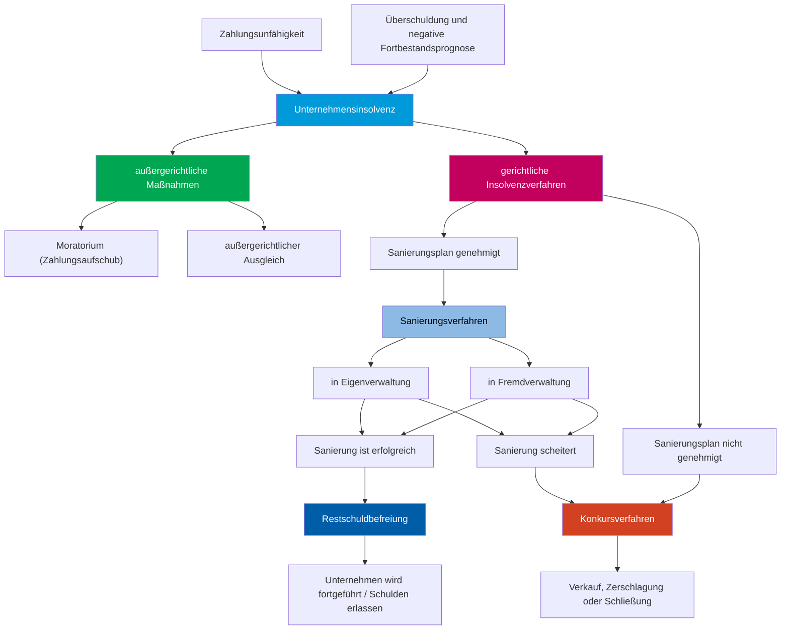
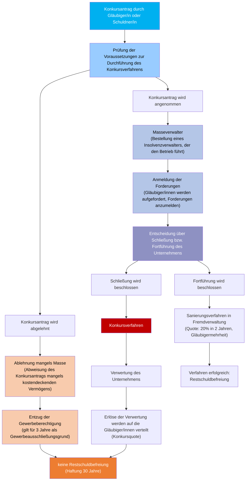

# Krisenmanagement / Insolvenz

## Ursachen für Krisen

- **externe** Ursachen: schwache Konjunktur, starker Konkurenzdruck, steigende Rohstoffpreise, technischer Fortschritt, *gesättigter Markt*,...
- **interne** Ursachen: Finanzlücken, nachlässiges Forderungsmanagement, Führungsstil, Expansionsbestrebungen, Fehler im Marketing, *fehlendes Controlling*, ...

> Interne Gründe für Krisen sind **fast immer Managementfehler**.
> **Externe** Gründe sind **viel seltener** als interne Gründe für Krisen.

## Ablauf von Krisen

- **Strategiekrise**:
    + strategische Fehleinschätzung
    + Verlust von Marktanteilen
- **Erfolgskrise**:
    + Umsatzrückgang
    + Etragsrückgang
    + Überkapazitäten
- **Liquiditätskrise**:
    + Liquiditätsprobleme
    + Überschuldung
    + Insolvenz

## Controlling zum Erkennen von Krisen

### Controllinginstrumente

- **Strategiekrise**: Portfolio-Analyse, SWOT-Analyse, Branchenvergleich, Stärken-Schwächen-Analyse, ...
- **Erfolgskrise**: Gewinn/Verlustrechnung, Bilanz, Kennzahlenanalyse, ...
- **Liquiditätskrise**: kurzfristige Finanzpläne, kurzfristige Leistungsbudgets

## Sanierung und Auflösung von Unternehmen

### Insolvenz von Unternehmen

#### Auslöser einer Unternehmensinsolvenz

- **Zahlungsunfähigkeit**: erhaltene Rechnungen, Löhne, Steuern u. Abgaben können nicht mehr bezahlt werden
- **Überschuldung** und **negative Fortbestandsprognose**: Überschuldung: Vermögen < Schulden; Wenn Überschuldung **und** negative Fortbestandsprognose vorliegen, ist das Unternehmen **insolvent**

### Einzelunternehmen u. Personengesellschaften

sind bei Zahlungsunfähigkeit insolvent

### Kapitalgesellschaften

**strengere Regelungen:** nicht nur bei Zahlungsunfähigkeit sondern auch bei Überschuldung + negative Fortbestandsprognose

> Eine **negative Fortbestandsprognose** ~ drohnende Zahlungsunfähigkeit in der Zukunft

> Liegt ein **Insolvenzgrund** vor, sind Einzelungernehmer bzw bei Gesellschaften Mitglieder von Organen **gesetzlich verpflichtet**, bei Gericht einen **Antrag auf Eröffnung eines Insolvenzverfahrens** zu stellen!

## Insolvenzverfahren

### Sanierung

Sanierungsmaßnahmen haben das Ziel, die Existenz des Unternehmens zu retten. Das Mitwirken der Gläubiger ist in allen Fällen notwendig.

#### Moratorium ~ Zahlungsaufschub

Die Gläubiger gewähren dem Unternehmen einen **Zahlungsaufschub**, damit es Zeit hat, eine Sanierung durchzuführen.

#### Außergerichtlicher Ausgleich

Die Gläubiger **verzichten** auf einen Teil ihrer Forderungen, damit das Unternehmen überleben kann. Dazu müssen **alle** Gläubiger zustimmen.

#### Sanierungsverfahren in Eigenverwaltung

Das Unternehmen bleibt unter der Leitung der bisherigen Geschäftsführung, die von einem Sachwalter überwacht wird. Das Unternehmen muss einen Sanierungsplan vor Gericht vorlegen. Außerdem muss den Gläubigern eine **Rückzahlungsquote** von **mindestens 30%** angeboten werden, die innerhalb von **zwei Jahren** zurückgezahlt werden soll. Zustimmen muss eine **Mehrheit der Gläubiger**

#### Sanierungsverfahren in Fremdverwaltung

Das Gericht ernennt einen Insolvenzverwalter, der die Leitung des Unternehmens übernimmt. Das Unternehmen muss einen Sanierungsplan vor Gericht vorlegen. Außerdem muss den Gläubigern eine **Rückzahlungsquote** von **mindestens 20%** angeboten werden, die innerhalb von **zwei Jahren** zurückgezahlt werden soll. Zustimmen muss eine **Mehrheit der Gläubiger**

-> Ist das Sanierungsverfahren erfolgreich, erhält das Unternehmen eine **Restschuldbefreiung** und kann fortgeführt werden. Scheitert das Sanierungsverfahren, wird ein Konkursverfahren eingeleitet.

## Konkurs

### Rangordung der Forderungen

Zuerst werden die Aussonderungsansprüche, dann die Absonderungsansprüche und zuletzt die Massenforderungen erfüllt.

1. **Aussonderungsansprüche**: Der Schuldener ist nicht Eigentümer dieser Vermögenswerte. z.B. Reperaturübernahmen, leihweise überlassene Sachen, Kommissionsware
2. **Absonderungsansprüche**: besonders berechtigte Forderungen. z.B. gesetzliches Pfandrecht für Spediteure u. Frachtführer, Hypotheken
3. **Massenforderungen**: diese Forderungen entstehen nach der Eröffnung des Insolvenzverfahrens. z.B. Kosten des Insolvenzverfahrens, Gehälter für die Zeit der Abwicklung

> **Insolvenzentgelt**: zum Zeitpunkt des Insolvenzantrags ausstehende **Lohn**- u. Gehaltzahlungen der Mitarbeiter ist über den **Insolvenz-Entgelt-Fonds** gesichert, wenn sie ihre Forderungen bei der IEF-Service-GmbH anmelden.

**Konkursquote**

$$
\text{Konkursquote} = \frac{\text{Restvermögen}}{\text{Insolvenzforderungen}}
$$

## Privatinsolvenz

Die Privatinsolvenz ist für natürliche Personen als auch für **Einzelunternehmer**

### Zahlungsplan

Schuldner bietet an, **einen Teil** seiner Schulden in **maximal 7 Jahren** zurückzuzahlen.

Merkmale:

- **Rückzahlungsquote** berechnet sich aus dem voraussichtlichen Einkommen der nächsten 3 Jahre
- **keine Pfändung**
- **Mehrheit der Gläubiger** muss zustimmen

### Abschöpfungsverfahren

Alles **Einkommen über dem Existenzminimum** wird gepfändet. Dauer ist **5 Jahre**

Abschöpfungsverfahren mithilfe eines **Tilgungsplans** dauert **nur 3 Jahre**, wenn der Antrag auf Privatinsolvenz innerhalb von **30 Tagen** nach Eröffnung des Insolvenzverfahrens gestellt wird. Wärenddessen **keine neuen Schulden** mehr

## Freiwillige Auflösung von Unternehmen

Einige Schließungsgründe sind:

- **Ruhestand**
- **Tod**
- **persönliche Gründe**: z.B. Krankheit, Scheidung, ...
- **Pop-up Stores**: Form eines Unternehmens, die nur für eine begrenzte Zeit existieren, z.B. für die Weihnachtszeit, ...
