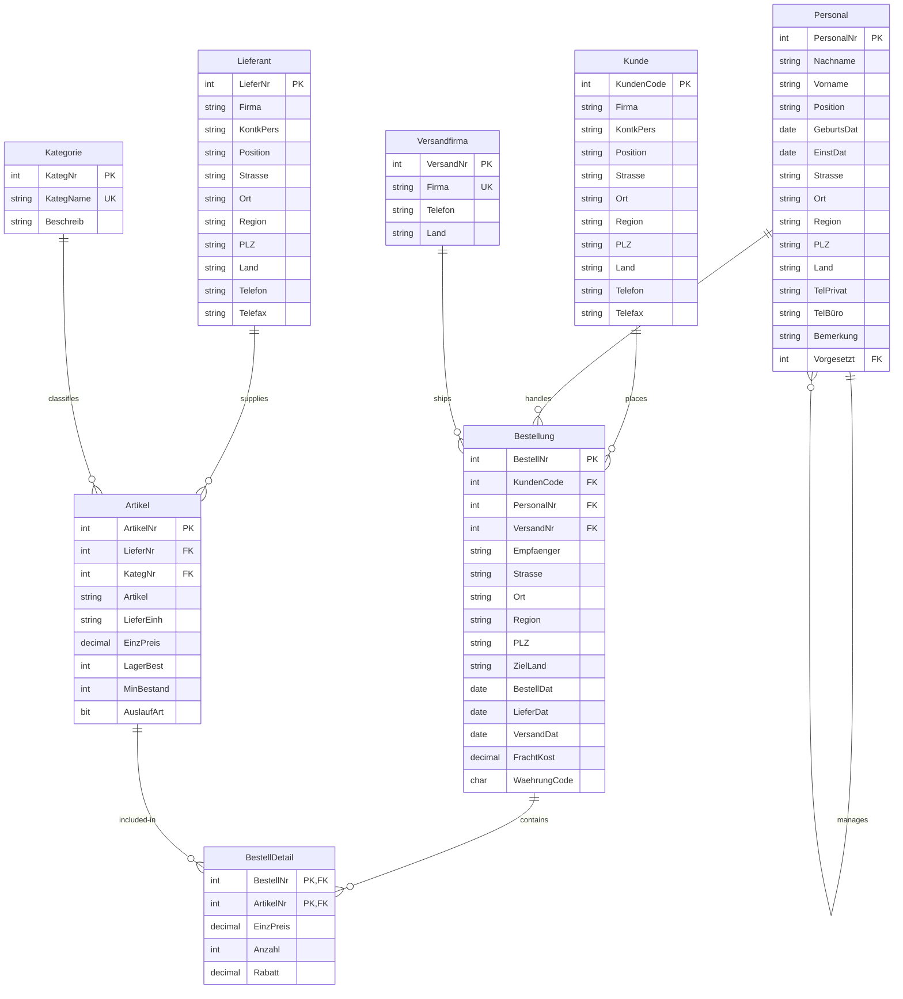

## Datenbankschema

*hier ist das mermaid, das SQL ist am [Ende der Datei](#sql-schema)*


## Testdaten

Es wurde mit Schleifen gearbeitet, um die Daten einzufügen. Das SQL ist [am Ende des Files](#sql-data)

### Adaptionen

- `Versandfirma` wurde als eigene Tabelle normalisiert, statt nur einen Freitext in der Bestellung zu speichern. Dadurch bleiben die geforderten drei Versandfirmen konsistent referenzierbar.
- Die im Attributblatt genannte Tabelle `Firmen` wurde nicht separat umgesetzt, weil sie fachlich mit Kunden/Lieferanten überlappt und für die Aufgabenstellung keinen zusätzlichen Informationsgewinn liefert.
    - `WaehrungCode` wurde in `Bestellung` aufgenommen. Dadurch bleibt das Modell für europaweite Kunden realistisch, während alle Artikelpreise weiterhin in einer einheitlichen Basiskalkulation gepflegt werden können.
- Lieferadresse und Empfänger bleiben in `Bestellung` redundant gespeichert, damit historische Auftragsdaten auch nach Stammdaten-'Änderungen' korrekt bleiben.

Das insert script generiert die Testdaten mithilfe von Schleifen. Die Testdaten sind so gestaltet, dass sie die verschiedenen Versandfirmen und Währungen gleichmäßig verteilen, um die Abfrageaufgaben realistisch zu gestalten.


## Data Warehouse

Aufgabe: Ein geeignetes Data Warehouse für den in 6.2 in [SCHL98] beschriebenen Analysebedarf ist zu
entwerfen und zu implementieren. Die Entscheidung für die Umsetzung ist zu begründen (siehe auch
6.4.4 in [SCHL98] für einen Überblick).
Zur vereinfachten Simulation eines ETL Prozesses kann das DWH auf derselben Datenbank in einem
Schema dwh angelegt werden.

- schema: starschema
- Welche Geschäftsprozesse sollen analysiert werden? -> Bestellungen
- Mit welchen Kennzahlen (Fakten) wird gearbeitet? -> Umsätze, Frachtkosten
- Welchen Detaillierungsgrad (Granularität) müssen die Daten besitzen? -> Monatlich
- Über welche Dimensionen ist eine Auswertung sinnvoll?
    - Umsatz: Artikel, Kunden, Personal, Versandfirma, Zeit
    - Frachtkosten: Kunden, Personal, Versandfirma, Zeit
- Wie lassen sich diese Dimensionen verdichten?
    - Artikel: Artikel - Lieferant - Ort - Land - Gesamt, Artikel - Kategorie - Gesamt
    - Kunde: Kunde - Ort - Land - Gesamt
    - Personal: Mitarbeiter - Gesamt
    - Versandfirma: Versandfirma - Gesamt
    - Zeit: Monat - Quartal - Jahr
- Welche Dimensionsattribute werden benötigt?
Keine
- Sind die Attribute stabil oder ändern sie sich mit der Zeit?
Stabil

das sql dafür ist wieder am [Ende des Files](#sql-warehouse)

### Umsetzung im DWH

Die Implementierung liegt in `data-warehouse.sql` und erzeugt ein Star-Schema im Schema `dwh`.

Dimensionen:

- `DimZeit` auf Monatsbasis (`Monat`, `Quartal`, `Jahr`) als geforderte Granularität
- `DimArtikel` mit den Verdichtungswegen Artikel -> Lieferant -> Ort -> Land sowie Artikel -> Kategorie
- `DimKunde` mit Kunde -> Ort -> Land
- `DimPersonal` mit Mitarbeiter
- `DimVersandfirma` mit Versandfirma
- `DimWaehrung` für die im OLTP vorhandenen Währungscodes

Fakten:

- `FactUmsatzMonat`: Umsatz (netto), Menge, Positionsanzahl
    - Dimensionen: Zeit, Artikel, Kunde, Personal, Versandfirma, Waehrung
- `FactFrachtMonat`: Frachtkosten, Bestellanzahl
    - Dimensionen: Zeit, Kunde, Personal, Versandfirma, Waehrung

ETL-Logik:

- Zeitdimension wird aus `Bestellung.BestellDat` auf Monatsersten abgeleitet.
- Umsatz wird aus `BestellDetail` als `EinzPreis * Anzahl * (1 - Rabatt)` aggregiert.
- Frachtkosten werden aus `Bestellung.FrachtKost` aggregiert.
- Das Skript ist idempotent (Drop/Create) und kann für Neuaufbau mehrfach ausgeführt werden.

## Inserts

Wird direkt via sql gemacht, z.B.

```sql
INSERT INTO [dwh].[DimZeit]
	([MonatKey], [MonatBeginn], [Jahr], [Quartal], [Monat], [MonatLabel])
SELECT DISTINCT
	(YEAR([b].[BestellDat]) * 100) + MONTH([b].[BestellDat]) AS [MonatKey],
	DATEFROMPARTS(YEAR([b].[BestellDat]), MONTH([b].[BestellDat]), 1) AS [MonatBeginn],
	YEAR([b].[BestellDat]) AS [Jahr],
	DATEPART(QUARTER, [b].[BestellDat]) AS [Quartal],
	MONTH([b].[BestellDat]) AS [Monat],
	CONCAT(YEAR([b].[BestellDat]), '-', RIGHT(CONCAT('0', MONTH([b].[BestellDat])), 2)) AS [MonatLabel]
FROM [oltp].[Bestellung] AS [b];
GO
```

## Beispielabfragen

Für das DWH wurden 6 unterschiedliche OLAP-Anfragen fachlich formuliert und als SQL umgesetzt.
Die Beispiele enthalten Slice, Dice, Drill-Down, Roll-Up und CUBE.

### 1) Slice: Umsatz je Kunde im Jahr 1997

Fachliche Frage:
Wie verteilt sich der Gesamtumsatz auf die einzelnen Kunden, wenn nur das Jahr 1997 betrachtet wird?

```sql
SELECT
    k.[KundenSK],
    k.[Kunde],
    SUM(f.[UmsatzNetto]) AS [Umsatz]
FROM [dwh].[FactUmsatzMonat] AS f
INNER JOIN [dwh].[DimKunde] AS k
    ON k.[KundenSK] = f.[KundenSK]
INNER JOIN [dwh].[DimZeit] AS z
    ON z.[ZeitSK] = f.[ZeitSK]
WHERE z.[Jahr] = 1997
GROUP BY k.[KundenSK], k.[Kunde]
ORDER BY [Umsatz] DESC;
```


### 2) Dice: Umsatz für ausgewählte Kombinationen

Fachliche Frage:
Wie hoch ist der Umsatz für eine Teilmenge von Jahren, Kundenländern und Artikelkategorien?

```sql
SELECT
    z.[Jahr],
    z.[Quartal],
    k.[Land] AS [KundenLand],
    a.[Kategorie],
    SUM(f.[UmsatzNetto]) AS [Umsatz]
FROM [dwh].[FactUmsatzMonat] AS f
INNER JOIN [dwh].[DimZeit] AS z
    ON z.[ZeitSK] = f.[ZeitSK]
INNER JOIN [dwh].[DimKunde] AS k
    ON k.[KundenSK] = f.[KundenSK]
INNER JOIN [dwh].[DimArtikel] AS a
    ON a.[ArtikelSK] = f.[ArtikelSK]
WHERE z.[Jahr] IN (1996, 1997)
    AND k.[Land] IN ('Deutschland', 'Österreich', 'Schweiz')
    AND a.[Kategorie] IN ('Getränke', 'Spezialitäten')
GROUP BY z.[Jahr], z.[Quartal], k.[Land], a.[Kategorie]
ORDER BY z.[Jahr], z.[Quartal], [Umsatz] DESC;
```


### 3) Drill-Down: Zeitliche Verfeinerung Jahr -> Quartal -> Monat

Fachliche Frage:
Wie entwickelt sich der Umsatz bei zunehmendem Detaillierungsgrad von Jahr über Quartal bis Monat?

```sql
SELECT
    z.[Jahr],
    z.[Quartal],
    z.[Monat],
    SUM(f.[UmsatzNetto]) AS [Umsatz]
FROM [dwh].[FactUmsatzMonat] AS f
INNER JOIN [dwh].[DimZeit] AS z
    ON z.[ZeitSK] = f.[ZeitSK]
GROUP BY z.[Jahr], z.[Quartal], z.[Monat]
ORDER BY z.[Jahr], z.[Quartal], z.[Monat];
```


### 4) Roll-Up: Aggregation Monat -> Quartal -> Jahr -> Gesamt

Fachliche Frage:
Welche aggregierten Summen ergeben sich beim stufenweisen Verdichten über die Zeitdimension?

```sql
SELECT
    z.[Jahr],
    z.[Quartal],
    z.[Monat],
    SUM(f.[UmsatzNetto]) AS [Umsatz]
FROM [dwh].[FactUmsatzMonat] AS f
INNER JOIN [dwh].[DimZeit] AS z
    ON z.[ZeitSK] = f.[ZeitSK]
GROUP BY ROLLUP (z.[Jahr], z.[Quartal], z.[Monat])
ORDER BY z.[Jahr], z.[Quartal], z.[Monat];
```


### 5) CUBE: Kombinationen aus Kundenland, Versandfirma und Währung

Fachliche Frage:
Welche Umsätze entstehen für alle Teilaggregate und Gesamtaggregate über Land, Versandfirma und Währung?

```sql
SELECT
    k.[Land] AS [KundenLand],
    v.[Versandfirma],
    w.[WaehrungCode],
    SUM(f.[UmsatzNetto]) AS [Umsatz]
FROM [dwh].[FactUmsatzMonat] AS f
INNER JOIN [dwh].[DimKunde] AS k
    ON k.[KundenSK] = f.[KundenSK]
INNER JOIN [dwh].[DimVersandfirma] AS v
    ON v.[VersandSK] = f.[VersandSK]
INNER JOIN [dwh].[DimWaehrung] AS w
    ON w.[WaehrungSK] = f.[WaehrungSK]
GROUP BY CUBE (k.[Land], v.[Versandfirma], w.[WaehrungCode])
ORDER BY k.[Land], v.[Versandfirma], w.[WaehrungCode];
```


### 6) Kennzahlenvergleich: Umsatz vs. Frachtkosten je Monat und Versandfirma

Fachliche Frage:
Wie verhält sich die Frachtkostenquote zum Umsatz je Monat und Versandfirma?

```sql
WITH [UmsatzAgg] AS
(
    SELECT
        [ZeitSK],
        [VersandSK],
        SUM([UmsatzNetto]) AS [Umsatz]
    FROM [dwh].[FactUmsatzMonat]
    GROUP BY [ZeitSK], [VersandSK]
),
[FrachtAgg] AS
(
    SELECT
        [ZeitSK],
        [VersandSK],
        SUM([FrachtKosten]) AS [FrachtKosten]
    FROM [dwh].[FactFrachtMonat]
    GROUP BY [ZeitSK], [VersandSK]
)
SELECT
    z.[Jahr],
    z.[Monat],
    v.[Versandfirma],
    u.[Umsatz],
    f.[FrachtKosten],
    CAST(
        CASE
            WHEN u.[Umsatz] = 0 THEN 0
            ELSE (f.[FrachtKosten] / u.[Umsatz]) * 100
        END
    AS DECIMAL(10,2)) AS [FrachtquoteProzent]
FROM [UmsatzAgg] AS u
INNER JOIN [FrachtAgg] AS f
    ON f.[ZeitSK] = u.[ZeitSK]
    AND f.[VersandSK] = u.[VersandSK]
INNER JOIN [dwh].[DimZeit] AS z
    ON z.[ZeitSK] = u.[ZeitSK]
INNER JOIN [dwh].[DimVersandfirma] AS v
    ON v.[VersandSK] = u.[VersandSK]
ORDER BY z.[Jahr], z.[Monat], v.[Versandfirma];
```


## SQL Schema

```sql
CREATE SCHEMA [oltp];
GO

CREATE TABLE [oltp].[Lieferant]
(
	[LieferNr] INT IDENTITY(1,1) NOT NULL,
	[Firma] VARCHAR(100) NOT NULL,
	[KontkPers] VARCHAR(60) NULL,
	[Position] VARCHAR(50) NULL,
	[Strasse] VARCHAR(100) NOT NULL,
	[Ort] VARCHAR(50) NOT NULL,
	[Region] VARCHAR(50) NULL,
	[PLZ] VARCHAR(10) NOT NULL,
	[Land] VARCHAR(50) NOT NULL,
	[Telefon] VARCHAR(30) NULL,
	[Telefax] VARCHAR(30) NULL,
	CONSTRAINT [PK_oltp_Lieferant] PRIMARY KEY CLUSTERED ([LieferNr] ASC)
);
GO

CREATE TABLE [oltp].[Kategorie]
(
	[KategNr] INT IDENTITY(1,1) NOT NULL,
	[KategName] VARCHAR(50) NOT NULL,
	[Beschreib] VARCHAR(255) NULL,
	CONSTRAINT [PK_oltp_Kategorie] PRIMARY KEY CLUSTERED ([KategNr] ASC),
	CONSTRAINT [UQ_oltp_Kategorie_KategName] UNIQUE ([KategName])
);
GO

CREATE TABLE [oltp].[Versandfirma]
(
	[VersandNr] INT IDENTITY(1,1) NOT NULL,
	[Firma] VARCHAR(100) NOT NULL,
	[Telefon] VARCHAR(30) NULL,
	[Land] VARCHAR(50) NOT NULL,
	CONSTRAINT [PK_oltp_Versandfirma] PRIMARY KEY CLUSTERED ([VersandNr] ASC),
	CONSTRAINT [UQ_oltp_Versandfirma_Firma] UNIQUE ([Firma])
);
GO

CREATE TABLE [oltp].[Kunde]
(
	[KundenCode] INT IDENTITY(1,1) NOT NULL,
	[Firma] VARCHAR(100) NOT NULL,
	[KontkPers] VARCHAR(60) NULL,
	[Position] VARCHAR(50) NULL,
	[Strasse] VARCHAR(100) NOT NULL,
	[Ort] VARCHAR(50) NOT NULL,
	[Region] VARCHAR(50) NULL,
	[PLZ] VARCHAR(10) NOT NULL,
	[Land] VARCHAR(50) NOT NULL,
	[Telefon] VARCHAR(30) NULL,
	[Telefax] VARCHAR(30) NULL,
	CONSTRAINT [PK_oltp_Kunde] PRIMARY KEY CLUSTERED ([KundenCode] ASC)
);
GO

CREATE TABLE [oltp].[Personal]
(
	[PersonalNr] INT IDENTITY(1,1) NOT NULL,
	[Nachname] VARCHAR(50) NOT NULL,
	[Vorname] VARCHAR(50) NOT NULL,
	[Position] VARCHAR(50) NULL,
	[GeburtsDat] DATE NULL,
	[EinstDat] DATE NOT NULL,
	[Strasse] VARCHAR(100) NOT NULL,
	[Ort] VARCHAR(50) NOT NULL,
	[Region] VARCHAR(50) NULL,
	[PLZ] VARCHAR(10) NOT NULL,
	[Land] VARCHAR(50) NOT NULL,
	[TelPrivat] VARCHAR(30) NULL,
	[TelBuero] VARCHAR(30) NULL,
	[Bemerkung] VARCHAR(255) NULL,
	[Vorgesetzt] INT NULL,
	CONSTRAINT [PK_oltp_Personal] PRIMARY KEY CLUSTERED ([PersonalNr] ASC),
	CONSTRAINT [FK_oltp_Personal_Vorgesetzt]
		FOREIGN KEY ([Vorgesetzt]) REFERENCES [oltp].[Personal] ([PersonalNr])
);
GO

CREATE TABLE [oltp].[Artikel]
(
	[ArtikelNr] INT IDENTITY(1,1) NOT NULL,
	[LieferNr] INT NOT NULL,
	[KategNr] INT NOT NULL,
	[Artikel] VARCHAR(100) NOT NULL,
	[LieferEinh] VARCHAR(20) NOT NULL,
	[EinzPreis] DECIMAL(10,2) NOT NULL,
	[LagerBest] INT NOT NULL,
	[MinBestand] INT NOT NULL,
	[AuslaufArt] BIT NOT NULL CONSTRAINT [DF_oltp_Artikel_AuslaufArt] DEFAULT ((0)),
	CONSTRAINT [PK_oltp_Artikel] PRIMARY KEY CLUSTERED ([ArtikelNr] ASC),
	CONSTRAINT [FK_oltp_Artikel_Lieferant]
		FOREIGN KEY ([LieferNr]) REFERENCES [oltp].[Lieferant] ([LieferNr]),
	CONSTRAINT [FK_oltp_Artikel_Kategorie]
		FOREIGN KEY ([KategNr]) REFERENCES [oltp].[Kategorie] ([KategNr]),
	CONSTRAINT [CK_oltp_Artikel_EinzPreis] CHECK ([EinzPreis] >= (0)),
	CONSTRAINT [CK_oltp_Artikel_LagerBest] CHECK ([LagerBest] >= (0)),
	CONSTRAINT [CK_oltp_Artikel_MinBestand] CHECK ([MinBestand] >= (0))
);
GO

CREATE TABLE [oltp].[Bestellung]
(
	[BestellNr] INT IDENTITY(1,1) NOT NULL,
	[KundenCode] INT NOT NULL,
	[PersonalNr] INT NOT NULL,
	[VersandNr] INT NOT NULL,
	[Empfaenger] VARCHAR(100) NOT NULL,
	[Strasse] VARCHAR(100) NOT NULL,
	[Ort] VARCHAR(50) NOT NULL,
	[Region] VARCHAR(50) NULL,
	[PLZ] VARCHAR(10) NOT NULL,
	[ZielLand] VARCHAR(50) NOT NULL,
	[BestellDat] DATE NOT NULL,
	[LieferDat] DATE NULL,
	[VersandDat] DATE NULL,
	[FrachtKost] DECIMAL(10,2) NOT NULL,
	[WaehrungCode] CHAR(3) NOT NULL CONSTRAINT [DF_oltp_Bestellung_WaehrungCode] DEFAULT ('EUR'),
	CONSTRAINT [PK_oltp_Bestellung] PRIMARY KEY CLUSTERED ([BestellNr] ASC),
	CONSTRAINT [FK_oltp_Bestellung_Kunde]
		FOREIGN KEY ([KundenCode]) REFERENCES [oltp].[Kunde] ([KundenCode]),
	CONSTRAINT [FK_oltp_Bestellung_Personal]
		FOREIGN KEY ([PersonalNr]) REFERENCES [oltp].[Personal] ([PersonalNr]),
	CONSTRAINT [FK_oltp_Bestellung_Versandfirma]
		FOREIGN KEY ([VersandNr]) REFERENCES [oltp].[Versandfirma] ([VersandNr]),
	CONSTRAINT [CK_oltp_Bestellung_FrachtKost] CHECK ([FrachtKost] >= (0)),
	CONSTRAINT [CK_oltp_Bestellung_WaehrungCode] CHECK ([WaehrungCode] IN ('EUR', 'GBP', 'CHF', 'SEK', 'NOK', 'DKK')),
	CONSTRAINT [CK_oltp_Bestellung_LieferDat] CHECK ([LieferDat] IS NULL OR [LieferDat] >= [BestellDat]),
	CONSTRAINT [CK_oltp_Bestellung_VersandDat] CHECK ([VersandDat] IS NULL OR [VersandDat] >= [BestellDat])
);
GO

CREATE TABLE [oltp].[BestellDetail]
(
	[BestellNr] INT NOT NULL,
	[ArtikelNr] INT NOT NULL,
	[EinzPreis] DECIMAL(10,2) NOT NULL,
	[Anzahl] INT NOT NULL,
	[Rabatt] DECIMAL(5,2) NOT NULL CONSTRAINT [DF_oltp_BestellDetail_Rabatt] DEFAULT ((0)),
	CONSTRAINT [PK_oltp_BestellDetail] PRIMARY KEY CLUSTERED ([BestellNr] ASC, [ArtikelNr] ASC),
	CONSTRAINT [FK_oltp_BestellDetail_Bestellung]
		FOREIGN KEY ([BestellNr]) REFERENCES [oltp].[Bestellung] ([BestellNr]),
	CONSTRAINT [FK_oltp_BestellDetail_Artikel]
		FOREIGN KEY ([ArtikelNr]) REFERENCES [oltp].[Artikel] ([ArtikelNr]),
	CONSTRAINT [CK_oltp_BestellDetail_EinzPreis] CHECK ([EinzPreis] >= (0)),
	CONSTRAINT [CK_oltp_BestellDetail_Anzahl] CHECK ([Anzahl] > (0)),
	CONSTRAINT [CK_oltp_BestellDetail_Rabatt] CHECK ([Rabatt] >= (0) AND [Rabatt] <= (0.30))
);
GO

CREATE INDEX [IX_oltp_Artikel_LieferNr] ON [oltp].[Artikel] ([LieferNr]);
GO

CREATE INDEX [IX_oltp_Artikel_KategNr] ON [oltp].[Artikel] ([KategNr]);
GO

CREATE INDEX [IX_oltp_Bestellung_KundenCode] ON [oltp].[Bestellung] ([KundenCode]);
GO

CREATE INDEX [IX_oltp_Bestellung_PersonalNr] ON [oltp].[Bestellung] ([PersonalNr]);
GO

CREATE INDEX [IX_oltp_Bestellung_BestellDat] ON [oltp].[Bestellung] ([BestellDat]);
GO

CREATE INDEX [IX_oltp_Bestellung_VersandNr] ON [oltp].[Bestellung] ([VersandNr]);
GO

CREATE INDEX [IX_oltp_BestellDetail_ArtikelNr] ON [oltp].[BestellDetail] ([ArtikelNr]);
GO
```


## SQL Data

```sql
DELETE FROM [oltp].[BestellDetail];
DELETE FROM [oltp].[Bestellung];
DELETE FROM [oltp].[Artikel];
DELETE FROM [oltp].[Personal];
DELETE FROM [oltp].[Kunde];
DELETE FROM [oltp].[Versandfirma];
DELETE FROM [oltp].[Kategorie];
DELETE FROM [oltp].[Lieferant];
GO

DBCC CHECKIDENT ('oltp.Bestellung', RESEED, 0);
DBCC CHECKIDENT ('oltp.Artikel', RESEED, 0);
DBCC CHECKIDENT ('oltp.Personal', RESEED, 0);
DBCC CHECKIDENT ('oltp.Kunde', RESEED, 0);
DBCC CHECKIDENT ('oltp.Versandfirma', RESEED, 0);
DBCC CHECKIDENT ('oltp.Kategorie', RESEED, 0);
DBCC CHECKIDENT ('oltp.Lieferant', RESEED, 0);
GO

INSERT INTO [oltp].[Lieferant]
    ([Firma], [KontkPers], [Position], [Strasse], [Ort], [Region], [PLZ], [Land], [Telefon], [Telefax])
VALUES
    ('Nordic Beverages AB', 'Sofia Lindgren', 'Export Manager', 'Stora Nygatan 14', 'Stockholm', 'Stockholms län', '11127', 'Schweden', '+46 8 410 120 10', '+46 8 410 120 19'),
    ('AlpenFrucht GmbH', 'Lukas Hofer', 'Vertriebsleiter', 'Maria-Theresien-Straße 8', 'Innsbruck', 'Tirol', '6020', 'Österreich', '+43 512 300 810', '+43 512 300 819'),
    ('Bella Pasta SRL', 'Giulia Romano', 'Sales Director', 'Via Garibaldi 51', 'Bologna', 'Emilia-Romagna', '40124', 'Italien', '+39 051 221 870', '+39 051 221 879'),
    ('Maison du Fromage SAS', 'Claire Martin', 'Account Manager', 'Rue de la Republique 19', 'Lyon', 'Auvergne-Rhone-Alpes', '69002', 'Frankreich', '+33 4 781 240 10', '+33 4 781 240 19'),
    ('Costa Verde Lda', 'Miguel Ferreira', 'Commercial Lead', 'Rua do Comercio 42', 'Porto', 'Norte', '4050-211', 'Portugal', '+351 22 410 5500', '+351 22 410 5509'),
    ('Mediterraneo Foods SA', 'Elena Papadopoulou', 'Export Coordinator', 'Leoforos Nikis 77', 'Thessaloniki', 'Kentriki Makedonia', '54622', 'Griechenland', '+30 2310 220 440', '+30 2310 220 449'),
    ('Danube Preserves Kft', 'Adam Kovacs', 'Sales Manager', 'Fo utca 25', 'Budapest', 'Budapest', '1011', 'Ungarn', '+36 1 555 7300', '+36 1 555 7309'),
    ('Prager Mühle a.s.', 'Jana Novak', 'Key Account Manager', 'Celetna 12', 'Prag', 'Praha', '11000', 'Tschechien', '+420 221 440 990', '+420 221 440 999'),
    ('Baltic Fish OU', 'Maarja Tamm', 'Export Specialist', 'Sadama 6', 'Tallinn', 'Harjumaa', '10111', 'Estland', '+372 611 7010', '+372 611 7019'),
    ('Lowland Dairy BV', 'Pieter de Vries', 'Commercial Manager', 'Nieuwezijds Voorburgwal 68', 'Amsterdam', 'Noord-Holland', '1012SB', 'Niederlande', '+31 20 550 6110', '+31 20 550 6119'),
    ('Rhein Gewürze GmbH', 'Mara Schneider', 'Category Lead', 'Schaafenstraße 32', 'Köln', 'Nordrhein-Westfalen', '50676', 'Deutschland', '+49 221 677 8900', '+49 221 677 8909'),
    ('Iberico Select SL', 'Carlos Mendez', 'Sales Manager', 'Calle de Atocha 95', 'Madrid', 'Comunidad de Madrid', '28012', 'Spanien', '+34 91 410 7210', '+34 91 410 7219'),
    ('Emerald Tea Ltd', 'Aoife Brennan', 'Regional Manager', 'Grand Parade 11', 'Cork', 'Munster', 'T12 D8P3', 'Irland', '+353 21 440 8720', '+353 21 440 8729'),
    ('Fjord Seafood AS', 'Henrik Nilsen', 'Export Manager', 'Bryggen 24', 'Bergen', 'Vestland', '5003', 'Norwegen', '+47 55 300 880', '+47 55 300 889'),
    ('Carpathia Foods SRL', 'Andrei Ionescu', 'Sales Director', 'Strada Lipscani 18', 'Bukarest', 'Bucuresti', '030167', 'Rumänien', '+40 21 410 6650', '+40 21 410 6659');
GO

INSERT INTO [oltp].[Kategorie]
    ([KategName], [Beschreib])
VALUES
    ('Getränke', 'Alkoholfreie und alkoholische Getränke für Gastronomie und Handel.'),
    ('Molkerei', 'Milchprodukte, Käse und Joghurt in gekühlter Lieferkette.'),
    ('Teigwaren', 'Pasta, Gnocchi und weitere haltbare Grundnahrungsmittel.'),
    ('Gewürze', 'Gewürze, Kräuter und Würzmischungen für Profiküchen.'),
    ('Konserven', 'Eingelegte oder haltbar gemachte Lebensmittel im Glas oder in Dosen.'),
    ('Süßwaren', 'Kekse, Schokolade und saisonale Feinkost für den Einzelhandel.'),
    ('Tiefkühlkost', 'Gefrorene Fisch-, Gemüse- und Fertigprodukte.'),
    ('Backwaren', 'Mehl, Brot-Spezialitäten und haltbare Backmischungen.'),
    ('Feinkost', 'Öle, Aufstriche, Spezialitäten und hochwertige Delikatessen.');
GO

INSERT INTO [oltp].[Versandfirma]
    ([Firma], [Telefon], [Land])
VALUES
    ('EuroRoad Logistics', '+49 69 710 440 100', 'Deutschland'),
    ('Baltic Parcel Group', '+45 33 700 220', 'Dänemark'),
    ('Mediterranean Freight Lines', '+39 010 880 4500', 'Italien');
GO

INSERT INTO [oltp].[Personal]
    ([Nachname], [Vorname], [Position], [GeburtsDat], [EinstDat], [Strasse], [Ort], [Region], [PLZ], [Land], [TelPrivat], [TelBuero], [Bemerkung], [Vorgesetzt])
VALUES
    ('Becker', 'Anna', 'Vertriebsleitung', '1983-02-14', '2016-04-01', 'Hohenstaufenring 23', 'Köln', 'Nordrhein-Westfalen', '50674', 'Deutschland', '+49 221 500 1001', '+49 221 500 2001', 'Verantwortlich für DACH-Kunden.', NULL),
    ('Dubois', 'Marc', 'Leitung Einkauf', '1981-07-19', '2017-09-01', 'Boulevard Voltaire 88', 'Paris', 'Ile-de-France', '75011', 'Frankreich', '+33 1 430 200 11', '+33 1 430 200 21', 'Steuert den strategischen Einkauf.', NULL),
    ('Rossi', 'Elena', 'Leitung Logistik', '1986-11-03', '2018-01-15', 'Via Torino 44', 'Mailand', 'Lombardei', '20123', 'Italien', '+39 02 550 320 11', '+39 02 550 320 21', 'Plant internationale Transporte.', NULL),
    ('Schmidt', 'Jonas', 'Key Account Manager', '1990-05-27', '2019-02-01', 'Apostelnstraße 12', 'Köln', 'Nordrhein-Westfalen', '50667', 'Deutschland', '+49 221 500 1002', '+49 221 500 2002', 'Betreut Retail-Großkunden.', 1),
    ('Müller', 'Sophie', 'Key Account Manager', '1992-08-09', '2020-03-16', 'Luxemburger Straße 71', 'Köln', 'Nordrhein-Westfalen', '50674', 'Deutschland', '+49 221 500 1003', '+49 221 500 2003', 'Schwerpunkt Foodservice und Hotellerie.', 1),
    ('Nowak', 'Piotr', 'Einkaufsspezialist', '1988-01-21', '2019-06-01', 'Marszalkowska 15', 'Warschau', 'Masowien', '00-624', 'Polen', '+48 22 410 8811', '+48 22 410 8821', 'Verhandelt Lieferantenrahmenverträge.', 2),
    ('Lefevre', 'Camille', 'Einkaufsspezialistin', '1991-12-12', '2021-04-12', 'Rue Merciere 7', 'Lyon', 'Auvergne-Rhone-Alpes', '69002', 'Frankreich', '+33 4 720 110 12', '+33 4 720 110 22', 'Zuständig für Feinkost und Molkerei.', 2),
    ('Svensson', 'Erik', 'Disposition', '1989-03-04', '2020-10-01', 'Södra Hamngatan 19', 'Göteborg', 'Västra Götaland', '41114', 'Schweden', '+46 31 420 550', '+46 31 420 650', 'Steuert Lagerbewegungen für Nordics.', 3),
    ('Kovacs', 'Zsuzsa', 'Disposition', '1993-09-17', '2022-01-10', 'Rakoczi ut 31', 'Budapest', 'Budapest', '1072', 'Ungarn', '+36 1 510 1100', '+36 1 510 1200', 'Plant Lieferungen nach Osteuropa.', 3),
    ('Silva', 'Rita', 'Sachbearbeitung Vertrieb', '1994-04-06', '2022-05-02', 'Rua de Santa Catarina 120', 'Porto', 'Norte', '4000-447', 'Portugal', '+351 22 510 3300', '+351 22 510 3310', 'Erfasst Aufträge aus Iberia.', 1),
    ('O''Brien', 'Niamh', 'Sachbearbeitung Vertrieb', '1995-06-18', '2023-02-01', 'Patrick Street 40', 'Cork', 'Munster', 'T12 YR7P', 'Irland', '+353 21 500 1200', '+353 21 500 1210', 'Zuständig für UK- und IE-Kunden.', 1),
    ('Novak', 'Petra', 'Customer Service', '1990-10-11', '2019-08-19', 'Na Prikope 4', 'Prag', 'Praha', '11000', 'Tschechien', '+420 224 551 400', '+420 224 551 410', 'Bearbeitet Reklamationen und Avisierungen.', 1),
    ('Papadopoulos', 'Nikos', 'Logistikkoordinator', '1987-02-26', '2021-11-15', 'Tsimiski 55', 'Thessaloniki', 'Kentriki Makedonia', '54623', 'Griechenland', '+30 2310 410 500', '+30 2310 410 510', 'Koordiniert temperaturgeführte Transporte.', 3),
    ('van Dijk', 'Sanne', 'Controller', '1985-09-01', '2018-06-04', 'Keizersgracht 71', 'Amsterdam', 'Noord-Holland', '1015CJ', 'Niederlande', '+31 20 610 7700', '+31 20 610 7710', 'Unterstützt Preis- und Margenanalysen.', 2),
    ('Ionescu', 'Mihai', 'Einkaufsspezialist', '1992-01-30', '2024-01-08', 'Bulevardul Unirii 35', 'Bukarest', 'Bucuresti', '030823', 'Rumänien', '+40 21 550 9100', '+40 21 550 9110', 'Betreut Lieferanten in Südosteuropa.', 2);
GO

INSERT INTO [oltp].[Kunde]
    ([Firma], [KontkPers], [Position], [Strasse], [Ort], [Region], [PLZ], [Land], [Telefon], [Telefax])
VALUES
    ('Alpenmarkt Wien GmbH', 'Birgit Kraus', 'Einkaufsleitung', 'Mariahilfer Straße 118', 'Wien', 'Wien', '1070', 'Österreich', '+43 1 522 1100', '+43 1 522 1199'),
    ('Bistro Nord Hamburg KG', 'Timo Renz', 'Inhaber', 'Lange Reihe 54', 'Hamburg', 'Hamburg', '20099', 'Deutschland', '+49 40 410 2200', '+49 40 410 2299'),
    ('Cucina Milano SRL', 'Francesca Bassi', 'Operations Manager', 'Via Dante 18', 'Mailand', 'Lombardei', '20121', 'Italien', '+39 02 410 3300', '+39 02 410 3399'),
    ('Delice Lyon SAS', 'Arnaud Petit', 'Directeur Achats', 'Rue Victor Hugo 22', 'Lyon', 'Auvergne-Rhone-Alpes', '69002', 'Frankreich', '+33 4 720 4400', '+33 4 720 4499'),
    ('Ebro Gourmet SL', 'Lucia Ortega', 'Compras', 'Gran Via 75', 'Madrid', 'Comunidad de Madrid', '28013', 'Spanien', '+34 91 510 5500', '+34 91 510 5599'),
    ('Fjord Hotel AS', 'Ingrid Solberg', 'Hotel Manager', 'Olav Kyrres gate 16', 'Bergen', 'Vestland', '5014', 'Norwegen', '+47 55 410 660', '+47 55 410 669'),
    ('Green Basket BV', 'Hugo de Boer', 'Category Manager', 'Damrak 88', 'Amsterdam', 'Noord-Holland', '1012LP', 'Niederlande', '+31 20 520 7700', '+31 20 520 7799'),
    ('Harbor Catering ApS', 'Mette Jorgensen', 'Indkoeb', 'Nyhavn 17', 'Kopenhagen', 'Hovedstaden', '1051', 'Dänemark', '+45 33 440 880', '+45 33 440 889'),
    ('Island Pantry Ltd', 'Sean Walsh', 'Purchasing Lead', 'Dame Street 12', 'Dublin', 'Leinster', 'D02 X285', 'Irland', '+353 1 520 9900', '+353 1 520 9999'),
    ('Jadran Market d.o.o.', 'Petra Kralj', 'Voditelj Nabave', 'Ilica 45', 'Zagreb', 'Grad Zagreb', '10000', 'Kroatien', '+385 1 550 1100', '+385 1 550 1199'),
    ('Kaiserstadt Feinkost GmbH', 'Moritz Lang', 'Sortimentsmanager', 'Kaiserstraße 21', 'München', 'Bayern', '80801', 'Deutschland', '+49 89 410 1200', '+49 89 410 1299'),
    ('Lisboa Delights Lda', 'Teresa Almeida', 'Compras', 'Avenida da Liberdade 44', 'Lissabon', 'Lisboa', '1250-096', 'Portugal', '+351 21 520 1300', '+351 21 520 1399'),
    ('Mediterraneo Retail SA', 'Giorgos Nikolaou', 'Procurement', 'Mitropoleos 28', 'Athen', 'Attika', '10563', 'Griechenland', '+30 210 410 1400', '+30 210 410 1499'),
    ('Nordlys Delikatesser AB', 'Emma Berg', 'Category Buyer', 'Drottninggatan 33', 'Stockholm', 'Stockholms län', '11151', 'Schweden', '+46 8 520 1500', '+46 8 520 1599'),
    ('Ostsee Bistro GmbH', 'Kathrin Block', 'Betriebsleitung', 'Seestraße 14', 'Rostock', 'Mecklenburg-Vorpommern', '18055', 'Deutschland', '+49 381 520 1600', '+49 381 520 1699'),
    ('Prague Pantry a.s.', 'Tomas Hruby', 'Nakup', 'Narodni 9', 'Prag', 'Praha', '11000', 'Tschechien', '+420 224 520 1700', '+420 224 520 1799'),
    ('Quality Foods Malta Ltd', 'Mark Camilleri', 'Purchasing', 'Republic Street 66', 'Valletta', 'Malta', 'VLT 1117', 'Malta', '+356 21 520 1800', '+356 21 520 1899'),
    ('Riga Market SIA', 'Ilze Ozola', 'Category Buyer', 'Brivibas iela 51', 'Riga', 'Riga', 'LV-1010', 'Lettland', '+371 67 520 1900', '+371 67 520 1999'),
    ('Seine Gourmet SAS', 'Luc Moreau', 'Chef Achats', 'Rue de Rivoli 80', 'Paris', 'Ile-de-France', '75004', 'Frankreich', '+33 1 520 2000', '+33 1 520 2099'),
    ('Taste of Flanders NV', 'Annelies Peeters', 'Inkoop', 'Meir 58', 'Antwerpen', 'Vlaanderen', '2000', 'Belgien', '+32 3 520 2100', '+32 3 520 2199'),
    ('Umbria Tavola SRL', 'Paolo Conti', 'Acquisti', 'Corso Vannucci 31', 'Perugia', 'Umbrien', '06121', 'Italien', '+39 075 520 2200', '+39 075 520 2299'),
    ('Valencia Food Hub SL', 'Nuria Segura', 'Compras', 'Carrer de Colon 29', 'Valencia', 'Comunitat Valenciana', '46004', 'Spanien', '+34 96 520 2300', '+34 96 520 2399'),
    ('Warsaw Market Sp. z o.o.', 'Alicja Zielinska', 'Kierownik Zakupow', 'Nowy Swiat 44', 'Warschau', 'Masowien', '00-363', 'Polen', '+48 22 520 2400', '+48 22 520 2499'),
    ('Xenia Hotels Cyprus Ltd', 'Andreas Georgiou', 'Procurement Manager', 'Ledra Street 52', 'Nikosia', 'Nicosia', '1011', 'Zypern', '+357 22 520 2500', '+357 22 520 2599'),
    ('Yarra Fine Foods Ltd', 'Lorna Hughes', 'Buyer', 'Merchant City 21', 'Glasgow', 'Schottland', 'G1 1AA', 'Vereinigtes Königreich', '+44 141 520 2600', '+44 141 520 2699'),
    ('Zürich Deli AG', 'Lea Meier', 'Einkauf', 'Bahnhofstraße 64', 'Zürich', 'Zürich', '8001', 'Schweiz', '+41 44 520 2700', '+41 44 520 2799'),
    ('Baltic Table UAB', 'Darius Petrauskas', 'Pirkimai', 'Gedimino pr. 15', 'Vilnius', 'Vilniaus apskritis', 'LT-01103', 'Litauen', '+370 5 520 2800', '+370 5 520 2899'),
    ('Capri Alimentari SRL', 'Silvia De Luca', 'Acquisti', 'Via Chiaia 90', 'Neapel', 'Kampanien', '80121', 'Italien', '+39 081 520 2900', '+39 081 520 2999'),
    ('Danube Retail s.r.o.', 'Marek Benes', 'Nakup', 'Mostova 13', 'Bratislava', 'Bratislavsky kraj', '81102', 'Slowakei', '+421 2 520 3000', '+421 2 520 3099'),
    ('Emerald Pantry Ltd', 'Ciara Murphy', 'Purchasing', 'Main Street 27', 'Galway', 'Connacht', 'H91 F6K1', 'Irland', '+353 91 520 3100', '+353 91 520 3199'),
    ('Flora Market SRL', 'Raluca Stan', 'Achizitii', 'Calea Victoriei 72', 'Bukarest', 'Bucuresti', '010083', 'Rumänien', '+40 21 520 3200', '+40 21 520 3299'),
    ('Geneva Gourmet SA', 'Thomas Rey', 'Achats', 'Rue du Rhone 17', 'Genf', 'Genf', '1204', 'Schweiz', '+41 22 520 3300', '+41 22 520 3399'),
    ('Helsinki Pantry Oy', 'Aino Laine', 'Ostot', 'Aleksanterinkatu 24', 'Helsinki', 'Uusimaa', '00170', 'Finnland', '+358 9 520 3400', '+358 9 520 3499'),
    ('Istria Food d.o.o.', 'Marin Juric', 'Nabava', 'Korzo 18', 'Rijeka', 'Primorsko-goranska', '51000', 'Kroatien', '+385 51 520 3500', '+385 51 520 3599'),
    ('Juliet Hospitality SAS', 'Helene Laurent', 'Achats Hotellerie', 'Promenade des Anglais 121', 'Nizza', 'Provence-Alpes-Cote d''Azur', '06000', 'Frankreich', '+33 4 520 3600', '+33 4 520 3699'),
    ('Krakow Fine Goods Sp. z o.o.', 'Michal Kowal', 'Kierownik Zakupow', 'Florianska 8', 'Krakau', 'Kleinpolen', '31-019', 'Polen', '+48 12 520 3700', '+48 12 520 3799'),
    ('Lisburn Foods Ltd', 'Ruth McCann', 'Buyer', 'Bow Street 16', 'Belfast', 'Nordirland', 'BT1 1BJ', 'Vereinigtes Königreich', '+44 28 520 3800', '+44 28 520 3899'),
    ('Marseille Provisions SAS', 'Julien Fabre', 'Achats', 'La Canebiere 39', 'Marseille', 'Provence-Alpes-Cote d''Azur', '13001', 'Frankreich', '+33 4 520 3900', '+33 4 520 3999'),
    ('Napoca Market SRL', 'Ioana Pop', 'Achizitii', 'Strada Memorandumului 11', 'Cluj-Napoca', 'Cluj', '400114', 'Rumänien', '+40 264 520 400', '+40 264 520 499'),
    ('Oslo Harbour Foods AS', 'Kari Johansen', 'Innkjop', 'Karl Johans gate 28', 'Oslo', 'Oslo', '0159', 'Norwegen', '+47 22 520 410', '+47 22 520 419'),
    ('Porto Select Lda', 'Joao Ribeiro', 'Compras', 'Rua das Flores 63', 'Porto', 'Norte', '4050-265', 'Portugal', '+351 22 520 4200', '+351 22 520 4299'),
    ('Queen City Market BV', 'Femke Vos', 'Category Buyer', 'Coolsingel 72', 'Rotterdam', 'Zuid-Holland', '3011AD', 'Niederlande', '+31 10 520 4300', '+31 10 520 4399'),
    ('Rhine Bistro GmbH', 'Daniel Weiss', 'Betriebsleitung', 'Bolkerstraße 27', 'Düsseldorf', 'Nordrhein-Westfalen', '40213', 'Deutschland', '+49 211 520 4400', '+49 211 520 4499'),
    ('Sevilla Delicatessen SL', 'Alicia Medina', 'Compras', 'Calle Sierpes 22', 'Sevilla', 'Andalusien', '41004', 'Spanien', '+34 95 520 4500', '+34 95 520 4599'),
    ('Tallinn Pantry OU', 'Kristjan Saar', 'Procurement', 'Viru valjak 4', 'Tallinn', 'Harjumaa', '10111', 'Estland', '+372 6 520 4600', '+372 6 520 4699'),
    ('Uppsala Gourmet AB', 'Maja Holm', 'Inkop', 'Svartbacksgatan 10', 'Uppsala', 'Uppsala län', '75320', 'Schweden', '+46 18 520 4700', '+46 18 520 4799');
GO

INSERT INTO [oltp].[Artikel]
    ([LieferNr], [KategNr], [Artikel], [LieferEinh], [EinzPreis], [LagerBest], [MinBestand], [AuslaufArt])
VALUES
    (1, 1, 'Skandinavischer Apfelschorle Mix', '24 x 0,33l', 18.40, 160, 40, 0),
    (1, 1, 'Nordic Tonic Water', '24 x 0,20l', 21.90, 140, 35, 0),
    (13, 1, 'Emerald Breakfast Tea', '20 Beutel', 4.60, 210, 50, 0),
    (10, 2, 'Gouda Mild in Scheiben', '2 kg Packung', 13.80, 90, 20, 0),
    (4, 2, 'Cremeux Ziegenkäse', '1 kg Laib', 17.40, 70, 18, 0),
    (2, 2, 'Alpen Jogurt Natur', '12 x 500 g', 11.20, 120, 30, 0),
    (3, 3, 'Tagliatelle al Bronzo', '10 x 500 g', 12.30, 180, 45, 0),
    (3, 3, 'Penne Rigate Classico', '12 x 500 g', 10.90, 200, 50, 0),
    (3, 3, 'Gnocchi di Patate', '14 x 400 g', 14.50, 130, 30, 0),
    (11, 4, 'Rhein Currywürzung', '6 x 500 g', 19.80, 85, 20, 0),
    (11, 4, 'Bio Paprika edelsüß', '12 x 250 g', 16.20, 105, 24, 0),
    (6, 4, 'Mediterrane Kräutermischung', '10 x 150 g', 13.60, 110, 25, 0),
    (7, 5, 'Paprika Relish mild', '12 x 300 g', 15.10, 95, 22, 0),
    (7, 5, 'Eingelegte Sauerkirschen', '8 x 720 ml', 18.70, 88, 20, 0),
    (15, 5, 'Ajvar Traditionsrezept', '12 x 350 g', 14.90, 100, 25, 0),
    (12, 6, 'Turron Mandelriegel', '18 x 80 g', 22.50, 75, 18, 0),
    (5, 6, 'Pastel de Nata Kekse', '16 x 150 g', 19.30, 92, 20, 0),
    (4, 6, 'Butterkekse mit Meersalz', '20 x 125 g', 17.90, 110, 28, 0),
    (14, 7, 'Lachsfilet portioniert', '5 kg Karton', 58.00, 42, 10, 0),
    (9, 7, 'Heringsfilet in Dillmarinade', '10 x 500 g', 26.40, 55, 12, 0),
    (6, 7, 'Spinatknödel Premium', '8 x 1 kg', 21.60, 64, 16, 0),
    (8, 8, 'Böhmisches Roggenmehl', '5 kg Sack', 8.90, 150, 35, 0),
    (8, 8, 'Landbrot Backmischung', '10 x 1 kg', 16.80, 125, 30, 0),
    (2, 8, 'Tiroler Kaisersemmel TK', '40 Stück', 14.20, 98, 24, 0),
    (5, 9, 'Olivenöl Reserva', '6 x 750 ml', 29.50, 68, 15, 0),
    (10, 9, 'Senf mit Honig', '12 x 200 ml', 12.90, 115, 26, 0),
    (12, 9, 'Manchego Creme', '8 x 250 g', 20.40, 80, 18, 0),
    (15, 9, 'Waldhonig Carpathia', '12 x 250 g', 18.10, 86, 20, 0),
    (13, 1, 'Cold Brew Irish Oat Latte', '12 x 250 ml', 24.60, 72, 18, 1),
    (1, 1, 'Holunderblüten Limonade', '24 x 0,33l', 19.20, 135, 32, 0);
GO

DECLARE @StartDate DATE = DATEADD(MONTH, -36, CAST(GETDATE() AS DATE));
DECLARE @MaxOrderDate DATE = DATEADD(DAY, -10, CAST(GETDATE() AS DATE));
DECLARE @RangeDays INT = DATEDIFF(DAY, @StartDate, @MaxOrderDate);

WITH
    [Numbers]
    AS
    (
        SELECT TOP (300)
            ROW_NUMBER() OVER (ORDER BY (SELECT NULL)) AS [n]
        FROM sys.all_objects AS [a]
	CROSS JOIN sys.all_objects AS [b]
    )
INSERT INTO [oltp].[Bestellung]
    ([KundenCode], [PersonalNr], [VersandNr], [Empfaenger], [Strasse], [Ort], [Region], [PLZ], [ZielLand], [BestellDat], [LieferDat], [VersandDat], [FrachtKost], [WaehrungCode])
SELECT
    [cust].[KundenCode],
    (([n] - 1) % 15) + 1,
    (([n] - 1) % 3) + 1,
    [cust].[Firma],
    [cust].[Strasse],
    [cust].[Ort],
    [cust].[Region],
    [cust].[PLZ],
    [cust].[Land],
    [ord].[BestellDat],
    DATEADD(DAY, 2 + ([n] % 4), [ord].[BestellDat]),
    DATEADD(DAY, 1 + ([n] % 3), [ord].[BestellDat]),
    CAST(8.50 + ((([n] - 1) % 7) * 3.75) + ((([n] - 1) % 3) * 2.40) AS DECIMAL(10,2)),
    CASE
		WHEN [cust].[Land] = 'Vereinigtes Königreich' THEN 'GBP'
		WHEN [cust].[Land] = 'Schweiz' THEN 'CHF'
		WHEN [cust].[Land] IN ('Schweden', 'Dänemark', 'Norwegen') THEN CASE [cust].[Land] WHEN 'Schweden' THEN 'SEK' WHEN 'Dänemark' THEN 'DKK' ELSE 'NOK' END
		ELSE 'EUR'
	END
FROM [Numbers]
CROSS APPLY
(
	SELECT DATEADD(DAY, (([n] * 37) % (@RangeDays + 1)), @StartDate) AS [BestellDat]
) AS [ord]
    JOIN [oltp].[Kunde] AS [cust]
    ON [cust].[KundenCode] = (([n] - 1) % 45) + 1;
GO

WITH
    [Numbers]
    AS
    (
        SELECT TOP (900)
            ROW_NUMBER() OVER (ORDER BY (SELECT NULL)) AS [n]
        FROM sys.all_objects AS [a]
	CROSS JOIN sys.all_objects AS [b]
    )
INSERT INTO [oltp].[BestellDetail]
    ([BestellNr], [ArtikelNr], [EinzPreis], [Anzahl], [Rabatt])
SELECT
    [base].[BestellNr],
    [picked].[ArtikelNr],
    CAST([art].[EinzPreis] * (1 + (([base].[ZeilenNr] - 1) * 0.03)) AS DECIMAL(10,2)),
    2 + (([base].[BestellNr] + ([base].[ZeilenNr] * 3)) % 10),
    CAST(
		CASE
			WHEN [base].[ZeilenNr] = 1 AND [base].[BestellNr] % 5 = 0 THEN 0.05
			WHEN [base].[ZeilenNr] = 2 AND [base].[BestellNr] % 7 = 0 THEN 0.10
			WHEN [base].[ZeilenNr] = 3 AND [base].[BestellNr] % 11 = 0 THEN 0.15
			ELSE 0.00
		END AS DECIMAL(5,2)
	)
FROM [Numbers]
CROSS APPLY
(
	SELECT
        (([n] - 1) / 3) + 1 AS [BestellNr],
        (([n] - 1) % 3) + 1 AS [ZeilenNr]
) AS [base]
CROSS APPLY
(
	SELECT
        CASE [base].[ZeilenNr]
			WHEN 1 THEN (([base].[BestellNr] * 7) % 30) + 1
			WHEN 2 THEN (([base].[BestellNr] * 7 + 11) % 30) + 1
			ELSE (([base].[BestellNr] * 7 + 19) % 30) + 1
		END AS [ArtikelNr]
) AS [picked]
    JOIN [oltp].[Artikel] AS [art]
    ON [art].[ArtikelNr] = [picked].[ArtikelNr];
GO

PRINT 'OLTP-Testdaten erzeugt:';
PRINT '  Lieferanten: 15';
PRINT '  Kategorien: 9';
PRINT '  Artikel: 30';
PRINT '  Mitarbeiter: 15';
PRINT '  Kunden: 45';
PRINT '  Versandfirmen: 3';
PRINT '  Bestellungen: 300';
PRINT '  Bestell-Details: 900';
GO
```

## SQL Warehouse

```sql
SET NOCOUNT ON;
GO

IF SCHEMA_ID('dwh') IS NULL
BEGIN
	EXEC('CREATE SCHEMA [dwh]');
END;
GO

DROP TABLE IF EXISTS [dwh].[FactUmsatzMonat];
DROP TABLE IF EXISTS [dwh].[FactFrachtMonat];
DROP TABLE IF EXISTS [dwh].[DimArtikel];
DROP TABLE IF EXISTS [dwh].[DimKunde];
DROP TABLE IF EXISTS [dwh].[DimPersonal];
DROP TABLE IF EXISTS [dwh].[DimVersandfirma];
DROP TABLE IF EXISTS [dwh].[DimWaehrung];
DROP TABLE IF EXISTS [dwh].[DimZeit];
GO

CREATE TABLE [dwh].[DimZeit]
(
	[ZeitSK] INT IDENTITY(1,1) NOT NULL,
	[MonatKey] INT NOT NULL,
	[MonatBeginn] DATE NOT NULL,
	[Jahr] SMALLINT NOT NULL,
	[Quartal] TINYINT NOT NULL,
	[Monat] TINYINT NOT NULL,
	[MonatLabel] CHAR(7) NOT NULL,
	CONSTRAINT [PK_dwh_DimZeit] PRIMARY KEY CLUSTERED ([ZeitSK] ASC),
	CONSTRAINT [UQ_dwh_DimZeit_MonatKey] UNIQUE ([MonatKey]),
	CONSTRAINT [UQ_dwh_DimZeit_MonatBeginn] UNIQUE ([MonatBeginn])
);
GO

CREATE TABLE [dwh].[DimArtikel]
(
	[ArtikelSK] INT IDENTITY(1,1) NOT NULL,
	[ArtikelNr] INT NOT NULL,
	[Artikel] VARCHAR(100) NOT NULL,
	[Kategorie] VARCHAR(50) NOT NULL,
	[Lieferant] VARCHAR(100) NOT NULL,
	[LieferantOrt] VARCHAR(50) NOT NULL,
	[LieferantLand] VARCHAR(50) NOT NULL,
	CONSTRAINT [PK_dwh_DimArtikel] PRIMARY KEY CLUSTERED ([ArtikelSK] ASC),
	CONSTRAINT [UQ_dwh_DimArtikel_ArtikelNr] UNIQUE ([ArtikelNr])
);
GO

CREATE TABLE [dwh].[DimKunde]
(
	[KundenSK] INT IDENTITY(1,1) NOT NULL,
	[KundenCode] INT NOT NULL,
	[Kunde] VARCHAR(100) NOT NULL,
	[Ort] VARCHAR(50) NOT NULL,
	[Land] VARCHAR(50) NOT NULL,
	CONSTRAINT [PK_dwh_DimKunde] PRIMARY KEY CLUSTERED ([KundenSK] ASC),
	CONSTRAINT [UQ_dwh_DimKunde_KundenCode] UNIQUE ([KundenCode])
);
GO

CREATE TABLE [dwh].[DimPersonal]
(
	[PersonalSK] INT IDENTITY(1,1) NOT NULL,
	[PersonalNr] INT NOT NULL,
	[Mitarbeiter] VARCHAR(101) NOT NULL,
	CONSTRAINT [PK_dwh_DimPersonal] PRIMARY KEY CLUSTERED ([PersonalSK] ASC),
	CONSTRAINT [UQ_dwh_DimPersonal_PersonalNr] UNIQUE ([PersonalNr])
);
GO

CREATE TABLE [dwh].[DimVersandfirma]
(
	[VersandSK] INT IDENTITY(1,1) NOT NULL,
	[VersandNr] INT NOT NULL,
	[Versandfirma] VARCHAR(100) NOT NULL,
	[Land] VARCHAR(50) NOT NULL,
	CONSTRAINT [PK_dwh_DimVersandfirma] PRIMARY KEY CLUSTERED ([VersandSK] ASC),
	CONSTRAINT [UQ_dwh_DimVersandfirma_VersandNr] UNIQUE ([VersandNr])
);
GO

CREATE TABLE [dwh].[DimWaehrung]
(
	[WaehrungSK] INT IDENTITY(1,1) NOT NULL,
	[WaehrungCode] CHAR(3) NOT NULL,
	CONSTRAINT [PK_dwh_DimWaehrung] PRIMARY KEY CLUSTERED ([WaehrungSK] ASC),
	CONSTRAINT [UQ_dwh_DimWaehrung_WaehrungCode] UNIQUE ([WaehrungCode])
);
GO

CREATE TABLE [dwh].[FactUmsatzMonat]
(
	[ZeitSK] INT NOT NULL,
	[ArtikelSK] INT NOT NULL,
	[KundenSK] INT NOT NULL,
	[PersonalSK] INT NOT NULL,
	[VersandSK] INT NOT NULL,
	[WaehrungSK] INT NOT NULL,
	[UmsatzNetto] DECIMAL(18,2) NOT NULL,
	[Menge] INT NOT NULL,
	[Positionen] INT NOT NULL,
	CONSTRAINT [PK_dwh_FactUmsatzMonat] PRIMARY KEY CLUSTERED
	(
		[ZeitSK] ASC,
		[ArtikelSK] ASC,
		[KundenSK] ASC,
		[PersonalSK] ASC,
		[VersandSK] ASC,
		[WaehrungSK] ASC
	),
	CONSTRAINT [FK_dwh_FactUmsatzMonat_DimZeit] FOREIGN KEY ([ZeitSK]) REFERENCES [dwh].[DimZeit]([ZeitSK]),
	CONSTRAINT [FK_dwh_FactUmsatzMonat_DimArtikel] FOREIGN KEY ([ArtikelSK]) REFERENCES [dwh].[DimArtikel]([ArtikelSK]),
	CONSTRAINT [FK_dwh_FactUmsatzMonat_DimKunde] FOREIGN KEY ([KundenSK]) REFERENCES [dwh].[DimKunde]([KundenSK]),
	CONSTRAINT [FK_dwh_FactUmsatzMonat_DimPersonal] FOREIGN KEY ([PersonalSK]) REFERENCES [dwh].[DimPersonal]([PersonalSK]),
	CONSTRAINT [FK_dwh_FactUmsatzMonat_DimVersandfirma] FOREIGN KEY ([VersandSK]) REFERENCES [dwh].[DimVersandfirma]([VersandSK]),
	CONSTRAINT [FK_dwh_FactUmsatzMonat_DimWaehrung] FOREIGN KEY ([WaehrungSK]) REFERENCES [dwh].[DimWaehrung]([WaehrungSK]),
	CONSTRAINT [CK_dwh_FactUmsatzMonat_UmsatzNetto] CHECK ([UmsatzNetto] >= 0),
	CONSTRAINT [CK_dwh_FactUmsatzMonat_Menge] CHECK ([Menge] >= 0),
	CONSTRAINT [CK_dwh_FactUmsatzMonat_Positionen] CHECK ([Positionen] >= 0)
);
GO

CREATE TABLE [dwh].[FactFrachtMonat]
(
	[ZeitSK] INT NOT NULL,
	[KundenSK] INT NOT NULL,
	[PersonalSK] INT NOT NULL,
	[VersandSK] INT NOT NULL,
	[WaehrungSK] INT NOT NULL,
	[FrachtKosten] DECIMAL(18,2) NOT NULL,
	[Bestellungen] INT NOT NULL,
	CONSTRAINT [PK_dwh_FactFrachtMonat] PRIMARY KEY CLUSTERED
	(
		[ZeitSK] ASC,
		[KundenSK] ASC,
		[PersonalSK] ASC,
		[VersandSK] ASC,
		[WaehrungSK] ASC
	),
	CONSTRAINT [FK_dwh_FactFrachtMonat_DimZeit] FOREIGN KEY ([ZeitSK]) REFERENCES [dwh].[DimZeit]([ZeitSK]),
	CONSTRAINT [FK_dwh_FactFrachtMonat_DimKunde] FOREIGN KEY ([KundenSK]) REFERENCES [dwh].[DimKunde]([KundenSK]),
	CONSTRAINT [FK_dwh_FactFrachtMonat_DimPersonal] FOREIGN KEY ([PersonalSK]) REFERENCES [dwh].[DimPersonal]([PersonalSK]),
	CONSTRAINT [FK_dwh_FactFrachtMonat_DimVersandfirma] FOREIGN KEY ([VersandSK]) REFERENCES [dwh].[DimVersandfirma]([VersandSK]),
	CONSTRAINT [FK_dwh_FactFrachtMonat_DimWaehrung] FOREIGN KEY ([WaehrungSK]) REFERENCES [dwh].[DimWaehrung]([WaehrungSK]),
	CONSTRAINT [CK_dwh_FactFrachtMonat_FrachtKosten] CHECK ([FrachtKosten] >= 0),
	CONSTRAINT [CK_dwh_FactFrachtMonat_Bestellungen] CHECK ([Bestellungen] >= 0)
);
GO

PRINT CONCAT('Aktuelle DB: ', DB_NAME());
SELECT
	(SELECT COUNT(*) FROM [oltp].[Lieferant]) AS [Lieferant],
	(SELECT COUNT(*) FROM [oltp].[Kategorie]) AS [Kategorie],
	(SELECT COUNT(*) FROM [oltp].[Kunde]) AS [Kunde],
	(SELECT COUNT(*) FROM [oltp].[Personal]) AS [Personal],
	(SELECT COUNT(*) FROM [oltp].[Versandfirma]) AS [Versandfirma],
	(SELECT COUNT(*) FROM [oltp].[Artikel]) AS [Artikel],
	(SELECT COUNT(*) FROM [oltp].[Bestellung]) AS [Bestellung],
	(SELECT COUNT(*) FROM [oltp].[BestellDetail]) AS [BestellDetail];

IF NOT EXISTS (SELECT 1 FROM [oltp].[Artikel])
BEGIN
	THROW 51000, 'DWH-Abbruch: [oltp].[Artikel] ist leer. Bitte [data.sql] in derselben Datenbank vollständig ausführen.', 1;
END;

IF NOT EXISTS (SELECT 1 FROM [oltp].[Bestellung])
BEGIN
	THROW 51001, 'DWH-Abbruch: [oltp].[Bestellung] ist leer. Bitte [data.sql] in derselben Datenbank vollständig ausführen.', 1;
END;

IF NOT EXISTS (SELECT 1 FROM [oltp].[BestellDetail])
BEGIN
	THROW 51002, 'DWH-Abbruch: [oltp].[BestellDetail] ist leer. Bitte [data.sql] in derselben Datenbank vollständig ausführen.', 1;
END;
GO

INSERT INTO [dwh].[DimZeit]
	([MonatKey], [MonatBeginn], [Jahr], [Quartal], [Monat], [MonatLabel])
SELECT DISTINCT
	(YEAR([b].[BestellDat]) * 100) + MONTH([b].[BestellDat]) AS [MonatKey],
	DATEFROMPARTS(YEAR([b].[BestellDat]), MONTH([b].[BestellDat]), 1) AS [MonatBeginn],
	YEAR([b].[BestellDat]) AS [Jahr],
	DATEPART(QUARTER, [b].[BestellDat]) AS [Quartal],
	MONTH([b].[BestellDat]) AS [Monat],
	CONCAT(YEAR([b].[BestellDat]), '-', RIGHT(CONCAT('0', MONTH([b].[BestellDat])), 2)) AS [MonatLabel]
FROM [oltp].[Bestellung] AS [b];
GO

INSERT INTO [dwh].[DimArtikel]
	([ArtikelNr], [Artikel], [Kategorie], [Lieferant], [LieferantOrt], [LieferantLand])
SELECT
	[a].[ArtikelNr],
	[a].[Artikel],
	[k].[KategName],
	[l].[Firma],
	[l].[Ort],
	[l].[Land]
FROM [oltp].[Artikel] AS [a]
INNER JOIN [oltp].[Kategorie] AS [k]
	ON [k].[KategNr] = [a].[KategNr]
INNER JOIN [oltp].[Lieferant] AS [l]
	ON [l].[LieferNr] = [a].[LieferNr];
GO

INSERT INTO [dwh].[DimKunde]
	([KundenCode], [Kunde], [Ort], [Land])
SELECT
	[k].[KundenCode],
	[k].[Firma],
	[k].[Ort],
	[k].[Land]
FROM [oltp].[Kunde] AS [k];
GO

INSERT INTO [dwh].[DimPersonal]
	([PersonalNr], [Mitarbeiter])
SELECT
	[p].[PersonalNr],
	CONCAT([p].[Vorname], ' ', [p].[Nachname])
FROM [oltp].[Personal] AS [p];
GO

INSERT INTO [dwh].[DimVersandfirma]
	([VersandNr], [Versandfirma], [Land])
SELECT
	[v].[VersandNr],
	[v].[Firma],
	[v].[Land]
FROM [oltp].[Versandfirma] AS [v];
GO

INSERT INTO [dwh].[DimWaehrung]
	([WaehrungCode])
SELECT DISTINCT
	[b].[WaehrungCode]
FROM [oltp].[Bestellung] AS [b];
GO

INSERT INTO [dwh].[FactUmsatzMonat]
	([ZeitSK], [ArtikelSK], [KundenSK], [PersonalSK], [VersandSK], [WaehrungSK], [UmsatzNetto], [Menge], [Positionen])
SELECT
	[dz].[ZeitSK],
	[da].[ArtikelSK],
	[dk].[KundenSK],
	[dp].[PersonalSK],
	[dv].[VersandSK],
	[dw].[WaehrungSK],
	CAST(SUM([bd].[EinzPreis] * [bd].[Anzahl] * (1 - [bd].[Rabatt])) AS DECIMAL(18,2)) AS [UmsatzNetto],
	SUM([bd].[Anzahl]) AS [Menge],
	COUNT(*) AS [Positionen]
FROM [oltp].[Bestellung] AS [b]
INNER JOIN [oltp].[BestellDetail] AS [bd]
	ON [bd].[BestellNr] = [b].[BestellNr]
INNER JOIN [dwh].[DimZeit] AS [dz]
	ON [dz].[MonatKey] = (YEAR([b].[BestellDat]) * 100) + MONTH([b].[BestellDat])
INNER JOIN [dwh].[DimArtikel] AS [da]
	ON [da].[ArtikelNr] = [bd].[ArtikelNr]
INNER JOIN [dwh].[DimKunde] AS [dk]
	ON [dk].[KundenCode] = [b].[KundenCode]
INNER JOIN [dwh].[DimPersonal] AS [dp]
	ON [dp].[PersonalNr] = [b].[PersonalNr]
INNER JOIN [dwh].[DimVersandfirma] AS [dv]
	ON [dv].[VersandNr] = [b].[VersandNr]
INNER JOIN [dwh].[DimWaehrung] AS [dw]
	ON [dw].[WaehrungCode] = [b].[WaehrungCode]
GROUP BY
	[dz].[ZeitSK],
	[da].[ArtikelSK],
	[dk].[KundenSK],
	[dp].[PersonalSK],
	[dv].[VersandSK],
	[dw].[WaehrungSK];
GO

INSERT INTO [dwh].[FactFrachtMonat]
	([ZeitSK], [KundenSK], [PersonalSK], [VersandSK], [WaehrungSK], [FrachtKosten], [Bestellungen])
SELECT
	[dz].[ZeitSK],
	[dk].[KundenSK],
	[dp].[PersonalSK],
	[dv].[VersandSK],
	[dw].[WaehrungSK],
	CAST(SUM([b].[FrachtKost]) AS DECIMAL(18,2)) AS [FrachtKosten],
	COUNT(*) AS [Bestellungen]
FROM [oltp].[Bestellung] AS [b]
INNER JOIN [dwh].[DimZeit] AS [dz]
	ON [dz].[MonatKey] = (YEAR([b].[BestellDat]) * 100) + MONTH([b].[BestellDat])
INNER JOIN [dwh].[DimKunde] AS [dk]
	ON [dk].[KundenCode] = [b].[KundenCode]
INNER JOIN [dwh].[DimPersonal] AS [dp]
	ON [dp].[PersonalNr] = [b].[PersonalNr]
INNER JOIN [dwh].[DimVersandfirma] AS [dv]
	ON [dv].[VersandNr] = [b].[VersandNr]
INNER JOIN [dwh].[DimWaehrung] AS [dw]
	ON [dw].[WaehrungCode] = [b].[WaehrungCode]
GROUP BY
	[dz].[ZeitSK],
	[dk].[KundenSK],
	[dp].[PersonalSK],
	[dv].[VersandSK],
	[dw].[WaehrungSK];
GO

CREATE INDEX [IX_dwh_FactUmsatzMonat_Zeit] ON [dwh].[FactUmsatzMonat] ([ZeitSK]);
CREATE INDEX [IX_dwh_FactUmsatzMonat_Artikel] ON [dwh].[FactUmsatzMonat] ([ArtikelSK]);
CREATE INDEX [IX_dwh_FactFrachtMonat_Zeit] ON [dwh].[FactFrachtMonat] ([ZeitSK]);
GO

PRINT 'DWH geladen:';
SELECT 'DimZeit' AS [Tabelle], COUNT(*) AS [Anzahl] FROM [dwh].[DimZeit]
UNION ALL SELECT 'DimArtikel', COUNT(*) FROM [dwh].[DimArtikel]
UNION ALL SELECT 'DimKunde', COUNT(*) FROM [dwh].[DimKunde]
UNION ALL SELECT 'DimPersonal', COUNT(*) FROM [dwh].[DimPersonal]
UNION ALL SELECT 'DimVersandfirma', COUNT(*) FROM [dwh].[DimVersandfirma]
UNION ALL SELECT 'DimWaehrung', COUNT(*) FROM [dwh].[DimWaehrung]
UNION ALL SELECT 'FactUmsatzMonat', COUNT(*) FROM [dwh].[FactUmsatzMonat]
UNION ALL SELECT 'FactFrachtMonat', COUNT(*) FROM [dwh].[FactFrachtMonat];
GO
```
