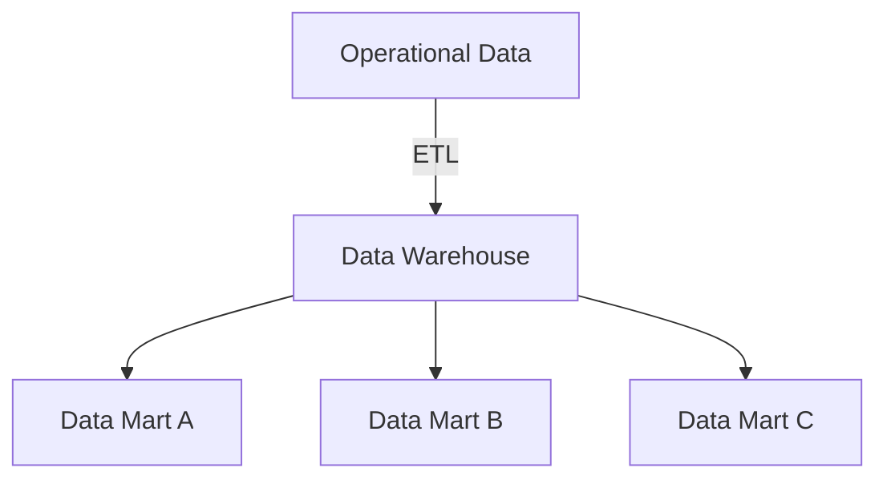
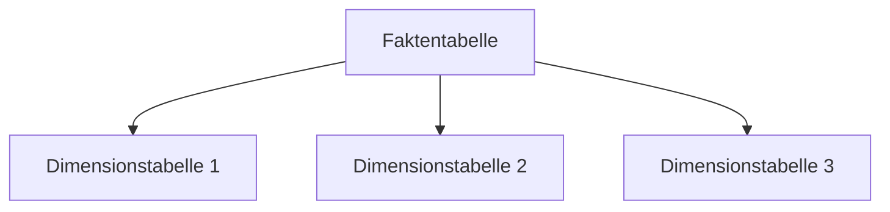
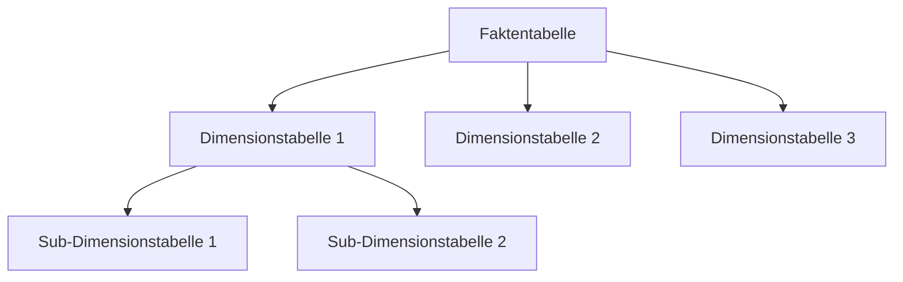
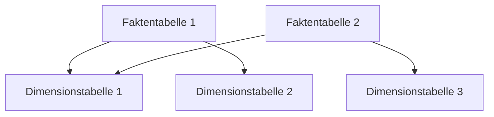
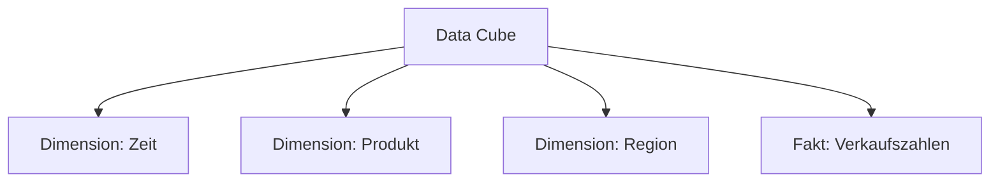

# Application reduces redundancyTime & Big Data

## Application Time

> Coalescing: Ein Prozess, bei dem mehrere Zeilen mit ähnlichen oder identischen Werten in einer Spalte zusammengeführt werden, um Redundanz zu reduzieren und die Datenbank effizienter zu gestalten.

## Big Data

### Operational Data vs Dispositive Data

- Operational Data: Daten, die in Echtzeit generiert werden und für den laufenden Betrieb eines Unternehmens oder einer Organisation relevant sind. Beispiele: Transaktionsdaten, Sensorendaten, Log-Daten.

- Dispositive Data: Daten, die für die Entscheidungsfindung und strategische Planung verwendet werden. Sie werden oft aus Operational Data abgeleitet und analysiert, um Erkenntnisse zu gewinnen. Beispiele: Berichte, Analysen, Prognosen.

### OLTP vs OLAP

- **OLTP** (Online Transaction Processing): Systeme, die für die Verarbeitung von Transaktionen in Echtzeit optimiert sind. Sie unterstützen viele gleichzeitige Benutzer und sind auf schnelle **Einfüge**-, **Aktualisierungs**- und **Löschoperationen** ausgelegt. Beispiele: Datenbanken für E-Commerce, Bankensysteme. *Row-Based oder sogar NoSQL-Datenbanken sind hier in der Regel vorteilhaft.*
- **OLAP** (Online Analytical Processing): Systeme, die für die Analyse großer Datenmengen optimiert sind. Sie unterstützen komplexe Abfragen und sind auf schnelle **Leseoperationen** ausgelegt. Beispiele: Data Warehouses, Business Intelligence Systeme. *Column-Based Datenbanken ist hier in der Regel vorteilhaft.*

### OLAP-Operationen:

- **Roll-up**: Aggregation von Daten auf einer höheren Ebene der Hierarchie. Beispiel: Aggregation von Verkaufsdaten von der Ebene "Nutzer_Land" zur Ebene "Nutzer_Kontinent". **SQL-Beispiel**: `SELECT Nutzer_Kontinent, SUM(Dauer_Minuten) FROM Stream GROUP BY Nutzer_Kontinent;`
- **Drill-down**: Detaillierung von Daten auf einer niedrigeren Ebene der Hierarchie. Beispiel: Detaillierung von Verkaufsdaten von der Ebene "Nutzer_Kontinent" zur Ebene "Nutzer_Land". **SQL-Beispiel**: `SELECT Nutzer_Land, SUM(Dauer_Minuten) FROM Stream GROUP BY Nutzer_Land;`
- **Slice**: Auswahl einer einzelnen Dimension aus einem Data Cube, um eine zweidimensionale Ansicht zu erhalten. Beispiel: Auswahl aller Verkaufsdaten für das Jahr 2025. **SQL-Beispiel**: `SELECT * FROM sales WHERE year = 2025;`
- **Dice**: Auswahl von Daten basierend auf mehreren Dimensionen, um eine mehrdimensionale Ansicht zu erhalten. Beispiel: Auswahl aller Verkaufsdaten für das Jahr 2025 und die Region Europa. **SQL-Beispiel**: `SELECT * FROM sales WHERE year = 2025 AND region = 'Europe';`
- **Pivot**: Umstrukturierung von Daten, um verschiedene Perspektiven zu analysieren. Beispiel: Umwandlung von Zeilen in Spalten, um die Verkaufszahlen nach Produktkategorie und Region zu analysieren. **SQL-Beispiel**: `SELECT category, region, SUM(sales) FROM sales GROUP BY category, region;`


## Data Warehouse

*Eine Datenbank als Grundlage für die Analyse von Daten (OLAP), die Daten aus verschiedenen Quellen integriert und für die Analyse optimiert ist.*


### Data Integration/Staging Area (ETL)

*Der Prozess der Extraktion, Transformation und Ladung (ETL) von Daten aus verschiedenen Quellen in das Data Warehouse. Die Staging Area ist ein temporärer Speicherort, an dem die Daten vor der Integration bereinigt und transformiert werden.*

-> z.B. Verkaufsdaten werden mithilfe von ETL aus verschiedenen Filialen in das Data Warehouse integriert, um eine einheitliche Sicht auf die Verkaufsleistung zu erhalten.

### Data Marts

*Ein Data Mart ist eine spezialisierte Version eines Data Warehouse, die sich auf einen bestimmten Geschäftsbereich oder eine bestimmte Abteilung konzentriert. Es enthält eine Teilmenge der Daten aus dem Data Warehouse, die für die spezifischen Bedürfnisse dieser Abteilung relevant sind.*

### Data Storage

Relationale Modelle sind:

- **Star Schema**: Ein einfaches Schema, bei dem eine zentrale Faktentabelle von mehreren Dimensionstabellen umgeben ist. Es ist leicht verständlich und ermöglicht schnelle Abfragen.



- **Snowflake Schema**: Eine Erweiterung des Star Schemas, bei der die Dimensionstabellen normalisiert sind. Es reduziert Redundanz, kann aber komplexer sein und zu langsameren Abfragen führen.



- **Galaxy Schema**: Ein Schema, bei dem mehrere Faktentabellen von gemeinsamen Dimensionstabellen umgeben sind. Es ermöglicht die Analyse über mehrere Geschäftsbereiche hinweg, kann aber komplex sein.



### Data Cube

*Ein Data Cube ist eine mehrdimensionale Darstellung von Daten, die es ermöglicht, Daten aus verschiedenen Perspektiven zu analysieren. Er besteht aus Dimensionen (z.B. Zeit, Produkt, Region) und Fakten (z.B. Verkaufszahlen).*



## Beispiel

"StreamFlix" möchte das Sehverhalten seiner Nutzer detailliert analysieren, um das Content-Angebot zielgerichtet zu optimieren. Bisher liegen die Daten in verschiedenen, unübersichtlichen Quellsystemen vor. Das Management möchte künftig schnell Antworten auf spezifische Fragen haben, wie zum Beispiel:

    "Wie viele Minuten an 'Sci-Fi'-Serien wurden im 4. Quartal 2025 von Nutzern aus 'Europa' gestreamt?"

Die zur Verfügung stehenden Rohdaten-Attribute sind:

- `StreamID` (Eindeutige ID des Streams)
- `Dauer_Minuten` (Die gemessene Kennzahl: Wie lange wurde geschaut?)
- `Datum` (Wann wurde geschaut?)
- `Nutzer_Name`
- `Nutzer_Alter`
- `Nutzer_Land`
- `Nutzer_Kontinent`
- `Titel_Name` (Name des Films/der Serie)
- `Kategorie_Name` (z. B. Sci-Fi, Comedy)
- `Kategorie_Altersfreigabe` (z. B. ab 12, ab 18)

### 1. Datenmodellierung (Snowflake)

- **FAKT_Stream**:
    - `StreamID` (PK)
    - `Dauer_Minuten`
    - `NutzerID` (FK)
    - `TitelID` (FK)
    - `Datum` (FK)
- **DIM_Zeit**
    - `Datum` (PK)
    - `Jahr`
    - `Quartal`
- **DIM_Nutzer**
    - `NutzerID` (PK)
    - `Nutzer_Name`
    - `Nutzer_Alter`
    - `Nutzer_Land` (FK)
- **DIM_LAND**
    - `Nutzer_Land` (PK)
    - `Nutzer_Kontinent`
- **DIM_Titel**
    - `TitelID` (PK)
    - `Titel_Name`
    - `KategorieID` (FK)
- **DIM_Kategorie**
    - `KategorieID` (PK)
    - `Kategorie_Name`
    - `Kategorie_Altersfreigabe`

### OLAP Operationen

Das Management betrachtet den vollständigen, mehrdimensionalen "Data Cube" deiner neuen Architektur. Welche der bekannten OLAP-Operationen (Roll-up, Drill-down, Slice, Dice, Pivot)  wendest du analytisch an, wenn du:

1. Von der detaillierten Ansicht "Nutzer_Land" auf die gröbere Ebene "Nutzer_Kontinent" wechselst?

- **Roll-up**: `SELECT Nutzer_Kontinent, SUM(Dauer_Minuten) FROM Stream JOIN Nutzer ON Stream.NutzerID = Nutzer.NutzerID GROUP BY Nutzer_Kontinent;`

2. Den Datenwürfel so zuschneidest, dass nur noch Daten für das "4. Quartal 2025" und die Kategorie "Sci-Fi" sichtbar sind?

- **Dice**: `SELECT * FROM Stream JOIN Titel ON Stream.TitelID = Titel.TitelID WHERE Datum >= '2025-10-01' AND Datum <= '2025-12-31' AND KategorieID IN (SELECT KategorieID FROM Kategorie WHERE Kategorie_Name = 'Sci-Fi');`

### SQL Abfrage

Wie viele Minuten an 'Sci-Fi'-Serien wurden im 4. Quartal 2025 von Nutzern aus 'Europa' gestreamt?

- **FAKT_Stream**:
    - `StreamID` (PK)
    - `Dauer_Minuten`
    - `NutzerID` (FK)
    - `TitelID` (FK)
    - `Datum` (FK)
- **DIM_Zeit**
    - `Datum` (PK)
    - `Jahr`
    - `Quartal`
- **DIM_Nutzer**
    - `NutzerID` (PK)
    - `Nutzer_Name`
    - `Nutzer_Alter`
    - `Nutzer_Land` (FK)
- **DIM_LAND**
    - `Nutzer_Land` (PK)
    - `Nutzer_Kontinent`
- **DIM_Titel**
    - `TitelID` (PK)
    - `Titel_Name`
    - `KategorieID` (FK)
- **DIM_Kategorie**
    - `KategorieID` (PK)
    - `Kategorie_Name`
    - `Kategorie_Altersfreigabe`

```sql
SELECT SUM(s.Dauer_minuten) FROM Stream s
JOIN Nutzer n ON s.NutzerID = n.NutzerID
JOIN DIM_Land l ON n.Land = l.Land
JOIN DIM_Zeit z ON s.Datum = z.Datum
JOIN DIM_Titel t ON s.TitelID = t.TitelID
JOIN DIM_Kategorie k ON t.KategorieID = k.KategorieID 
WHERE k.Kategorie_Name = 'Sci-Fiction'
AND z.Quartal = 4 AND z.Jahr = 2025
AND l.Nutzer_Kontinent = Europa
```