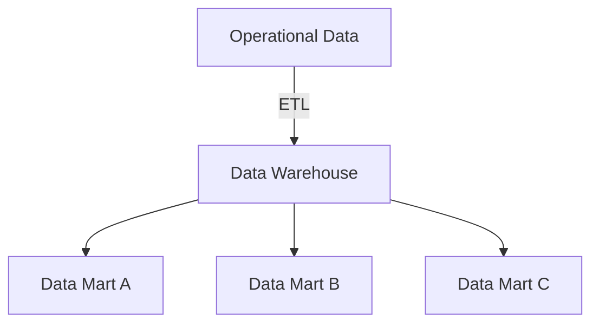
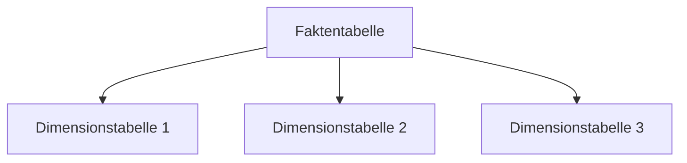
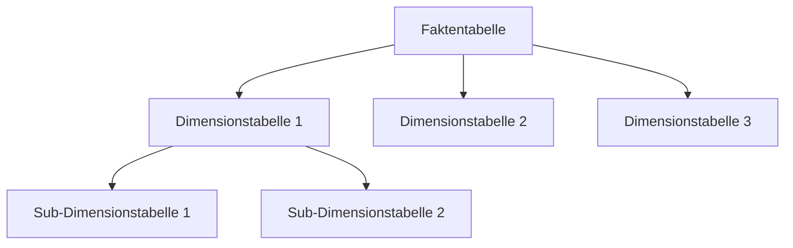
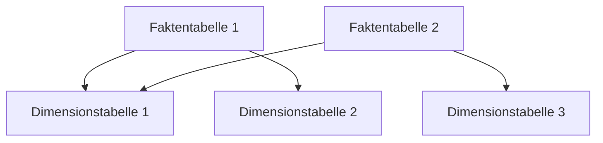
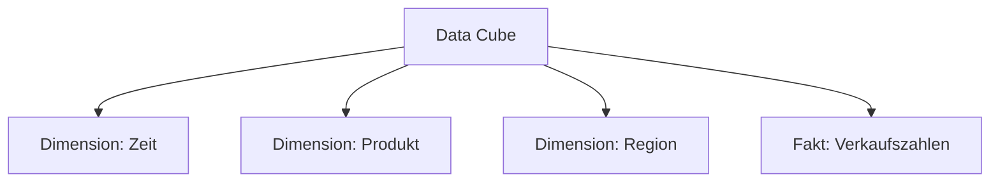

# TODO: TITEL

## Big Data

### Operational Data vs Dispositive Data

- Operational Data: Daten, die in Echtzeit generiert werden und für den laufenden Betrieb eines Unternehmens oder einer Organisation relevant sind. Beispiele: Transaktionsdaten, Sensorendaten, Log-Daten.

- Dispositive Data: Daten, die für die Entscheidungsfindung und strategische Planung verwendet werden. Sie werden oft aus Operational Data abgeleitet und analysiert, um Erkenntnisse zu gewinnen. Beispiele: Berichte, Analysen, Prognosen.

### OLTP vs OLAP

- **OLTP** (Online Transaction Processing): Systeme, die für die Verarbeitung von Transaktionen in Echtzeit optimiert sind. Sie unterstützen viele gleichzeitige Benutzer und sind auf schnelle **Einfüge**-, **Aktualisierungs**- und **Löschoperationen** ausgelegt. Beispiele: Datenbanken für E-Commerce, Bankensysteme. *Row-Based oder sogar NoSQL-Datenbanken sind hier in der Regel vorteilhaft.*
- **OLAP** (Online Analytical Processing): Systeme, die für die Analyse großer Datenmengen optimiert sind. Sie unterstützen komplexe Abfragen und sind auf schnelle **Leseoperationen** ausgelegt. Beispiele: Data Warehouses, Business Intelligence Systeme. *Column-Based Datenbanken ist hier in der Regel vorteilhaft.*

## Data Warehouse

*Eine Datenbank als Grundlage für die Analyse von Daten (OLAP), die Daten aus verschiedenen Quellen integriert und für die Analyse optimiert ist.*

### Data Integration/Staging Area (ETL)

*Der Prozess der Extraktion, Transformation und Ladung (ETL) von Daten aus verschiedenen Quellen in das Data Warehouse. Die Staging Area ist ein temporärer Speicherort, an dem die Daten vor der Integration bereinigt und transformiert werden.*

-> z.B. Verkaufsdaten werden mithilfe von ETL aus verschiedenen Filialen in das Data Warehouse integriert, um eine einheitliche Sicht auf die Verkaufsleistung zu erhalten.

### Data Marts

*Ein Data Mart ist eine spezialisierte Version eines Data Warehouse, die sich auf einen bestimmten Geschäftsbereich oder eine bestimmte Abteilung konzentriert. Es enthält eine Teilmenge der Daten aus dem Data Warehouse, die für die spezifischen Bedürfnisse dieser Abteilung relevant sind.*

### Data Storage

Relationale Modelle sind:

- **Star Schema**: Ein einfaches Schema, bei dem eine zentrale Faktentabelle von mehreren Dimensionstabellen umgeben ist. Es ist leicht verständlich und ermöglicht schnelle Abfragen.

- **Snowflake Schema**: Eine Erweiterung des Star Schemas, bei der die Dimensionstabellen normalisiert sind. Es reduziert Redundanz, kann aber komplexer sein und zu langsameren Abfragen führen.

- **Galaxy Schema**: Ein Schema, bei dem mehrere Faktentabellen von gemeinsamen Dimensionstabellen umgeben sind. Es ermöglicht die Analyse über mehrere Geschäftsbereiche hinweg, kann aber komplex sein.

### Data Cube

*Ein Data Cube ist eine mehrdimensionale Darstellung von Daten, die es ermöglicht, Daten aus verschiedenen Perspektiven zu analysieren. Er besteht aus Dimensionen (z.B. Zeit, Produkt, Region) und Fakten (z.B. Verkaufszahlen).*

