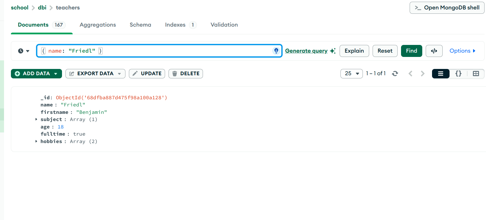
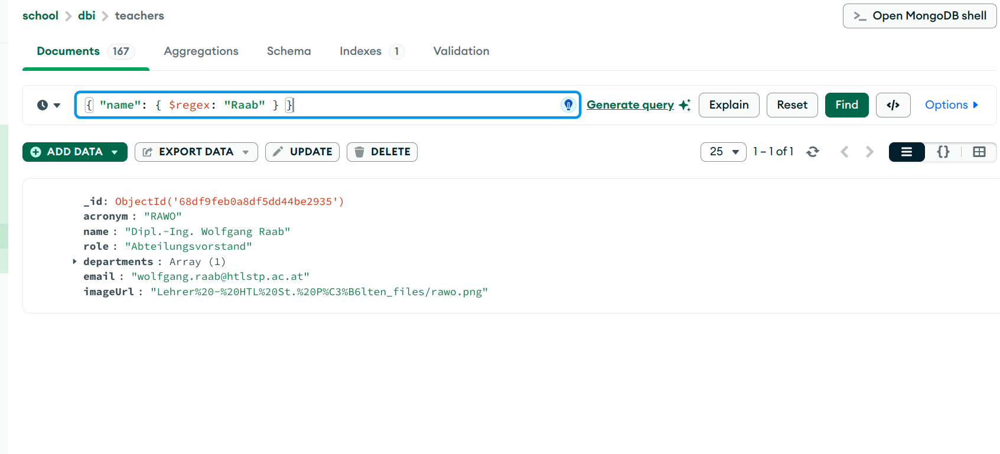
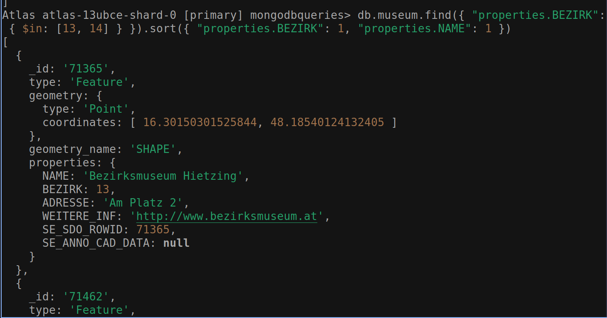
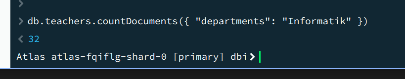

# MongoDB CRUD Operations

## Data selection and Imports

### Prepare a cluster on your Atlas storage

cluster name: 'school'
database_name: 'dbi'
collection_name: 'teachers'

username: 5ahif
password: 5ahif

### Find/Extract Data

My data:

from 'htlstp.ac.at/lehrer'
convertet to JSON via gemini ai (easier than webscraping and possible because of the small data size)

```json
{
  "meta": {...},
    "data": [
}
```

### Import the data

to import data into mongodb, the options are:

- mongoimport tool
- write a script (e.g. in python)
- use a GUI tool (e.g. MongoDB Compass)
- use the mongo shell

I used the mongodb compass


How the 5ahif user can access the dbi database:

```fish
mongosh "mongodb+srv://school.fu7deyq.mongodb.net/" --apiVersion 1 --username 5ahif
```

and then switch to the dbi database:

```js
use dbi
```

## CRUD Operations

<!-- todo: delete tasks -->
- Add one suitable document with fictional data.
- Formulate three functional questions regarding the data in your collection. Create three
distinctive queries for these questions.
- Update your data with three distinct update statements with suitable filters. One of the
statements needs to be an upsert statement.
- Remove at least one document with a proper delete statement.
- Provide and describe queries that show the effects of your statements.
<!-- -- -->

### Create (Insert) a Document

```js
db.teachers.insertOne(
  {
    "name": "Friedl",
    "firstname": "Benjamin",
    "subject": ["DBI"],
    "age": 18,
    "fulltime": true,
    "hobbies": ["Going to school", "Joking"]
  }
)
```



### Read (Find) Documents

#### Prof. Raab

```js
db.teachers.find({ "name": { $regex: "Raab" } })
```



#### all Abteilungsvorstand

```js
db.teachers.find({ "role": "Abteilungsvorstand" })
```



#### How many teachers are in the department 'Informatik'?

```js
db.teachers.countDocuments({ "departments": "Informatik" })
```



### Update Documents

```js
db.teachers.updateOne(
  { "name": "Friedl" },
  { $set: { "age": 19 } }
)
```


```js
db.teachers.updateMany(
  { "fulltime": true },
  { $set: { "hobbies": [] } }
)
```


**Upsert Example**

> Upsert: if the document does not exist, create it.

```js
db.teachers.updateOne(
  { "name": "Mustermann" },
  { $set: { "firstname": "Max", "age": 30, "subject": ["Math"], "fulltime": false } },
  { upsert: true }
)
```

<!-- TODO: third update -->

### Delete Documents

```js
db.teachers.deleteOne({ "name": "Friedl" })
```
