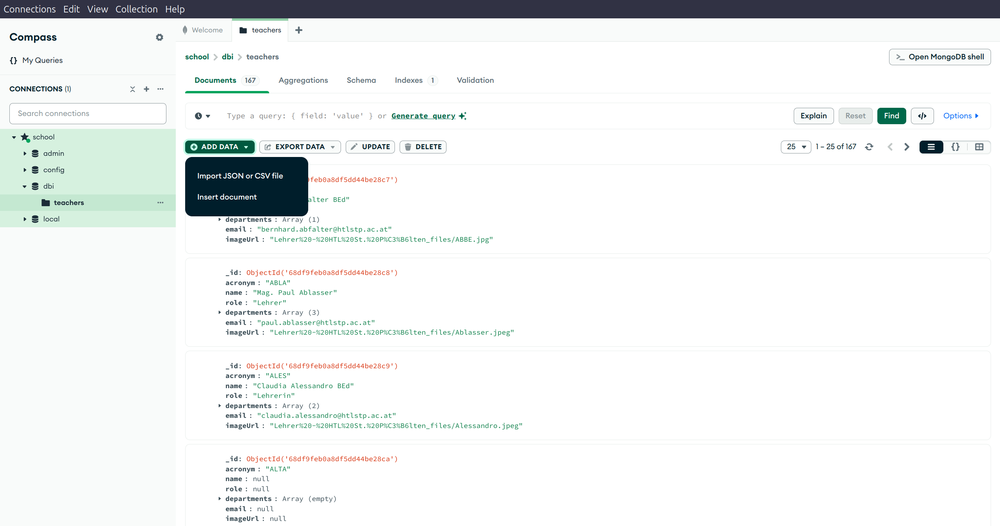
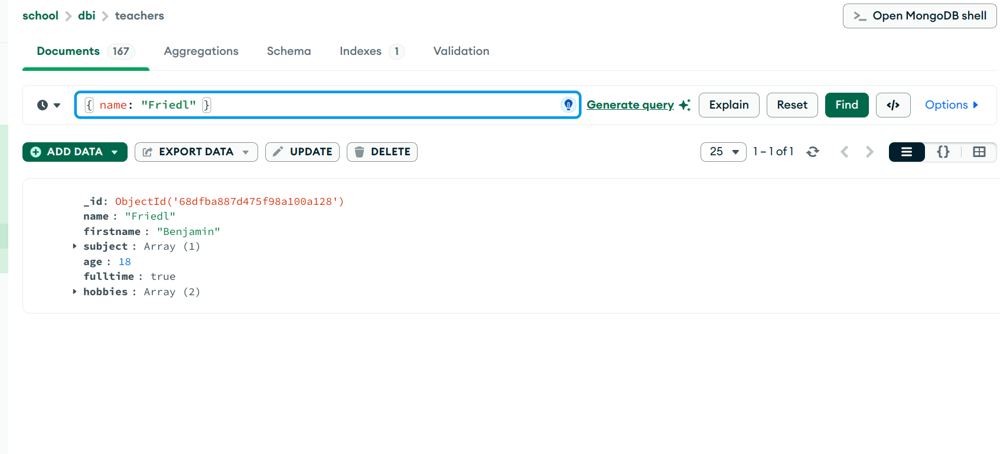
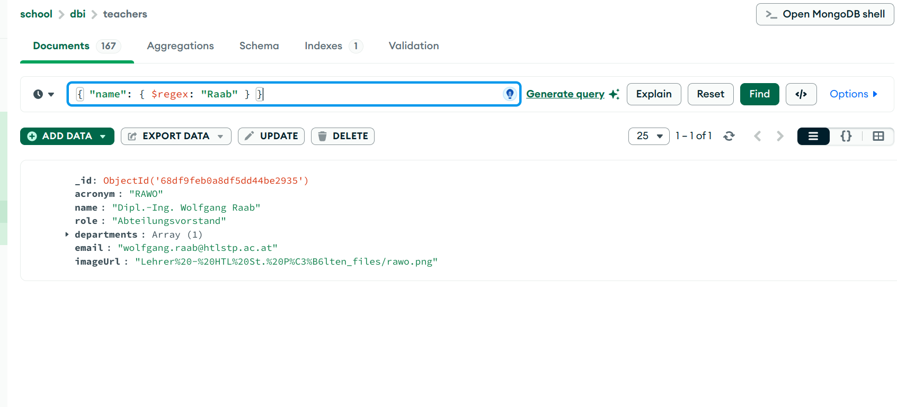
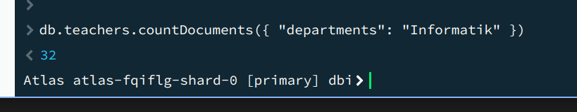
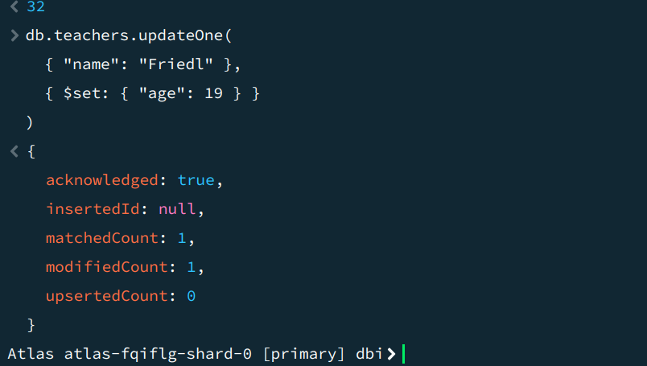
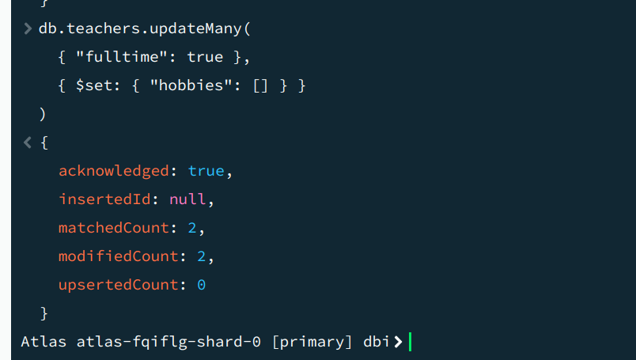

## Kopie von AdventureWorks von Backup wiederherstellen

Die Übung (wir verwenden die gleiche Datenbank:
<https://www.mssqltips.com/tutorial/sql-server-index-maintenance/>)





<!-- SalesOrderID SalesOrderDetailID CarrierTrackingNumber OrderQty ProductID SpecialOfferID UnitPrice UnitPriceDiscount LineTotal rowguid ModifiedDate
43659 1 4911-403C-98 1 776 1 2024,994 0,00 2024.994000 B207C96D-D9E6-402B-8470-2CC176C42283 2011-05-31 00:00:00.000 -->

| SalesOrderID | SalesOrderDetailID | CarrierTrackingNumber | OrderQty | ProductID | SpecialOfferID | UnitPrice | UnitPriceDiscount | LineTotal   | rowguid                              | ModifiedDate            |
| :----------- | :----------------- | :-------------------- | :------- | :-------- | :------------- | :-------- | :---------------- | :---------- | :----------------------------------- | :---------------------- |
| 43659        | 1                  | 4911-403C-98          | 1        | 776       | 1              | 2024,994  | 0,00              | 2024.994000 | B207C96D-D9E6-402B-8470-2CC176C42283 | 2011-05-31 00:00:00.000 |

## Tabelle Kopieren

```sql
-- Heap-Tabelle (ohne Index)
SELECT * INTO [Sales].[SalesOrderDetail_Heap] FROM [Sales].[SalesOrderDetail];

-- Clustered Index Tabelle
SELECT * INTO [Sales].[SalesOrderDetail_Clustered] FROM [Sales].[SalesOrderDetail];

-- Non-Clustered Index Tabelle
SELECT * INTO [Sales].[SalesOrderDetail_NonClustered] FROM [Sales].[SalesOrderDetail];

-- Clustered Columnstore Index Tabelle
SELECT * INTO [Sales].[SalesOrderDetail_ClusteredColumnstore] FROM [Sales].[SalesOrderDetail];
```

> Um die Performance zu testen kann `SET STATISTICS IO ON;` verwendet werden.

## Heap (ohne Index)

```sql
SELECT * FROM [Sales].[SalesOrderDetail_Heap] WHERE SalesOrderID = 43659;
```

Scananzahl 1, logische Lesevorgänge 1498, CPU-Zeit = 15 ms, verstrichene Zeit =
15 ms. 

## Clustered Index

### Create Clustered Index

```sql
CREATE CLUSTERED INDEX CIX_SalesOrderDetail_SalesOrderID
ON [Sales].[SalesOrderDetail_Clustered](SalesOrderID);
```

```sql
SELECT * FROM [Sales].[SalesOrderDetail_Clustered] WHERE SalesOrderID = 43659;
```

Scananzahl 1, logische Lesevorgänge 3,CPU-Zeit = 0 ms, verstrichene Zeit = 0 ms.


## Non-Clustered Index

### Create Non-Clustered Index

```sql
CREATE NONCLUSTERED INDEX NCIX_SalesOrderDetail_SalesOrderID
ON [Sales].[SalesOrderDetail_NonClustered](SalesOrderID);
```

```sql
SELECT * FROM [Sales].[SalesOrderDetail_NonClustered] WHERE SalesOrderID = 43659;
```

Scananzahl 1, logische Lesevorgänge 14, CPU-Zeit = 0 ms, verstrichene Zeit = 0
ms. 

## Columnstore Index

### Create Columnstore Index

```sql
CREATE CLUSTERED COLUMNSTORE INDEX CCIX_SalesOrderDetail
ON [Sales].[SalesOrderDetail_ClusteredColumnstore];
```

```sql
SELECT * FROM [Sales].[SalesOrderDetail_ClusteredColumnstore] WHERE SalesOrderID = 43659;
```

Scananzahl 1, logische Lesevorgänge 0,CPU-Zeit = 15 ms, verstrichene Zeit = 10
ms. 

Column Store indexes are optimized for read-heavy operations and analytical
queries, making them ideal for data warehousing scenarios. They store data in a
compressed format, which can significantly reduce storage requirements and
improve query performance for large datasets. However, they may not perform as
well for transactional workloads that involve frequent updates or inserts.

## FullText Indexes
