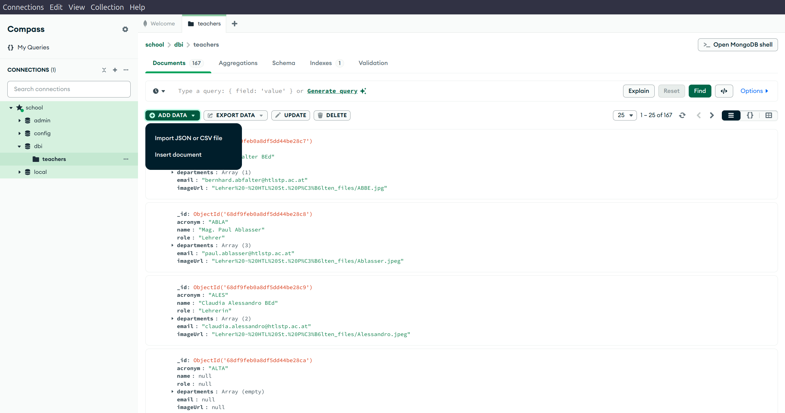

## Kopie von AdventureWorks von Backup wiederherstellen

Die Übung (wir verwenden die gleiche Datenbank:
<https://www.mssqltips.com/tutorial/sql-server-index-maintenance/>)


<!-- SalesOrderID SalesOrderDetailID CarrierTrackingNumber OrderQty ProductID SpecialOfferID UnitPrice UnitPriceDiscount LineTotal rowguid ModifiedDate
43659 1 4911-403C-98 1 776 1 2024,994 0,00 2024.994000 B207C96D-D9E6-402B-8470-2CC176C42283 2011-05-31 00:00:00.000 -->

| SalesOrderID | SalesOrderDetailID | CarrierTrackingNumber | OrderQty | ProductID | SpecialOfferID | UnitPrice | UnitPriceDiscount | LineTotal   | rowguid                              | ModifiedDate            |
| :----------- | :----------------- | :-------------------- | :------- | :-------- | :------------- | :-------- | :---------------- | :---------- | :----------------------------------- | :---------------------- |
| 43659        | 1                  | 4911-403C-98          | 1        | 776       | 1              | 2024,994  | 0,00              | 2024.994000 | B207C96D-D9E6-402B-8470-2CC176C42283 | 2011-05-31 00:00:00.000 |

## Tabelle Kopieren

```sql
-- Heap-Tabelle (ohne Index)
SELECT * INTO [Sales].[SalesOrderDetail_Heap] FROM [Sales].[SalesOrderDetail];

-- Clustered Index Tabelle
SELECT * INTO [Sales].[SalesOrderDetail_Clustered] FROM [Sales].[SalesOrderDetail];

-- Non-Clustered Index Tabelle
SELECT * INTO [Sales].[SalesOrderDetail_NonClustered] FROM [Sales].[SalesOrderDetail];

-- Clustered Columnstore Index Tabelle
SELECT * INTO [Sales].[SalesOrderDetail_ClusteredColumnstore] FROM [Sales].[SalesOrderDetail];

-- FullText Index Tabelle
SELECT * INTO [Production].[ProductDescription_FullText] FROM [Production].[ProductDescription];
```

> Um die Performance zu testen kann `SET STATISTICS IO ON;` verwendet werden.

---

## Heap (ohne Index)

### Theorie

Ein **Heap** ist eine Tabelle ohne Clustered Index. Die Daten werden in keiner
bestimmten Reihenfolge gespeichert – sie liegen "chaotisch" auf den Datenseiten.

**Eigenschaften:**

- Daten werden am Ende der Tabelle eingefügt (schnelle INSERTs)
- Bei SELECT muss die gesamte Tabelle gescannt werden (**Table Scan**)
- Keine physische Sortierung der Daten
- Geeignet für: Staging-Tabellen, Bulk-Imports, temporäre Daten

### Ausführungsplan OHNE Index (Heap)

```sql
SELECT * FROM [Sales].[SalesOrderDetail_Heap] WHERE SalesOrderID = 43659;
```

**Ergebnis:** Scananzahl 1, **logische Lesevorgänge 1498**, CPU-Zeit = 15 ms,
verstrichene Zeit = 15 ms.


**Tooltip-Analyse:**

- **Operator:** Table Scan (Heap)
- **Anzahl Zeilen (geschätzt):** 121.317
- **Anzahl Zeilen (tatsächlich):** 121.317
- **Kosten:** 100% der Abfrage

> **Erklärung:** Da kein Index vorhanden ist, muss SQL Server **alle 121.317
> Zeilen** lesen und einzeln auf `SalesOrderID = 43659` prüfen. Das führt zu
> 1498 logischen Lesevorgängen.

---

## Clustered Index

### Theorie

Ein **Clustered Index** sortiert und speichert die Datenzeilen physisch in der
Tabelle basierend auf dem Index-Schlüssel. Die Tabelle selbst wird zum Index
(B-Tree-Struktur).

**Eigenschaften:**

- Pro Tabelle nur **ein** Clustered Index möglich
- Die Blattknoten des B-Tree enthalten die **tatsächlichen Datenzeilen**
- Sehr effizient für Bereichsabfragen (`BETWEEN`, `<`, `>`)
- Ideal für: Primärschlüssel, häufig gefilterte/sortierte Spalten

### Ausführungsplan MIT Clustered Index

```sql
CREATE CLUSTERED INDEX CIX_SalesOrderDetail_SalesOrderID
ON [Sales].[SalesOrderDetail_Clustered](SalesOrderID);
```

```sql
SELECT * FROM [Sales].[SalesOrderDetail_Clustered] WHERE SalesOrderID = 43659;
```

**Ergebnis:** Scananzahl 1, **logische Lesevorgänge 3**, CPU-Zeit = 0 ms,
verstrichene Zeit = 0 ms.


**Tooltip-Analyse:**

- **Operator:** Clustered Index Seek
- **Anzahl Zeilen (geschätzt):** 12
- **Anzahl Zeilen (tatsächlich):** 12
- **Kosten:** 100% der Abfrage

### Vergleich: Heap vs. Clustered Index

| Metrik                    | Heap (ohne Index) | Mit Clustered Index   |
| :------------------------ | :---------------- | :-------------------- |
| **Logische Lesevorgänge** | 1498              | 3                     |
| **Gelesene Zeilen**       | 121.317           | 12                    |
| **Operator**              | Table Scan        | Clustered Index Seek  |
| **Verbesserung**          | -                 | **99,8% weniger I/O** |

> **Erklärung:** Der Clustered Index ermöglicht einen direkten **Seek** zur
> gesuchten SalesOrderID. Statt alle 121.317 Zeilen zu scannen, werden nur die
> 12 relevanten Zeilen gelesen.

---

## Non-Clustered Index

### Theorie

Ein **Non-Clustered Index** ist eine separate Struktur, die auf die Datenzeilen
verweist. Die Blattknoten enthalten den Indexschlüssel + einen Zeiger (Row
Locator) auf die eigentlichen Daten.

**Eigenschaften:**

- Mehrere Non-Clustered Indexes pro Tabelle möglich (bis zu 999)
- Benötigt zusätzlichen Speicherplatz
- Bei Abfragen mit vielen Spalten: **Key Lookup** erforderlich
- Ideal für: Spalten in WHERE-Klauseln, JOINs, ORDER BY

### Ausführungsplan MIT Non-Clustered Index

```sql
CREATE NONCLUSTERED INDEX NCIX_SalesOrderDetail_SalesOrderID
ON [Sales].[SalesOrderDetail_NonClustered](SalesOrderID);
```

```sql
SELECT * FROM [Sales].[SalesOrderDetail_NonClustered] WHERE SalesOrderID = 43659;
```

**Ergebnis:** Scananzahl 1, **logische Lesevorgänge 14**, CPU-Zeit = 0 ms,
verstrichene Zeit = 0 ms.


**Tooltip-Analyse:**

- **Operator 1:** Index Seek (NonClustered)
  - Anzahl Zeilen: 12
- **Operator 2:** RID Lookup (Heap) oder Key Lookup
  - Zusätzliche Lesevorgänge pro gefundener Zeile

### Vergleich: Clustered vs. Non-Clustered Index

| Metrik                    | Non-Clustered Index           | Clustered Index      |
| :------------------------ | :---------------------------- | :------------------- |
| **Logische Lesevorgänge** | 14                            | 3                    |
| **Operatoren**            | Index Seek + RID Lookup       | Clustered Index Seek |
| **Zusätzlicher Aufwand**  | Key/RID Lookup für jede Zeile | Keiner               |

> **Erklärung:** Der Non-Clustered Index findet die 12 Zeilen schnell (Index
> Seek), muss aber für jede Zeile einen zusätzlichen **RID Lookup** durchführen,
> um die restlichen Spalten zu holen. Das erklärt die 14 Lesevorgänge (Index +
> 12 Lookups).

---

## Columnstore Index

### Theorie

Ein **Columnstore Index** speichert Daten spaltenweise statt zeilenweise. Dies
ermöglicht hohe Kompression und schnelle analytische Abfragen über große
Datenmengen.

**Eigenschaften:**

- Daten werden **spaltenweise** in Segmenten gespeichert
- Hohe Kompressionsrate (bis zu 10x weniger Speicher)
- Ideal für: Data Warehousing, OLAP, Aggregationen
- Weniger geeignet für: OLTP, häufige Einzelzeilen-Updates

### Ausführungsplan MIT Columnstore Index

```sql
CREATE CLUSTERED COLUMNSTORE INDEX CCIX_SalesOrderDetail
ON [Sales].[SalesOrderDetail_ClusteredColumnstore];
```

```sql
SELECT * FROM [Sales].[SalesOrderDetail_ClusteredColumnstore] WHERE SalesOrderID = 43659;
```

**Ergebnis:** Scananzahl 1, **logische Lesevorgänge 0** (Segment-basiert),
CPU-Zeit = 15 ms, verstrichene Zeit = 10 ms.


**Tooltip-Analyse:**

- **Operator:** Columnstore Index Scan
- **Anzahl Zeilen:** Segmente werden gelesen, nicht einzelne Zeilen
- **Batch Mode:** Verarbeitet ~900 Zeilen pro Batch

### Vergleich: Rowstore vs. Columnstore

| Metrik             | Heap (Rowstore)   | Columnstore Index |
| :----------------- | :---------------- | :---------------- |
| **Speicherformat** | Zeilenweise       | Spaltenweise      |
| **Kompression**    | Gering            | Hoch (10x)        |
| **Punkt-Abfragen** | Schnell mit Index | Langsamer         |
| **Aggregationen**  | Langsam           | Sehr schnell      |
| **OLTP-Eignung**   | Gut               | Schlecht          |
| **OLAP-Eignung**   | Schlecht          | Sehr gut          |

> **Erklärung:** Columnstore-Indexes sind für analytische Abfragen wie `SUM()`,
> `AVG()`, `GROUP BY` optimiert. Für Punkt-Abfragen (einzelne SalesOrderID) sind
> Rowstore-Indexes effizienter.

---

## FullText Index

### Theorie

Ein **FullText Index** ermöglicht effiziente Textsuche in großen Textfeldern
(VARCHAR, NVARCHAR, TEXT). Er erstellt einen invertierten Index über die Wörter
im Text.

**Eigenschaften:**

- Ermöglicht linguistische Suche (Wortstämme, Synonyme)
- `CONTAINS`, `FREETEXT`, `CONTAINSTABLE` Funktionen
- Benötigt einen **FullText Catalog**
- Ideal für: Dokumentensuche, Produktbeschreibungen, Artikeltext

### Ausführungsplan OHNE FullText Index

```sql
-- Tabelle ohne FullText Index: LIKE-Suche
SELECT * FROM [Production].[ProductDescription_FullText] 
WHERE Description LIKE '%comfortable%';
```

**Operator:** Table Scan oder Clustered Index Scan

- Alle Zeilen müssen gelesen und einzeln auf das Muster geprüft werden
- Bei großen Tabellen sehr langsam

### Ausführungsplan MIT FullText Index

```sql
-- FullText Catalog erstellen
CREATE FULLTEXT CATALOG ftCatalog AS DEFAULT;

-- FullText Index erstellen (benötigt unique index)
CREATE UNIQUE INDEX UIX_ProductDescription_ID 
ON [Production].[ProductDescription_FullText](ProductDescriptionID);

CREATE FULLTEXT INDEX ON [Production].[ProductDescription_FullText](Description)
KEY INDEX UIX_ProductDescription_ID
ON ftCatalog;
```

```sql
-- Suche mit FullText
SELECT * FROM [Production].[ProductDescription_FullText] 
WHERE CONTAINS(Description, 'comfortable');
```

**Tooltip-Analyse:**

- **Operator:** FullText Match
- Nur Zeilen mit "comfortable" werden aus dem invertierten Index geholt
- Deutlich weniger I/O als LIKE '%...%'

### Vergleich: LIKE vs. FullText

| Metrik                 | LIKE '%text%' | FullText CONTAINS  |
| :--------------------- | :------------ | :----------------- |
| **Index nutzbar**      | Nein          | Ja                 |
| **Operator**           | Table Scan    | FullText Match     |
| **Wortstamm-Suche**    | Nein          | Ja (FORMSOF)       |
| **Ranking**            | Nein          | Ja (CONTAINSTABLE) |
| **Wildcard am Anfang** | Langsam       | N/A                |

> **Erklärung:** FullText-Suche verwendet einen invertierten Index, der für
> jedes Wort eine Liste der Dokumente enthält. Dadurch kann "comfortable" direkt
> gefunden werden, ohne alle Zeilen zu scannen.


---

## SQL Server Index Maintenance

### Theorie

Durch INSERT, UPDATE und DELETE-Operationen **fragmentieren** Indexes über Zeit.
Fragmentierung bedeutet:

- **Logische Fragmentierung:** Seiten sind nicht mehr in der richtigen
  Reihenfolge
- **Interne Fragmentierung:** Seiten sind nicht voll ausgelastet

**Konsequenzen:**

- Mehr I/O für Leseoperationen
- Größerer Speicherbedarf
- Langsamere Abfragen

### Fragmentierung analysieren

```sql
-- Index-Fragmentierung prüfen
SELECT 
    OBJECT_NAME(ips.object_id) AS TableName,
    i.name AS IndexName,
    ips.index_type_desc AS IndexType,
    ips.avg_fragmentation_in_percent AS FragmentationPercent,
    ips.page_count AS PageCount
FROM sys.dm_db_index_physical_stats(
    DB_ID(), 
    OBJECT_ID('[Sales].[SalesOrderDetail_Clustered]'), 
    NULL, NULL, 'LIMITED'
) ips
JOIN sys.indexes i ON ips.object_id = i.object_id AND ips.index_id = i.index_id
WHERE ips.avg_fragmentation_in_percent > 0;
```




### Wartungsstrategien

| Fragmentierung | Empfohlene Aktion | SQL-Befehl                   |
| :------------- | :---------------- | :--------------------------- |
| **< 5%**       | Keine Aktion      | -                            |
| **5% - 30%**   | REORGANIZE        | `ALTER INDEX ... REORGANIZE` |
| **> 30%**      | REBUILD           | `ALTER INDEX ... REBUILD`    |

### Index Reorganize

```sql
-- Defragmentiert den Index ohne Sperre (Online)
ALTER INDEX CIX_SalesOrderDetail_SalesOrderID 
ON [Sales].[SalesOrderDetail_Clustered] 
REORGANIZE;
```

**Eigenschaften:**

- Online-Operation (keine Sperre)
- Geringer Ressourcenverbrauch
- Für moderate Fragmentierung (5-30%)

### Index Rebuild

```sql
-- Erstellt den Index komplett neu
ALTER INDEX CIX_SalesOrderDetail_SalesOrderID 
ON [Sales].[SalesOrderDetail_Clustered] 
REBUILD WITH (ONLINE = ON, FILLFACTOR = 80);
```

**Eigenschaften:**

- Erstellt den Index vollständig neu
- Mit `ONLINE = ON`: Minimal-invasiv (Enterprise Edition)
- `FILLFACTOR`: Lässt Platz für zukünftige Inserts
- Für starke Fragmentierung (> 30%)

### Alle Indexes einer Tabelle rebuilden

```sql
-- Alle Indexes der Tabelle neu erstellen
ALTER INDEX ALL ON [Sales].[SalesOrderDetail_Clustered] REBUILD;
```

### Fill Factor

Der **Fill Factor** bestimmt, wie voll die Indexseiten bei REBUILD gefüllt
werden:

| Fill Factor | Beschreibung                   | Anwendungsfall            |
| :---------- | :----------------------------- | :------------------------ |
| **100%**    | Seiten komplett gefüllt        | Statische Tabellen        |
| **80-90%**  | 10-20% Platz für neue Einträge | Moderate Insert-Aktivität |
| **50-70%**  | 30-50% Platz                   | Hohe Insert-Aktivität     |

> **Erklärung:** Ein niedrigerer Fill Factor reduziert Page Splits bei INSERTs,
> benötigt aber mehr Speicherplatz.

---

## Zusammenfassung

| Index-Typ         | Anwendungsfall                    | Vorteile                  | Nachteile            |
| :---------------- | :-------------------------------- | :------------------------ | :------------------- |
| **Heap**          | Staging, Bulk Import              | Schnelle Inserts          | Langsame Suche       |
| **Clustered**     | Primärschlüssel, Bereichsabfragen | Sehr schneller Zugriff    | Max. 1 pro Tabelle   |
| **Non-Clustered** | Sekundäre Suchspalten             | Flexibel, mehrere möglich | Key Lookup overhead  |
| **Columnstore**   | OLAP, Aggregationen               | Hohe Kompression          | Schlecht für OLTP    |
| **FullText**      | Textsuche                         | Linguistische Suche       | Zusätzlicher Catalog |
