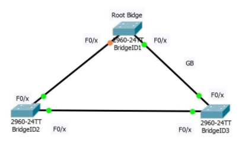
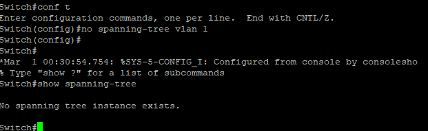

# **Titel: Shells**

| **AufgabenNr:** | 1 |
|---|:---|
| **Klasse:** | 4AHIF |
| **Name:** | Benjamin Friedl |
| **Gruppe:** | 1 |
| **Abgabetermin:** |  |
| **Abgabedatum:** |  |

## **Kurzbeschreibung:**

TODO

---
\
\
\
\
\
\
\
\
\
\
\
\
\
\
\
\
\
\
\
\
\
\
\
\
\
\
\
\

# Inhaltsverzeichnis

<!-- 1. [Shells](#shells)
2. [Commands](#commands)
3. [Verketten von Befehlen](#verketten-von-befehlen)
4. [Netcat](#netcat)
    1. [Chat-Tool](#chat-tool)
    2. [File-Transfer-Tool](#file-transfer-tool)
    3. [Shellzugriff](#shellzugriff)
    4. [Netcat unter Windows](#netcat-unter-windows) -->
\
\
\
\
\
\
\
\
\
\
\
\
\
\
\
\
\
\
\
\
\
\
\
\
\
\
\
\
\
\
\
\
\
\
\
\

----
## Aufbau



## Allgemeine Aufgaben u. Funktionen

- **Verhinderung von Schleifen**
- **Automatische Erkennung von Ausfällen**
- **Automatische Wiederherstellung von Verbindungen**
- **Automatische Erkennung von neuen Verbindungen, Routen und Ausfällen**

## Timer

- **Hello Timer**: Zeitintervall, in dem ein Router ein Hello-Paket sendet
- **Dead Timer**: Zeitintervall, in dem ein Router ein Hello-Paket empfangen muss, ansonsten wird die Verbindung als tot angesehen
- **Update Timer**: Zeitintervall, in dem ein Router ein Update-Paket sendet
- **Hold Timer**: Zeitintervall, in dem ein Router auf ein Update-Paket wartet
- **Flush Timer**: Zeitintervall, in dem ein Router eine Verbindung als tot ansieht
- **Aging Timer**: Zeitintervall, in dem ein Router eine Verbindung als tot ansieht, wenn kein Update-Paket empfangen wurde
- **Max Age Timer**: Zeitintervall, in dem ein Router eine Verbindung als tot ansieht, wenn kein Update-Paket empfangen wurde
- **Retransmission Timer**: Zeitintervall, in dem ein Router ein Update-Paket erneut sendet
- **Acknowledgement Timer**: Zeitintervall, in dem ein Router auf ein Acknowledgement-Paket wartet
- **Route Timer**: Zeitintervall, in dem ein Router eine Route als tot ansieht
- **Route Update Timer**: Zeitintervall, in dem ein Router ein Update-Paket sendet
- **Route Hold Timer**: Zeitintervall, in dem ein Router auf ein Update-Paket wartet
- **Route Flush Timer**: Zeitintervall, in dem ein Router eine Route als tot ansieht
- **Route Aging Timer**: Zeitintervall, in dem ein Router eine Route als tot ansieht, wenn kein Update-Paket empfangen wurde

## theoretische Fragen

- Rootbridge wird der Switch mit der niedrigsten Bridge-ID (Priority + MAC-Adresse) genannt.
- Der Rootport ist der Port, der den kürzesten Pfad (Kosten) zum Rootbridge hat.
- Der Designated Port ist der Port, der den kürzesten Pfad zum Rootbridge hat. Jeder Switch hat pro Segment nur einen Designated Port. Die Entscheidung, welcher Port Designated Port wird, wird anhand der Bridge-ID entschieden. Der Port mit der niedrigsten Bridge-ID wird Designated Port.

- Der NON-Designated Port ist der Port, der nicht Designated Port ist. Er wird blockiert, um Schleifen zu verhindern.


## PUTTY für Serielle Verbindung mit Switch

> Switches brauchen Strom!


### Vorhersage

### Deaktivieren von Spanning Tree



<!-- | 537.6917.5b00 |
| 3c5e.c3a6.f880 |
| 3c5e.c3a6.fb00 | -->
| MAC-Adresse | Reihenfolge |
|---|---|
| 537.6917.5b00 | 1 |
| 3c5e.c3a6.f880 | 2 |
| 3c5e.c3a6.fb00 | 3 |

### Clients

Um Clients mit einem Switch zu verbinden, müssen die Ports aktiviert werden. Dazu muss der Port auf dem Switch aktiviert werden.

```bash
Switch> enable
Switch# configure terminal
Switch(config)# interface FastEthernet 0/1 # Port 1 aktivieren
Switch(config-if)# no shutdown # Port aktivieren
Switch(config-if)# exit # Verlassen des Ports
```

### MAC-TABELLE

```bash	
Switch# show mac-address-table
```
