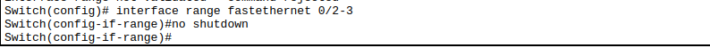
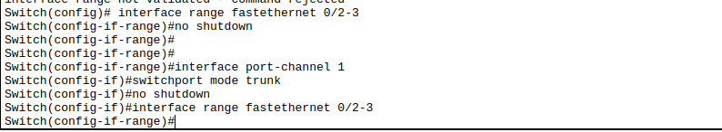

# **Titel: Etherchannel und Portsecurity**

| **AufgabenNr:** | 01 |
|---|:---|
| **Klasse:** | 4AHIF |
| **Name:** | Benjamin Friedl |
| **Gruppe:** | 1 |
| **Abgabetermin:** | 17.10.2024 |
| **Abgabedatum:** | 17.10.2024 |

## **Kurzbeschreibung:**


---
\
\
\
\
\
\
\
\
\
\
\
\
\
\
\
\
\
\
\
\
\
\
\
\
\
\
\
\

# Inhaltsverzeichnis

1. [Allgemeine Aufgaben und Funktionen des STP](#1-allgemeine-aufgaben-und-funktionen-des-stp)
2. [Timer im Spanning Tree Protocol](#2-timer-im-spanning-tree-protocol)
3. [Theoretische Fragen](#3-theoretische-fragen)
    1. [Welcher Switch wird die Root Bridge?](#31-welcher-switch-wird-die-root-bridge)
    2. [Welche Ports werden Root Ports?](#32-welche-ports-werden-root-ports)
    3. [Wo ist der Non-Designated/Designated Ports? Wie kommt die Entscheidung zustande?](#33-wo-ist-der-non-designateddesignated-ports-wie-kommt-die-entscheidung-zustande
4. [Schleife schließen](#4-schleife-schließen)
    1. [Schleife schließen](#41-schleife-schließen)
    2. [Annahmen prüfen](#42-annahmen-prüfen)
5. [Root Bridge ändern](#5-root-bridge-ändern)
6. [Spanning Tree deaktivieren](#6-spanning-tree-deaktivieren)
\
\
\
\
\
\
\
\
\
\
\
\
\
\
\
\
\
\
\
\
\
\
\
\
\
\
\
\
\

## 1. Aufbau

Ein Router verbunden mit einem Core Switch, der wiederum mit zwei weiteren Switches über 2 Ports verbunden ist. Die Switches haben wieder jeweils zwei Access Switches angeschlossen. Die Access Switches sind mit jeweils einem Client verbunden.


## Allgemeines zu Etherchannel und LACP

Etherchannel ist eine Technologie, die es ermöglicht, mehrere physische Verbindungen zwischen zwei Geräten zu bündeln, um die Bandbreite zu erhöhen und die Redundanz zu verbessern. Etherchannel wird auch als Portbündelung oder Linkaggregation bezeichnet. Es gibt verschiedene Protokolle, die zur Konfiguration von Etherchannel verwendet werden können, darunter LACP (Link Aggregation Control Protocol) und PAgP (Port Aggregation Protocol). In diesem Abschnitt werden wir uns auf LACP konzentrieren.

LACP ist ein standardisiertes Protokoll, das von IEEE 802.3ad definiert wird und die automatische Konfiguration von Etherchannel-Gruppen ermöglicht. LACP ermöglicht es, mehrere physische Verbindungen zwischen zwei Geräten zu bündeln und als eine logische Verbindung zu behandeln. LACP verwendet eine dynamische Methode zur Bestimmung, welche Ports in einem Etherchannel-Bündel aktiv sind und welche Ports inaktiv sind. LACP ermöglicht auch die automatische Erkennung und Behebung von Fehlern in der Verbindung.

## 2. Konfiguration von Etherchannel mit LACP

**Schritte**

1. Konfigurieren Sie die physischen Schnittstellen, die Sie zu einem Etherchannel-Bündel hinzufügen möchten.
2. Erstellen Sie ein Etherchannel-Bündel und konfigurieren Sie es mit dem Befehl `channel-group <group-number> mode active`.
3. Konfigurieren Sie die Schnittstellen, die Sie zu einem Etherchannel-Bündel hinzufügen möchten, mit dem Befehl `channel-group <group-number> mode active`.
4. Überprüfen Sie die Konfiguration mit dem Befehl `show etherchannel summary`.

### 2.1 Physische Schnittstellen konfigurieren

Konfig auf Switch 1 (Core Switch):
The Access Switch are connected on Ports 2 and 3.

```bash
Switch1(config)# interface range fastethernet 0/2-3
Switch1(config-if-range)# no shutdown
```


Der Befehl `range` wählt gleichzeitig mehrere Schnittstellen (in diesem Fall GigabitEthernet 0/2 und 0/3) aus, und der Befehl `no shutdown` aktiviert die Schnittstellen.

Konfig auf Switch 2 (Switch unter Core Switch):

```bash
Switch2(config)# interface range fastethernet 0/1-3
Switch2(config-if-range)# no shutdown
```


### 2.2 Etherchannel-Bündel erstellen

Konfig auf Switch 1 (Core Switch):

```bash
Switch1(config)# interface port-channel 1
Switch1(config-if)# switchport mode trunk
Switch1(config-if)# no shutdown
```


Der Befehl `interface port-channel 1` erstellt ein Etherchannel-Bündel mit der Nummer 1. Der Befehl `switchport mode trunk` konfiguriert das Etherchannel-Bündel als Trunk-Port, und der Befehl `no shutdown` aktiviert das Etherchannel-Bündel.

### 2.3 Physische Schnittstellen zum Etherchannel-Bündel hinzufügen

Konfig auf Switch 1 (Core Switch):

```bash
Switch1(config)# interface range fastethernet 0/2-3
Switch1(config-if-range)# channel-group 1 mode active
```


Der erste Befehl wählt die Schnittstellen aus, die zum Etherchannel-Bündel hinzugefügt werden sollen, und der zweite Befehl fügt die Schnittstellen zum Etherchannel-Bündel hinzu und konfiguriert sie im aktiven Modus.

Wieder für Switch 2 (Switch unter Core Switch):

```bash
Switch1(config)# interface range fastethernet 0/1-3
Switch1(config-if-range)# channel-group 1 mode active
```


### 2.4 Konfiguration überprüfen

Konfig auf Switch 1 (Core Switch):

```bash
Switch1# show etherchannel summary
```


Der Befehl `show etherchannel summary` zeigt eine Zusammenfassung der Etherchannel-Konfiguration auf dem Switch an, einschließlich der Nummer des Etherchannel-Bündels, der Mitgliedsschnittstellen und ihres Status.

> **Hinweis:**
>
> In dem Beispiel muss das für jeden Switch gemacht werden, der an das Etherchannel-Bündel angeschlossen ist.

## 3. Portsecurity

