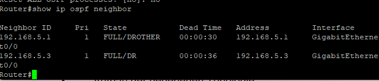
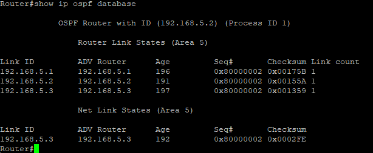
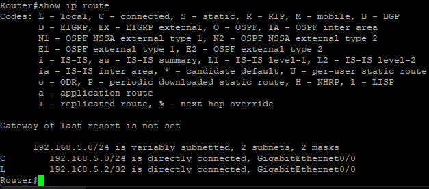
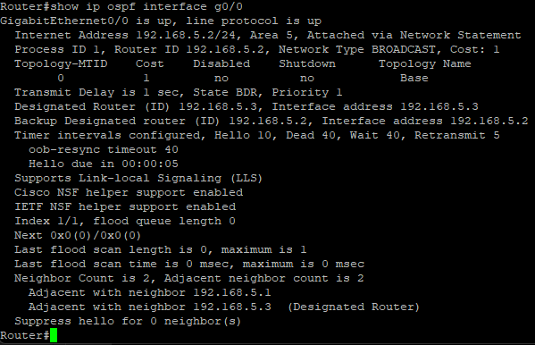
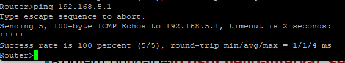
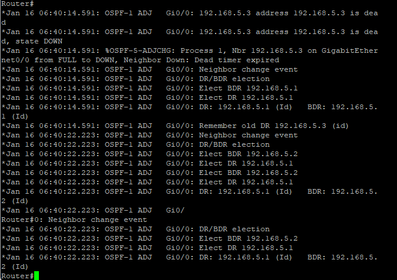
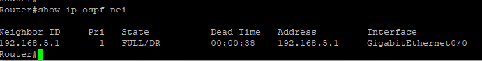
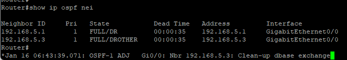

# **Titel: OSPF**

| **AufgabenNr:** | 09 |
|---|:---|
| **Klasse:** | 4AHIF |
| **Name:** | Benjamin Friedl |
| **Gruppe:** | 1 |
| **Abgabetermin:** | 30.1.2025 |
| **Abgabedatum:** | 29.01.2025 |

## **Kurzbeschreibung:**

In diesem Protokoll wird das OSPF-Protokoll behandelt. Ziel ist es, ein Netzwerk nach Angabe des Lehrers aufzubauen und das Open Shortest Path First (OSPF) zu konfigurieren.

---
\
\
\
\
\
\
\
\
\
\
\
\
\
\
\
\
\
\
\
\
\
\
\
\
\
\
\
\

# Inhaltsverzeichnis

- [Theorie](#theroie)
- [Übung](#topologie)
  - [Address Ranges](#address-ranges)
- [OSPF Setup](#ospf-setup)
  - [Basic Interface Configuration](#basic-interface-configuration)
  - [OSPF Configuration](#ospf-configuration)
  - [Anzeige und Analyse der Tabellen (Nachbar, Topologie, Routing)](#anzeige-und-analyse-der-tabellen-nachbar-topologie-routing)
  - [Welcher Netzwerktyp ist eingestellt?](#welcher-netzwerktyp-ist-eingestellt)
  - [Welche Timer verwendet OSPF und welche Werte sind konfiguriert?](#welche-timer-verwendet-ospf-und-welche-werte-sind-konfiguriert)
  - [Ändern Sie die Prioritäten derart das Wien DR und Wellington BDR wird.](#ändern-sie-die-prioritäten-derart-das-wien-dr-und-wellington-bdr-wird)
  - [Schalten sie den DR ab und zeichnen sie den Wahlvorgang auf](#schalten-sie-den-dr-ab-und-zeichnen-sie-den-wahlvorgang-auf)
  - [Router wieder einschalten](#router-wieder-einschalten)
  - [Konfigurieren Sie MD5 Authentication zwischen den Router](#konfigurieren-sie-md5-authentication-zwischen-den-router)

\
\
\
\
\
\
\
\
\
\
\
\
\
\
\
\
\
\
\
\
\
\
\
\
\
\
\
\
\

## Theroie

OSPF (Open Shortest Path First) ist ein Link-State-Routing-Protokoll, das den Dijkstra-Algorithmus verwendet, um den besten Pfad zu einem Ziel zu finden. OSPF ist ein **Interior Gateway Protocol (IGP)**, das in einem **Autonomous System (AS)** verwendet wird. OSPF verwendet **Hello-Pakete**, um Nachbarn zu entdecken und **Link State Advertisements (LSAs)**, um die Topologie des Netzwerks zu verbreiten.

OSPF hat 3 Tabellen:

- **Neighbor Table**: Liste der Nachbarn: wird durch *Hello-Pakete* aufgebaut (alle 30s)
- **Link State DB**: Liste aller Router und Links: wird durch *Link State Advertisements* aufgebaut
- **Routing Table**: Beste Pfade zu allen Zielen: wird durch den *Dijkstra-Algorithmus* berechnet

## Topologie

### Address Ranges

- 192.168.5.1
- 192.168.5.2
- 192.168.5.3

## OSPF Setup

### Basic Interface Configuration

```bash
Router(config)# interface g0/0
Router(config-if)# ip address 192.168.5.2 255.255.255.0 // wegen /24
```

### OSPF Configuration

```bash
Router(config)# router ospf 1
Router(config-router)# network 192.168.5.0 0.0.0.255 area 5
Router(config-router)# router-id 5.5.5.5
Router(config-router)# no shutdown
```

### Anzeige und Analyse der Tabellen (Nachbar, Topologie, Routing)

```bash
Router# show ip ospf neighbor
Router# show ip ospf database
Router# show ip route
```



The OSPF neighbor table contains the following information:

- **.1**: `FULL/DROTHER`
- **.2**: `FULL/BDR` // me
- **.3**: `FULL/DR`



<!-- todo -->
---



The routing table shows the following routes:

- **C**: directly connected: `192.168.5.0/24`
- **L**: local: `192.168.5.2/32`

#### Welcher Netzwerktyp ist eingestellt?

```bash
Router# show ip ospf interface g0/0
```



Netzwerktyp: **BROADCAST**

#### Welche Timer verwendet OSPF und welche Werte sind konfiguriert?

OSPF verwendet die folgenden Timer:

- **Hello Timer**: Zeitintervall, in dem ein Router ein Hello-Paket sendet. (default 10 Sekunden)
- **Dead Timer**: Zeitintervall, in dem ein Router einen Nachbarn als tot ansieht, wenn kein Hello-Paket empfangen wurde. (default 40 Sekunden)
- **LSA Timer**: Zeitintervall, in dem ein Router ein LSA-Paket sendet. (default 30 Minuten)
- **LSA Group Pacing Timer**: Zeitintervall, in dem ein Router ein LSA-Gruppenpaket sendet. (default 240 Sekunden)

**show current values:**

```bash
Router# show ip ospf
```

```bash
Router(config)# router ospf 1
Router(config-router)#
```

Wenn die Werte geändert werden, müssen sie auf allen Geräten im OSPF-Netzwerk gleich sein. Sind sie nicht gleich, kann es zu Problemen kommen (z.B. Routing-Schleifen) weil die Router nicht mehr synchron sind.


**Wichtig**: Man muss 20 Sekunden warten, bis die Änderungen wirksam werden.

<!-- TODO: change router timers img -->

### Ändern Sie die Prioritäten derart das Wien DR und Wellington BDR wird

Bei uns war das Default, zu lernzwecken haben wir es genau umgekehrt gemacht.

**print current values:**

```bash
Router# show ip ospf interface g0/0
```

Current values:

- **State**: `BDR`
- **Priority**: `1`

**change values:**

Die Priorität wird auf 255 gesetzt, damit der Router zum DR wird.

```bash
Router(config)# interface g0/0
Router(config-if)# ip ospf priority 255
```

### Schalten sie den DR ab und zeichnen sie den Wahlvorgang auf

Zuerst wird mit `debug ip ospf adj` das Debugging aktiviert.

Der Router mit DR wird mit `shutdown` abgeschaltet.



Der Router mit der höchsten Priorität wird zum DR und der Router mit der zweithöchsten Priorität wird zum BDR.



### Router wieder einschalten

Der Router wird wieder eingeschaltet.

```bash
Router(config)# interface g0/0
Router(config-if)# no shutdown
```

Der jetzt hinzugeschaltene Router wird zu `DROTHER` weil er sich neu hinzugeschaltet hat und die *Neuwahl* nicht automatisch durchgeführt wird.



Manueller Neustart des OSPF-Prozesses:

```bash
Router# clear ip ospf process
```

> ## Loopback-Interfaces
>
> Weil sich noch niemand mit dem Netzwerk verbunden hat können wir Loopback-Interfaces erstellen um die Funktionalität zu testen.
>
> ```bash
> Router(config)# interface loopback 0
> Router(config-if)# ip address 10.20.5.254 255.255.255.0
> ```

### Konfigurieren Sie MD5 Authentication zwischen den Router

MD5 Authentication wird verwendet, um OSPF-Nachrichten zu authentifizieren. Die Konfiguration erfolgt in zwei Schritten:

1. **Konfiguration des Schlüssels:**

```bash
Router(config)# key chain OSPF
Router(config-keychain)# key 1
Router(config-keychain-key)# key-string password
```

2. **Konfiguration der Authentifizierung:**

```bash
Router(config)# interface g0/0
Router(config-if)# ip ospf message-digest-key 1 md5 password
```

> Der Schlüssel muss auf allen Geräten im OSPF-Netzwerk konfiguriert werden.

Testen: Wenn man versucht, sich mit einem Router zu verbinden, der nicht den gleichen Schlüssel hat, wird die Verbindung fehlschlagen.
