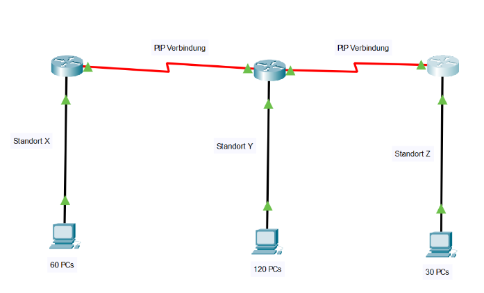
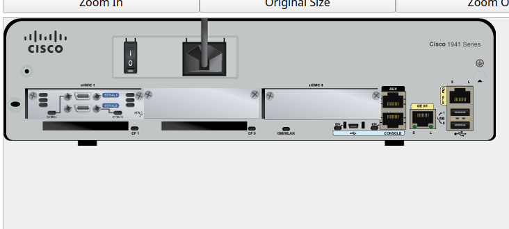
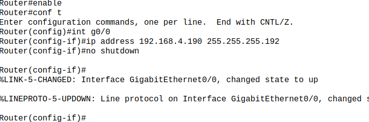
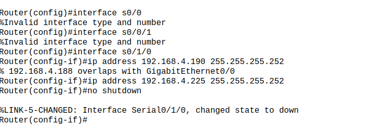
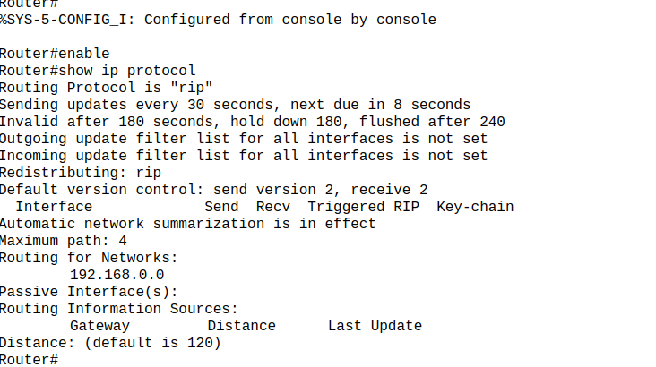
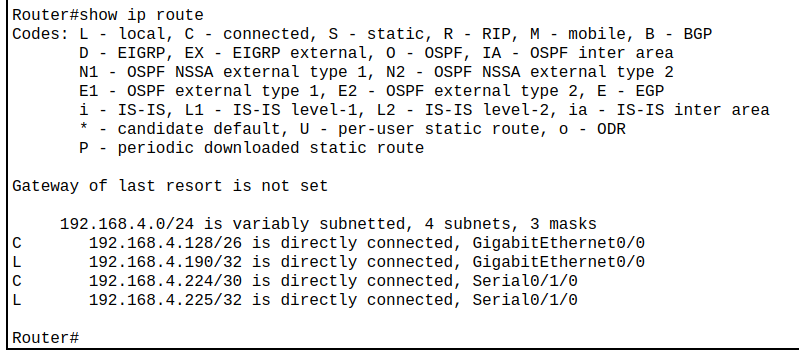

# **Titel: RIP**

| **AufgabenNr:** | 05 |
|---|:---|
| **Klasse:** | 4AHIF |
| **Name:** | Benjamin Friedl |
| **Gruppe:** | 1 |
| **Abgabetermin:** | 16.01.2025 |
| **Abgabedatum:** | 15.01.2025 |

## **Kurzbeschreibung:**

In diesem Protokoll wird das RIP-Protokoll behandelt. Ziel ist es, ein Netzwerk nach Angabe des Lehrers aufzubauen und das Routing Information Protocol (RIP) zu konfigurieren.

---
\
\
\
\
\
\
\
\
\
\
\
\
\
\
\
\
\
\
\
\
\
\
\
\
\
\
\
\

# Inhaltsverzeichnis

- [Theorie](#theorie)
  - [1. Allgemeine Aufgaben und Funktionen des RIP](#1-allgemeine-aufgaben-und-funktionen-des-rip)
- [Übung](#übung)
  - [Aufbau des Netzwerkes](#aufbau-des-netzwerkes)
  - [Routing RIP an allen angeschlossenen Netzwerken aktivieren](#routing-rip-an-allen-angeschlossenen-netzwerken-aktivieren)
    - [Einrichten](#einrichten)
    - [RIP Aktivieren](#rip-aktivieren)
    - [Welchen Timer verwendet RIP?](#3-welchen-timer-verwendet-rip)
    - [Routing Tabelle](#4-routing-tabelle)
    - [Split Horizon](#5-split-horizon)
    - [Mögliche Befehle im Router-Konfigurationsmodus](#6-mögliche-befehle-im-router-konfigurationsmodus)
    - [Default Gateway](#7-default-gateway)

\
\
\
\
\
\
\
\
\
\
\
\
\
\
\
\
\
\
\
\
\
\
\
\
\
\
\
\
\

## Theorie

### 1. Allgemeine Aufgaben und Funktionen des RIP

Das Routing Information Protocol (RIP) ist ein Routing-Protokoll. Der Sinn des Protokolls ist es, die besten Routen zu einem Ziel zu finden. RIP verwendet den **Bellman-Ford-Algorithmus**, was es für kleine Netzwerke geeignet macht. Der Nachteil gegenüber beispielsweise OSPF ist, dass es nur 15 Hops unterstützt.

Um zu entscheiden, welche Route die beste ist, wird eine `Routing-Tabelle` verwendet. In dieser Tabelle sind alle Routen und deren Kosten gespeichert. Die Kosten sind die Anzahl der Hops, die ein Paket machen muss, um das Ziel zu erreichen.

Es wirt mit Codes gearbeitet, die die Art der Route beschreiben. Beispielsweise `C` für Connected, `S` für Static, `R` für RIP, `O` für OSPF, `B` für BGP.

## Übung

### Aufbau des Netzwerkes



- Router 1 (120Pcs): 192.168.0.0/25 -> Subnetzmaske: 255.255.
- Router 2 (60Pcs): 192.168.0.128/26 -> Subnetzmaske: 255.255.255.192
- Router 3 (30Pcs): 192.168.0.192/27



PtP1: 2 Bits Hostanteil, 192.168.4.224/30, Netzmaske .252, Adressen .224-.227
PtP2: 2 Bits Hostanteil, 192.168.4.228/30, Netzmaske .252, Adressen .228-.231

> ### Punkt zu Punkt Verbindung
>
> Eine Punkt-zu-Punkt-Verbindung ist eine Verbindung zwischen zwei Endpunkten. Es gibt keine anderen Geräte, die die Verbindung nutzen. Ein Beispiel dafür ist eine serielle Verbindung zwischen zwei Routern.
>
> Eine Punkt-zu-Punkt Verbindung hat immer **2 Hosts** => **2 Bits Hostanteil** => **Netzmaske** `255.255.255.252`

### Routing RIP an allen angeschlossenen Netzwerken aktivieren

#### Einrichten

Zuerst muss das Interface mit `no shutdown` aktiviert werden. Danach wird die IP-Adresse und die Subnetzmaske konfiguriert.

```bash
Router(config)# interface g0/0 // GigaBitEthernet 0/0
Router(config-if)# ip address 192.168.4.190 255.255.255.192
Router(config-if)# no shutdown
```



Das muss für alle Router gemacht werden.

Die **Seriellen Verbindungen**:

```bash
Router(config)# interface s0/0/1 // Serial
Router(config-if)# ip address 192.168.4.190 255.255.255.252 // 252: 
Router(config-if)# no shutdown
```



**IP Adressen:**

- R1: .192
- R2: .126
. R3: .222

---

### RIP Aktivieren

```bash
Router(config)# router rip
Router(config-router)# network 192.168.0.0 // Netzwerkadresse
Router(config-router)# version 2
Router(config-router)# show ip protocols
```

Der letzte Befehl zeigt die IP-Protokolle an. Zu sehen ist, dass RIP aktiviert ist.



### 3 Welchen Timer verwendet RIP

- **Update Timer**: Zeitintervall, in dem ein Router ein Update-Paket sendet. (default 30 Sekunden)
- **Invalid Timer**: Zeitintervall, in dem ein Router eine Route als ungültig ansieht, wenn kein Update-Paket empfangen wurde. (default 180 Sekunden)
- **Hold-Down Timer**: Zeitintervall, in dem ein Router auf ein Update-Paket wartet. (default 180 Sekunden)
- **Flush Timer**: Zeitintervall, in dem ein Router eine Route als tot ansieht. (default 240 Sekunden)

### 4 Routing Tabelle

```bash
Router# show ip route
```



Die Routing-Tabelle zeigt die Routen an, die der Router kennt. Der Screenshot is vom Standort Amstetten. Man sieht die Routen zu den Standorten Tulln (Serial 0/1/0) und den 60 PCs (GigaBitEthernet 0/0) die über RIP konfiguriert wurden.

Die **Administrative Distance** (AD) ist bei RIP 120.

### 5 Split Horizon

Split Horizon ist eine Methode, um Routing-Schleifen zu verhindern. Dabei wird eine Route nicht an den Router weitergegeben, von dem sie empfangen wurde.

**Ausschalten:**

```bash
Router(config)# no ip split-horizon
```

Wenn Split Horizon ausgeschaltet ist, kann es zu Routing-Schleifen kommen. Die Updates werden dann an den Router weitergegeben, von dem sie empfangen wurden.

### 6 Mögliche Befehle im Router-Konfigurationsmodus

Die möglichen Befehle können mit `?` angezeigt werden. Dafür muss man sich im Konfigurationsmodus des Routers befinden.

```bash
Router(config)# router rip
Router(config-router)# ?
```


### 7 Default Gateway

Mit dem Befehl `ip default-gateway` kann ein Default Gateway konfiguriert werden.

```bash
Router(config)# ip default-gateway 192.168.4.230
```
