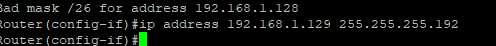
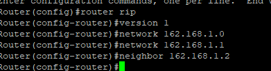

# **Titel: RIP**

| **AufgabenNr:** | 05 |
|---|:---|
| **Klasse:** | 4AHIF |
| **Name:** | Benjamin Friedl |
| **Gruppe:** | 1 |
| **Abgabetermin:** | X |
| **Abgabedatum:** | X |

## **Kurzbeschreibung:**

In diesem Protokoll wird das RIP-Protokoll behandelt. Ziel ist es, ein Netzwerk nach Angabe des Lehrers aufzubauen und das Routing Information Protocol (RIP) zu konfigurieren.

---
\
\
\
\
\
\
\
\
\
\
\
\
\
\
\
\
\
\
\
\
\
\
\
\
\
\
\
\

# Inhaltsverzeichnis

\
\
\
\
\
\
\
\
\
\
\
\
\
\
\
\
\
\
\
\
\
\
\
\
\
\
\
\
\

## Theorie

### 1. Allgemeine Aufgaben und Funktionen des RIP

Das Routing Information Protocol (RIP) ist ein Routing-Protokoll, welches für kleinere Netzwerke geeignet ist.
<!-- // TODO -->

## Übung

### Aufbau des Netzwerkes


- Router 1 (120Pcs): 192.168.0.0/25 -> Subnetzmaske: 255.255.
- Router 2 (60Pcs): 192.168.0.128/26 -> Subnetzmaske: 255.255.255.192
- Router 3 (30Pcs): 192.168.0.192/27

### Router konfigurieren

#### Router 2 konfigurieren

`ip address 192.168.1.129 255.255.255.192` -> IP-Adresse und Subnetzmaske setzen



```bash
Router> enable
Router# conf t
Router(config)# interface g0/1
Router(config-if)# ip address <IP> <Subnet>
Router(config-if)# no shutdown
Router(config-if)# exit
Router(config)# router rip
Router(config-router)# network
Router(config-router)# exit
Router(config)# exit
Router# wr
```

### Router verbinden u. einschalten

Mit Putty auf die Router verbinden und einschalten:

```bash
Router> enable
Router# conf t
Router(config)# interface g0/1 // = interface gigabitethernet 0/1
```

### Netzwerkverbindung aufzubauen

Mithilfe einer Seriellen Verbindung die Router miteinander verbinden.

### Konfiguration der Router



###
