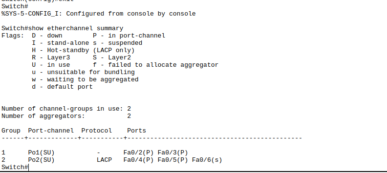
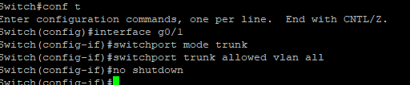
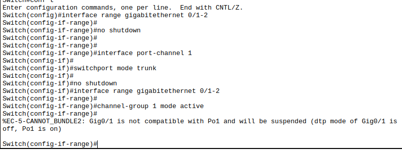
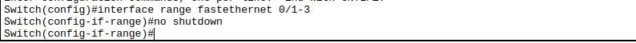

# **Titel: Spanning Tree**

| **AufgabenNr:** | 01 |
|---|:---|
| **Klasse:** | 4AHIF |
| **Name:** | Benjamin Friedl |
| **Gruppe:** | 1 |
| **Abgabetermin:** | 17.10.2024 |
| **Abgabedatum:** | 17.10.2024 |

## **Kurzbeschreibung:**

In diesem Protokoll wird das Spanning Tree Protocol (STP) behandelt. STP ist ein Netzwerkprotokoll, das in Switches verwendet wird, um Netzwerkschleifen zu vermeiden und die Netzwerkkonvergenz zu gewährleisten. Dieses Protokoll bestimmt

---
\
\
\
\
\
\
\
\
\
\
\
\
\
\
\
\
\
\
\
\
\
\
\
\
\
\
\
\

# Inhaltsverzeichnis

1. [Allgemeine Aufgaben und Funktionen des STP](#1-allgemeine-aufgaben-und-funktionen-des-stp)
2. [Timer im Spanning Tree Protocol](#2-timer-im-spanning-tree-protocol)
3. [Theoretische Fragen](#3-theoretische-fragen)
4. [Praktische Übungen](#4-praktische-übungen)
   1. [Packet Tracer](#4b-packet-tracer)
      1. [Clients mit Switch verbinden](#clients-mit-switch-verbinden)
      2. [Portfast aktivieren](#portfast-aktivieren)
      3. [BPDU Guard aktivieren](#bpdu-guard-aktivieren)
      4. [Richten Sie einen Ssh-Zugang zum Switch ein. Wählen sie dazu passende IP Adressen (Testen)](#richten-sie-einen-ssh-zugang-zum-switch-ein-wählen-sie-dazu-passende-ip-adressen-testen)
\
\
\
\
\
\
\
\
\
\
\
\
\
\
\
\
\
\
\
\
\
\
\
\
\
\
\
\
\
\
\
\
\
\
\
\

## 1. Allgemeine Aufgaben und Funktionen des STP

Das **Spanning Tree Protocol** (STP) hat folgende Funktionen:

- Verhindern von Netzwerkschleifen: STP erkennt redundante Pfade und deaktiviert unnötige Links, um Schleifen zu vermeiden.
- Ermitteln einer Root Bridge: Der Switch mit der niedrigsten Bridge-ID wird zur Root Bridge gewählt.
- Verwalten der Netzwerkpfade: Jeder Switch bestimmt einen optimalen Pfad zur Root Bridge.
-Port-Zustände: STP kann Ports in verschiedene Zustände versetzen, wie **z. B.:**
  - **Blocking**: Der Port leitet keine Frames weiter, empfängt aber BPDU-Nachrichten.
  - **Listening**: Der Port hört auf BPDU-Nachrichten, leitet aber keine Frames weiter.
  - **Learning**: Der Port beginnt, MAC-Adressen zu lernen, leitet aber noch keine Frames weiter.
  - **Forwarding**: Der Port leitet Daten weiter und lernt MAC-Adressen.
  - **Disabled**: Der Port ist deaktiviert

## 2. Timer im Spanning Tree Protocol

**STP verwendet drei Haupt-Timer, um das Netzwerk zu stabilisieren:**

- **Hello-Timer** (Standard 2 Sekunden): Gibt an, wie oft die Root Bridge BPDU-Nachrichten sendet.
- **Max Age-Timer** (Standard 20 Sekunden): Gibt an, wie lange ein Switch eine BPDU behält, bevor er den Pfad als ungültig betrachtet.
- **Forward Delay-Timer** (Standard 15 Sekunden): Gibt die Dauer an, wie lange ein Port im Listening- und Learning-Zustand bleibt.

## 3. Theoretische Fragen

### 3.1 Welcher Switch wird die Root Bridge?

A: Der Switch mit der niedrigsten Bridge-ID wird zur Root Bridge gewählt (MAC: 3ce5.c3a6.fa80)

### 3.2 Welche Ports werden Root Ports?

A: Die Ports, die den kürzesten Pfad zur Root Bridge haben, werden zu Root Ports. In diesem Fall sind dies die Ports, die direkt mit der Root Bridge verbunden sind.

### 3.3 Wo ist der Non-Designated/Designated Ports? Wie kommt die Entscheidung zustande?

A: Der Non-Designated Port ist der Port, der nicht zum kürzesten Pfad zur Root Bridge gehört. Der Designated Port ist der Port, der zum kürzesten Pfad zur Root Bridge gehört. Die Entscheidung wird durch die Bridge-ID und den Portkosten getroffen.
<!-- Todo: Image -->

## 4. Schleife schließen

### 4.1 Schleife schließen

### 4.2 Annahmen prüfen




## 5. Root Bridge ändern

```bash
Switch(config)# spanning-tree vlan 1 root primary
```



## 6. Spanning Tree deaktivieren

```bash
Switch(config)# no spanning-tree vlan 1
```

Dieser Befehl deaktiviert das Spanning Tree Protocol für VLAN 1 auf dem Switch. Dadurch werden alle Ports in den Forwarding-Zustand versetzt, was zu Netzwerkschleifen führen kann. Die Ports fangen an, Daten zu senden und blinken, was zu einer Überlastung des Netzwerks führen kann. Um das zu beenden muss man die Switches neu starten.

```bash
Switch# reload
```

## 4b. Packet tracer

### Clients mit Switch verbinden


**Mac adressen der Clients:**


### Portfast aktivieren

Portfast ist eine Funktion, die die Konvergenzzeit (Reaktionszeit)
des Spanning Tree Protocol (STP) verkürzt, indem sie den Listening- und Learning-Zustand überspringt. Portfast wird auf Access-Ports angewendet, die mit Endgeräten wie PCs, Druckern und Servern verbunden sind. Wenn ein Port mit Portfast aktiviert ist, wird er sofort in den Forwarding-Zustand versetzt, ohne die normalen STP-Zustände durchlaufen zu müssen.

```bash
Switch(config)# interface range fa0/1-2
Switch(config-if-range)# spanning-tree portfast
```

Der erste Befehl wählt die Schnittstellen aus, die konfiguriert werden sollen, und der zweite Befehl aktiviert Portfast auf diesen Schnittstellen.


### BPDU Guard aktivieren

BPDU Guard ist eine Sicherheitsfunktion, die verhindert, dass Switches an Access-Ports angeschlossen werden. Wenn ein Switch an einem Access-Port angeschlossen ist, sendet er BPDU-Nachrichten, die normalerweise nur von Root-Bridges gesendet werden. Wenn der Switch BPDU-Nachrichten empfängt, wird der Port deaktiviert, um Netzwerkschleifen zu verhindern.

> **Hinweis:** BPDU Guard wird normalerweise auf Access-Ports aktiviert, um sicherzustellen, dass nur Endgeräte angeschlossen sind.

```bash
Switch(config)# interface range fa0/1-2
Switch(config-if-range)# spanning-tree bpduguard enable
```



### Richten Sie einen Ssh-Zugang zum Switch ein. Wählen sie dazu passende IP Adressen (Testen)

**Schritte:**

1. Konfigurieren Sie die IP-Adresse und das Subnetz auf dem Switch.
2. Aktivieren Sie den SSH-Zugriff auf dem Switch.
3. Konfigurieren Sie ein Passwort für den SSH-Zugriff.

**Konfiguration:**

- IP-Adresse bekommen:

> **Hinweis:** Die IP-Adresse muss im selben Subnetz wie der Client sein.

> #### Config:
> - IP Client: `10.0.0.4`
>-  Subnetz: `255.0.0.0`


```bash
Switch(config)# interface vlan 1 // enter the vlan interface
Switch(config-if)# ip address // set the ip address
Switch(config-if)# no shutdown // activate the interface
```


- SSH-Zugriff aktivieren:

```bash
Switch(config)# ip domain-name example.com
Switch(config)# hostname <hostname> // for example: hostname myswitch
Switch(config)# crypto key generate rsa <hostname> // for example: crypto key generate rsa switch
Switch(config)# ip ssh version 2
Switch(config)# line vty 0 15
Switch(config-line)# transport input ssh
```


- Passwort konfigurieren:

```bash
Switch(config)# username admin password admin
```


- Testen:

```bash
ssh admin 
```


Jetzt können Sie sich mit dem Switch über SSH verbinden, was die Sicherheit erhöht, da der SSH-Zugriff verschlüsselt ist.
