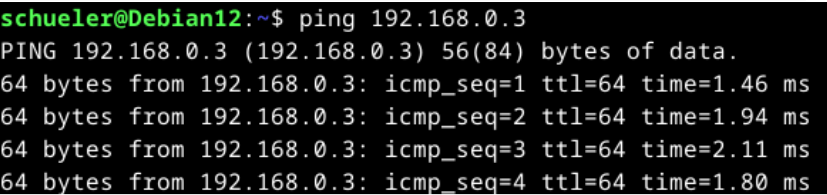
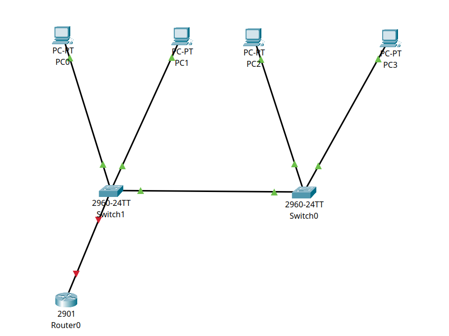
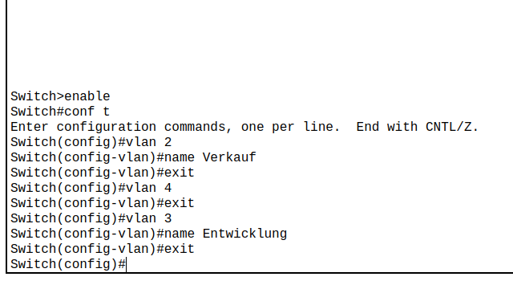
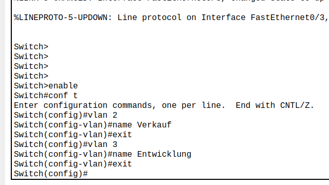
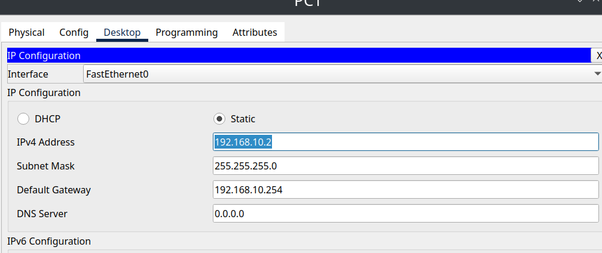
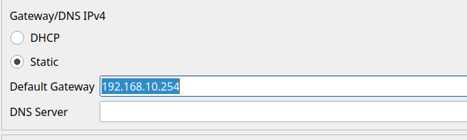
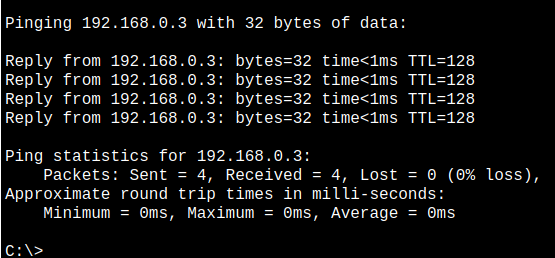
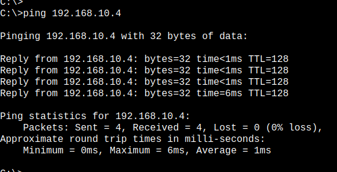

# **Titel: VLan**

| **AufgabenNr:** | 03 |
|---|:---|
| **Klasse:** | 4AHIF |
| **Name:** | Benjamin Friedl |
| **Gruppe:** | 1 |
| **Abgabetermin:** | 21.11.2024 |
| **Abgabedatum:** | 20.11.2024 |

## **Kurzbeschreibung:**

In diesem Protokoll wird das Virtual Local Area Network (VLAN) behandelt. VLANs sind logische Gruppen von Geräten, die so konfiguriert sind, als ob sie sich in einem einzigen physischen LAN befinden. VLANs ermöglichen es, dass Geräte in verschiedenen physischen Standorten in einem Netzwerk miteinander kommunizieren können, als ob sie sich im selben physischen Standort befinden.

---
\
\
\
\
\
\
\
\
\
\
\
\
\
\
\
\
\
\
\
\
\
\
\
\
\
\
\
\

# Inhaltsverzeichnis

- [Angabe](#angabe)
- [Commands](#commands)
- [VLAN Konfiguration](#vlan-konfiguration)
  - [Löschen Sie ggf. die bestehende Konfiguration](#löschen-sie-ggf-die-bestehende-konfiguration)
  - [Erstellen der Trunkverbindung (letzter Port). Kontrolle mittels CDP](#erstellen-der-trunkverbindung-letzter-port-kontrolle-mittels-cdp)
  - [Konfiguration von Switch_Etage1 als Server, Switch_Etage2 als Client](#konfiguration-von-switch_etage1-als-server-switch_etage2-als-client)
  - [Anzeige der VTP Konfiguration](#anzeige-der-vtp-konfiguration)
  - [Erstellen von VLAN: Verkauf und Entwicklung](#erstellen-von-vlan-verkauf-und-entwicklung)
  - [Zuweisen der Ports 1-3 zu Verkauf; 4-6 zu Entwicklung](#zuweisen-der-ports-1-3-zu-verkauf-4-6-zu-entwicklung)
  - [Anzeige und Analyse der VLAN Konfiguration](#anzeige-und-analyse-der-vlan-konfiguration)
  - [Überprüfen der Verbindung (Ping)](#überprüfen-der-verbindung-ping)
- [Inter-VLAN Routing](#inter-vlan-routing)
  - [Aufbau](#aufbau)
    - [Trunk-Port](#trunk-port)
    - [Router](#router)
    - [Standartgateway für Clients für VLAN](#standartgateway-für-clients-für-vlan)
  - [Überprüfen der Erreichbarkeiten](#überprüfen-der-erreichbarkeiten)
\
\
\
\
\
\
\
\
\
\
\
\
\
\
\
\
\
\
\
\
\
\
\
\
\
\
\
\
\

## Angabe

- VLAN Konfiguration
  - Löschen Sie ggf. die bestehende Konfiguration
  - Erstellen der Trunkverbindung (letzter Port). Kontrolle mittels CDP
  - Konfiguration von Switch_Etage1 als Server, Switch_Etage2 als Client
  - Konfiguration der VTP Domain: IFDOM
  - Anzeige der VTP Konfiguration
  - Erstellen von VLAN: Verkauf und Entwicklung
  - Zuweisen der Ports 1-3 zu Verkauf; 4-6 zu Entwicklung
  - Anzeige und Analyse der VLAN Konfiguration
  - Überprüfen der Verbindung (Ping)

- Inter-VLAN Routing
  - Aktivieren Sie das Intervlan Routing
  - Überprüfen der Erreichbarkeiten

## Commands

- `show vlan`: Zeigt die VLAN-Konfiguration an
- `show vtp status`: Zeigt den VTP-Status an

> VTP: VLAN Trunking Protocol
>
> - VTP ist ein Protokoll, das die Konfiguration von VLANs auf einem Netzwerk von Switches vereinfacht.
> - VTP ermöglicht es, VLAN-Informationen über das Netzwerk zu verteilen.
> - VTP ermöglicht es, VLANs auf einem Switch zu erstellen, zu löschen und zu ändern, und diese Änderungen werden automatisch auf alle anderen Switches im Netzwerk übertragen.

## VLAN Konfiguration

### Löschen Sie ggf. die bestehende Konfiguration

Die VLAN-Konfig ist eine Datei, die auf dem Flash-Speicher des Switches gespeichert ist. Diese Datei kann gelöscht werden, um die VLAN-Konfiguration zurückzusetzen.

```bash
Switch# delete flash:vlan.dat
Switch# reload
```


### Erstellen der Trunkverbindung (letzter Port). Kontrolle mittels CDP

```bash
Switch(config)# interface range fa0/24 // range bezieht sich auf die Ports 24-48
Switch(config-if-range)# switchport mode trunk
Switch(config-if-range)# switchport trunk allowed vlan all // erlaubt alle VLANs
Switch(config-if-range)# no shutdown
```


### Konfiguration von Switch_Etage1 als Server, Switch_Etage2 als Client

Jeder Switch kann als VTP-Server, VTP-Client oder VTP-Transparent konfiguriert werden.

**Server**: Der VTP-Server ist für die Erstellung, Änderung und Löschung von VLANs verantwortlich. Die Änderungen werden an alle VTP-Clients und VTP-Server im Netzwerk verteilt.

```bash
Switch_Etage1(config)# vtp mode server
Switch_Etage1(config)# vtp domain IFTS
Switch_Etage1(config)# vtp password cisco
Switch_Etage1(config)# vtp version 2
Switch_Etage1(config)# no shutdown
```

**Client**: Der VTP-Client empfängt die VLAN-Informationen vom VTP-Server und speichert sie in der VLAN-Datenbank.

```bash
Switch_Etage2(config)# vtp mode client
Switch_Etage2(config)# vtp domain IFTS // muss mit dem VTP-Domain-Namen des VTP-Servers übereinstimmen
Switch_Etage2(config)# vtp password cisco
Switch_Etage2(config)# vtp version 2
Switch_Etage2(config)# no shutdown
```


### Anzeige der VTP Konfiguration

```bash
Switch_Etage1# show vtp status
```

### Erstellen von VLAN: Verkauf und Entwicklung

```bash
Switch_Etage1(config)# vlan 10
Switch_Etage1(config-vlan)# name Verkauf
Switch_Etage1(config)# vlan 20
Switch_Etage1(config-vlan)# name Entwicklung
```


### Zuweisen der Ports 1-3 zu Verkauf; 4-6 zu Entwicklung

```bash
Switch_Etage1(config)# interface range fa0/1-3
Switch_Etage1(config-if-range)# switchport mode access
Switch_Etage1(config-if-range)# switchport access vlan 10
Switch_Etage1(config-if-range)# no shutdown
```

```bash
Switch_Etage1(config)# interface range fa0/4-6
Switch_Etage1(config-if-range)# switchport mode access
Switch_Etage1(config-if-range)# switchport access vlan 20
Switch_Etage1(config-if-range)# no shutdown
```


### Anzeige und Analyse der VLAN Konfiguration

```bash
Switch_Etage1# show vlan
```

```bash
Switch_Etage1# show vlan brief // zeigt eine kompakte Übersicht der VLAN-Konfiguration
```


### Überprüfen der Verbindung (Ping)

Um die Verbindung zwischen den VLANs zu überprüfen setzen wir eine VM auf, die sich in einem anderen VLAN befindet. Dafür verwenden wir Debian VMs, wie die aufgesetzt werden kann siehe vorherige Protokolle.

**Kurzgefasst**:

Diese VM muss man die VM über das zweite Netzwerkinterface mit dem Switch verbinden. Die VM braucht eine feste IP-Adresse. Wegen den VLANs sind jetzt schon andere Rechner nicht mehr erreichbar. Die VM muss also in das VLAN eingetragen werden.

```bash
DebianVM:~$ ping <IP-Adresse>
```



## Inter-VLAN Routing

**Allgemein**: Inter-VLAN-Routing ist die Kommunikation zwischen VLANs. Standardmäßig können Geräte in verschiedenen VLANs nicht miteinander kommunizieren, da sie in unterschiedlichen Broadcast-Domänen sind. Inter-VLAN-Routing ermöglicht es, dass Geräte in verschiedenen VLANs miteinander kommunizieren können.

### Aufbau



- Es gibt 4 Endgeräte, die sich in verschiedenen VLANs befinden.
- Es sind jeweils zwei Geräte mit einem Switch verbunden.
- Ein Switch (Etage 1) ist mit einem Router verbunden.
- Die Switches sind über Trunk-Ports miteinander verbunden.
- Vlan `Verkauf` bekommt id 2
- Vlan `Entwicklung` bekommt id 3

#### Trunk-Port

Ein Trunk-Port ist ein Port, der Daten von mehreren VLANs übertragen kann. Trunk-Ports werden verwendet, um Daten zwischen Switches zu übertragen.




Die Endgeräte brauchen alle eine IP-Adresse:



#### Router

Jetzt müssen wir das Inter-VLAN-Routing auf dem Router aktivieren.

**Wichtig**: Erst nur das Interface aktivieren, dann die IP-Adresse setzen.

```bash
Router>enable
Router#conf t
Enter configuration commands, one per line.  End with CNTL/Z.
Router(config)#int g0/0
Router(config-if)#no shut

Router(config-if)#
%LINK-5-CHANGED: Interface GigabitEthernet0/0, changed state to up

%LINEPROTO-5-UPDOWN: Line protocol on Interface GigabitEthernet0/0, changed state to up

Router(config-if)#exit
Router(config)#int g0/0.3
Router(config-subif)#
%LINK-5-CHANGED: Interface GigabitEthernet0/0.3, changed state to up

%LINEPROTO-5-UPDOWN: Line protocol on Interface GigabitEthernet0/0.3, changed state to up

Router(config-subif)#encaps dot 3
Router(config-subif)#ip addr 192.168.10.154 255.255.255.0
Router(config-subif)#
```

#### Standartgateway für Clients für VLAN



### Überprüfen der Erreichbarkeiten

Die Clients in den VLANs sollten jetzt miteinander kommunizieren können.

```cmd
<!-- get ip address -->
C:\>ping 192.168.0.3
```



Und jetzt funktioniert es auch im anderen VLAN:

```cmd
C:\>ping 192.168.10.4
```


