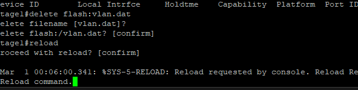
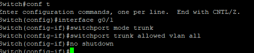
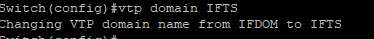
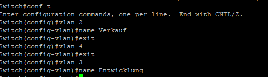
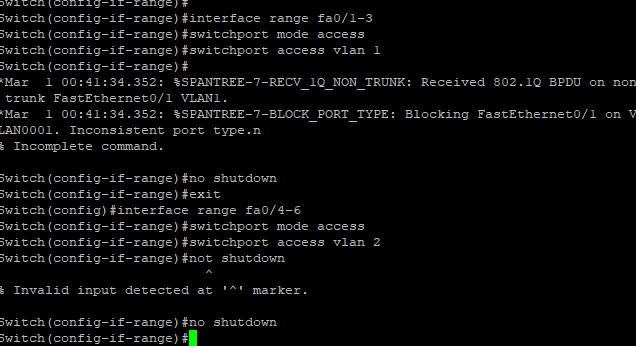
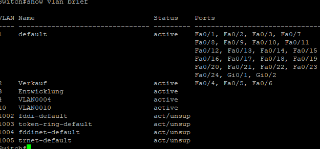

# **Titel: VLan**

| **AufgabenNr:** | 03 |
|---|:---|
| **Klasse:** | 4AHIF |
| **Name:** | Benjamin Friedl |
| **Gruppe:** | 1 |
| **Abgabetermin:** | X |
| **Abgabedatum:** | X |

## **Kurzbeschreibung:**

In diesem Protokoll wird das Virtual Local Area Network (VLAN) behandelt. VLANs sind logische Gruppen von Geräten, die so konfiguriert sind, als ob sie sich in einem einzigen physischen LAN befinden. VLANs ermöglichen es, dass Geräte in verschiedenen physischen Standorten in einem Netzwerk miteinander kommunizieren können, als ob sie sich im selben physischen Standort befinden.

---
\
\
\
\
\
\
\
\
\
\
\
\
\
\
\
\
\
\
\
\
\
\
\
\
\
\
\
\

# Inhaltsverzeichnis


\
\
\
\
\
\
\
\
\
\
\
\
\
\
\
\
\
\
\
\
\
\
\
\
\
\
\
\
\

## Angabe

- VLAN Konfiguration
  - Löschen Sie ggf. die bestehende Konfiguration
  - Erstellen der Trunkverbindung (letzter Port). Kontrolle mittels CDP
  - Konfiguration von Switch_Etage1 als Server, Switch_Etage2 als Client
  - Konfiguration der VTP Domain: IFDOM
  - Anzeige der VTP Konfiguration
  - Erstellen von VLAN: Verkauf und Entwicklung
  - Zuweisen der Ports 1-3 zu Verkauf; 4-6 zu Entwicklung
  - Anzeige und Analyse der VLAN Konfiguration
  - Überprüfen der Verbindung (Ping)

- Inter-VLAN Routing
  - Aktivieren Sie das Intervlan Routing
  - Überprüfen der Erreichbarkeiten

## Commands

- `show vlan`: Zeigt die VLAN-Konfiguration an
- `show vtp status`: Zeigt den VTP-Status an

> VTP: VLAN Trunking Protocol
>
> - VTP ist ein Protokoll, das die Konfiguration von VLANs auf einem Netzwerk von Switches vereinfacht.
> - VTP ermöglicht es, VLAN-Informationen über das Netzwerk zu verteilen.
> - VTP ermöglicht es, VLANs auf einem Switch zu erstellen, zu löschen und zu ändern, und diese Änderungen werden automatisch auf alle anderen Switches im Netzwerk übertragen.

## VLAN Konfiguration

### Löschen Sie ggf. die bestehende Konfiguration

Die VLAN-Konfig ist eine Datei, die auf dem Flash-Speicher des Switches gespeichert ist. Diese Datei kann gelöscht werden, um die VLAN-Konfiguration zurückzusetzen.

```bash
Switch# delete flash:vlan.dat
Switch# reload
```



### Erstellen der Trunkverbindung (letzter Port). Kontrolle mittels CDP

```bash
Switch(config)# interface range fa0/24 // range bezieht sich auf die Ports 24-48
Switch(config-if-range)# switchport mode trunk
Switch(config-if-range)# switchport trunk allowed vlan all // erlaubt alle VLANs
Switch(config-if-range)# no shutdown
```



### Konfiguration von Switch_Etage1 als Server, Switch_Etage2 als Client

Jeder Switch kann als VTP-Server, VTP-Client oder VTP-Transparent konfiguriert werden.

**Server**: Der VTP-Server ist für die Erstellung, Änderung und Löschung von VLANs verantwortlich. Die Änderungen werden an alle VTP-Clients und VTP-Server im Netzwerk verteilt.

```bash
Switch_Etage1(config)# vtp mode server
Switch_Etage1(config)# vtp domain IFTS
Switch_Etage1(config)# vtp password cisco
Switch_Etage1(config)# vtp version 2
Switch_Etage1(config)# no shutdown
```


**Client**: Der VTP-Client empfängt die VLAN-Informationen vom VTP-Server und speichert sie in der VLAN-Datenbank.

```bash
Switch_Etage2(config)# vtp mode client
Switch_Etage2(config)# vtp domain IFTS // muss mit dem VTP-Domain-Namen des VTP-Servers übereinstimmen
Switch_Etage2(config)# vtp password cisco
Switch_Etage2(config)# vtp version 2
Switch_Etage2(config)# no shutdown
```



### Anzeige der VTP Konfiguration

```bash
Switch_Etage1# show vtp status
```

### Erstellen von VLAN: Verkauf und Entwicklung

```bash
Switch_Etage1(config)# vlan 10
Switch_Etage1(config-vlan)# name Verkauf
Switch_Etage1(config)# vlan 20
Switch_Etage1(config-vlan)# name Entwicklung
```




### Zuweisen der Ports 1-3 zu Verkauf; 4-6 zu Entwicklung

```bash
Switch_Etage1(config)# interface range fa0/1-3
Switch_Etage1(config-if-range)# switchport mode access
Switch_Etage1(config-if-range)# switchport access vlan 10
Switch_Etage1(config-if-range)# no shutdown
```

```bash
Switch_Etage1(config)# interface range fa0/4-6
Switch_Etage1(config-if-range)# switchport mode access
Switch_Etage1(config-if-range)# switchport access vlan 20
Switch_Etage1(config-if-range)# no shutdown
```



### Anzeige und Analyse der VLAN Konfiguration

```bash
Switch_Etage1# show vlan
```

```bash
Switch_Etage1# show vlan brief // zeigt eine kompakte Übersicht der VLAN-Konfiguration
```



### Überprüfen der Verbindung (Ping)

Um die Verbindung zwischen den VLANs zu überprüfen, können wir einen Ping-Befehl verwenden.
Um Ping zu verwenden brauchen wir eine IP-Adresse. Diese können wir mit dem `ip address` Befehl konfigurieren.

```bash
Switch_Etage1(config)# interface vlan 10
Switch_Etage1(config-if)# ip address <ip_adress> <subnet_mask>
// Beispiel: ip address 192.168.0.17 255.255.255.0
```

```bash
Switch_Etage1# ping
```

## Inter-VLAN Routing
