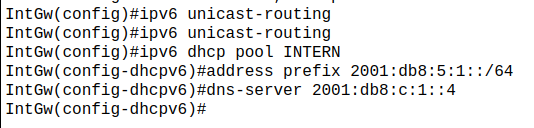
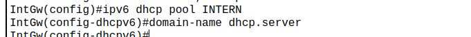
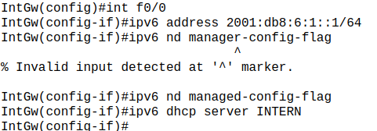
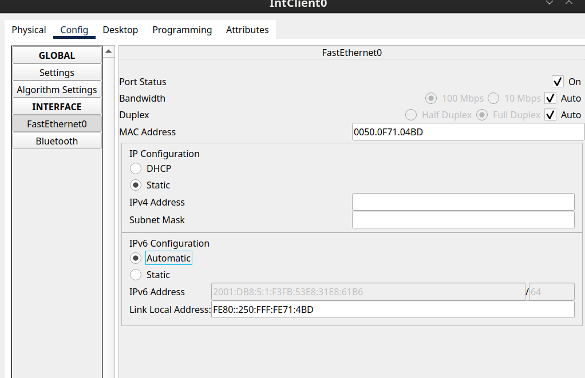
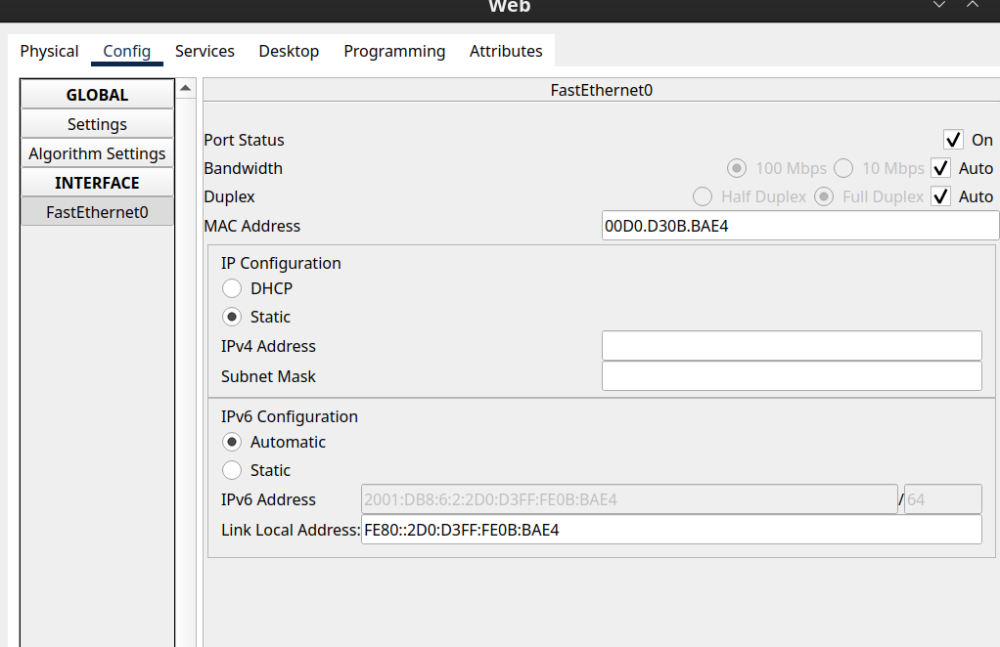
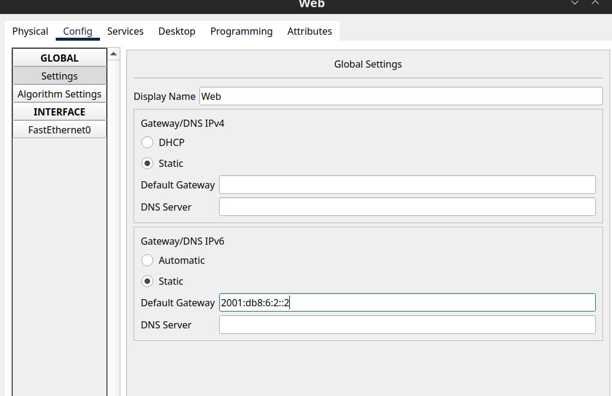
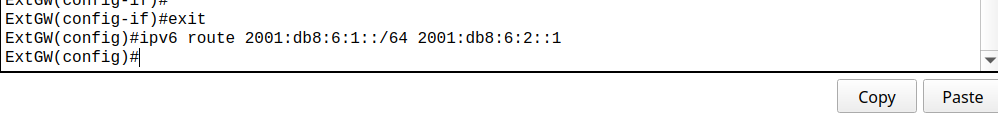
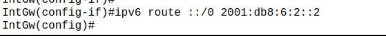
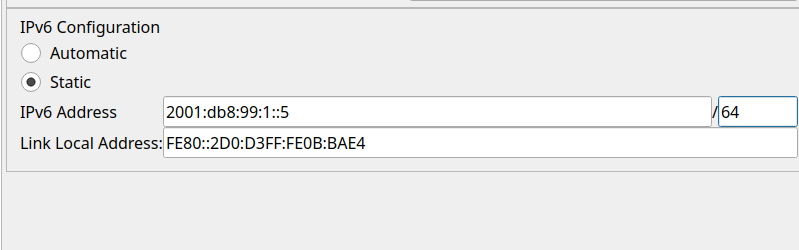

# **Titel: Unternehmensnetzwerke IPv6**

| **AufgabenNr:** | 12 |
|---|:---|
| **Klasse:** | 4AHIF |
| **Name:** | Benjamin Friedl |
| **Gruppe:** | 1 |
| **Abgabetermin:** | X.3.2025 |
| **Abgabedatum:** | X.3.2025 |

## **Kurzbeschreibung:**

Aufgabe zur Konfiguration eines Unternehmensnetzwerkes mit DMZ und NAT mit IPv6.

---
\
\
\
\
\
\
\
\
\
\
\
\
\
\
\
\
\
\
\
\
\
\
\
\
\
\
\
\

## Inhaltsverzeichnis

1. [Anforderungen](#anforderungen)
2. [Init](#init)
3. [DMZ-Adresse](#3-dmz-adresse)
4. [Interne Router per NAT nach außen](#4-Interne-Router-per-NAT-nach-außen)
5. [DNS](#5-dns)
6. [ACL's](#acls)
7. [Troubleshooting/Debugging](#troubleshootingdebugging)

---
\
\
\
\
\
\
\
\
\
\
\
\
\
\
\
\
\
\
\
\
\
\
\
\
\
\
\
\
\
\
\
\
\
\
\
\
\
\
\

## Anforderungen

Sie haben das Netzwerk 2001:db8:KNr::/48 von Ihrem ISP bekommen.

- Teilen Sie dieses Netzwerk in 2 Netzwerke (intern, DMZ) auf. Welche 2
Netzwerke ergeben sich?

- Vergeben Sie auf allen Geräten des LANs Adressen per DHCP

- Tragen Sie die notwendigen Routen im Firmennetzwerk ein. Wo setzen sie
welche Route?

- Testen Sie die Verbindungen

- Tragen Sie die Namen am DNS ein (A-Record)

- Erstellen Sie ACL’s damit:
  - der DNS Zugriff funktioniert
  - die Mitarbeiter im Web surfen können (80,443)
  - ein Mitarbeiter per ssh auf die Router zugreifen kann
  - von außen die Server (nur) auf ihren vorgesehen Ports erreichbar sein.

## Init

> Notiz: ipv6 aktivieren:
>
>```bash
>IntGw ipv6 unicast-routing
>int f0/0
>ipv6 add
>ipv6 address 2001:db8:99:1::1/64
>no shut
>```
>
> Das gleiche für int f0/1, nur ipv6 ist dann: `2001:db8:99:2::1/64`

### Zwei Netzwerke

- Internes Netz (LAN): 2001:db8:5:1::/64
- DMZ: 2001:db8:5:2::/64

### DHCP Server (Stateful)

> DHCP bei IPv6 vs. IPv4
>
> - Bei IPv4 wird der DHCP-Server verwendet, um IP-Adressen an Clients zu vergeben. Weil bei IPv6 die Clients ihre IP-Adressen selbst generieren, wird der DHCP-Server verwendet, um zusätzliche Informationen wie DNS-Server und Domain-Namen bereitzustellen.

IPv6 Unicast-Routing muss aktiviert werden:

Zweck von `ipv6 unicast-routing`:

- Aktiviert das IPv6-Routing auf dem Router.
- Erlaubt dem Router, IPv6-Pakete zwischen verschiedenen Netzwerken weiterzuleiten.
- Notwendig, um den Router als Gateway für IPv6-Netzwerke zu konfigurieren.

> IntGw(config)# `ipv6 unicast-routing`
>
#### Interner Router




DNS Server konfigurieren:



DNS Feld auf automatisch bei allen Clients:



Addresse zuweisen:

```bash
IntGw(config)# interface f0/0
IntGw(config-if)# ipv6 address 2001:db8:5:1::1/64
IntGw(config-if)# no shutdown
IntGw(config-if)# exit
```

#### Externe Router

```bash
ExtGw(config)# interface f0/0
ExtGW(config-if)#ipv6 address 2001:db8:6:2::2/64
ExtGW(config)#ipv6 unicast-routing
```

##### Webserver




Das gleiche für den FTP-Server.

### Routen

Ext zum internen Router:



Default Route vom Int zum externen Gw:


Außerdem müssen alle Interfaces hochgefahren und die DNS Server konfiguriert werden. (siehe [unternehmensnetzwerke ipv4](https://lexica.fri3dl.dev/school/nscs_praxis/v2_unternehmensnetzwerk))



- Webserver: `2001:db8:5:2::5`
- FTP-Server: `2001:db8:5:2::6`

Jetzt kann mit `nslookup` mit einem Client die DNS Server IP-Adresse abgefragt werden:

```bash
nslookup web.nscs.lan
```

### ACL's

> ACL's sind unter IPv6 nocheinmal wichtigere als unter IPv4, da ohne ACL's sämtliche Geräte im DMZ im Internet erreichbar sind.

#### IntGw

**Remove all ACL's**:

```bash
no ipv6 access-list internal_in
no ipv6 access-list internal_out
no ipv6 access-list dmz_in
no ipv6 access-list dmz_out
int f0/0
no ipv6 traffic-filter internal_in in
no ipv6 traffic-filter internal_out out
int f0/1
no ipv6 traffic-filter dmz_in in
no ipv6 traffic-filter dmz_out out
```

**InternalIn**:

permit:

- ping (icmpv6)
- dns
- tcp/udp (http/ftp)

```bash
no ipv6 access-list internal_in
ipv6 access-list internal_in
remark allow icmpv6
permit icmp any any
remark allow dns
permit udp any any eq 53
permit tcp any any eq 53
remark allow http/ftp
permit tcp any any eq 80
permit tcp any any eq 443
int f0/0
ipv6 traffic-filter internal_in in
```

**InternalOut**:

```bash
no ipv6 access-list internal_out
ipv6 access-list internal_out
remark allow icmpv6
permit icmp any any
remark allow dns
permit udp any any eq 53
permit tcp any any eq 53
remark allow http/ftp
permit tcp any any eq 80
permit tcp any any eq 443
int f0/0
ipv6 traffic-filter internal_out out
```

#### Auf ExGW

**Remove all ACL's**:

```bash
no ipv6 access-list external_out
no ipv6 access-list external_out
no ipv6 access-list to_internal_deny
no ipv6 access-list external_in
no ipv6 access-list external_out
no ipv6 access-list to_internal_deny
```

```bash
no ipv6 access-list external_out
ipv6 access-list external_in
permit tcp any host 2001:DB8:5:2::5 eq 80
permit tcp any host 2001:DB8:5:2::5 eq 443
permit tcp any host 2001:DB8:5:2::6 eq 21
permit tcp any host 2001:DB8:5:2::6 eq 20
```

**Out:**

```bash
ipv6 access-list external_out
permit tcp any any established
ipv6 access-list to_internal_deny
deny ipv6 any 2001:db8:5:1::/64
remark bind to interface
```

###
