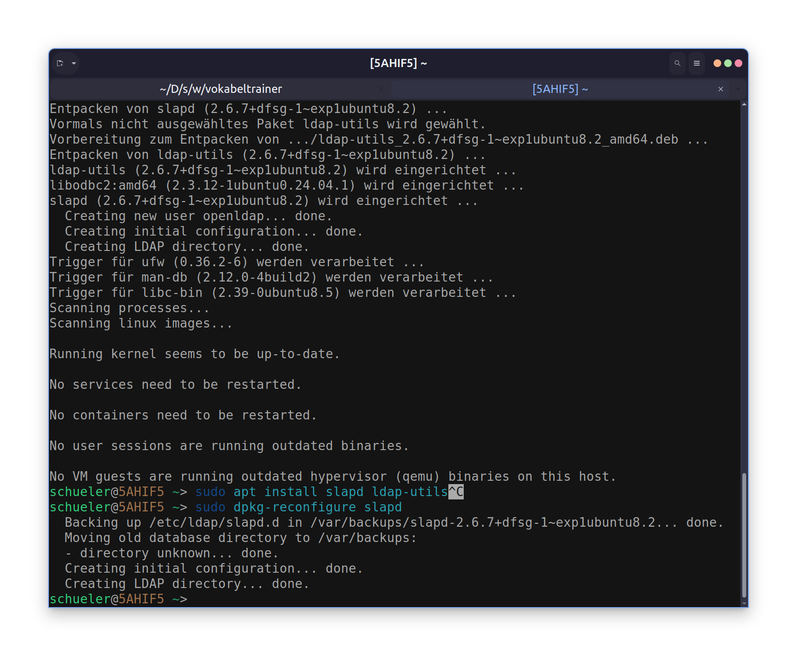

## Bind

### Install

```bash
sudo apt install bind9
```

> **Restarten des Dienstes**
>
> ```bash
> sudo systemctl restart bind9
> ```

### Konfiguration

Die Konfigurationsdatei befindet sich unter `/etc/bind/named.conf.options`.

```bash
sudo nano /etc/bind/named.conf.options
```

## New Zone

1. Create a file named `db.friedl.lan` in the `/etc/bind/zones/` directory and add the following content:

```bash
sudo nano /etc/bind/zones/db.friedl.lan
```

```text
;; db.friedl.lan
;; Forwardlookupzone für friedl.lan
;;
$TTL 2D
@       IN      SOA     ns.friedl.lan. mail.friedl.lan. (
                        2006032201      ; Serial
                                8H      ; Refresh
                                2H      ; Retry
                                4W      ; Expire
                                3H )    ; NX (TTL Negativ Cache)

@                               IN      NS      ns.friedl.lan.
                                IN      MX      10 mailserver.friedl.lan.
                                IN      A       192.168.0.10
                                IN      AAAA    2001:db8::1

ns                     IN      A       192.168.0.10
rechner1                        IN      A       192.168.0.200
mailserver                      IN      A       192.168.0.201
rechner2                        IN      CNAME   mailserver
```

2. Then, add the new zone to the BIND configuration by editing the file `/etc/bind/named.conf.local`:

edit file `/etc/bind/named.conf.local`

```text
zone "friedl.lan" {
    type master;
    file "/etc/bind/zones/db.friedl.lan";
};
```

3. Restart the BIND service to apply the changes:

```bash
sudo systemctl restart bind9
```

### Test

To test the DNS server, you can use the `dig` command:

```bash
dig @localhost friedl.lan
```

this should return the A record for `friedl.lan`.

we got the following records:


## Debugging

reading the system logs:

```bash
sudo journalctl -u bind9
```

or to read the newest logs

```bash
sudo journalctl -u bind9 -f
```

## Sekundär DNS Server

Einrichtung eines sekundären DNS-Servers:

[Ubuntu Docs: Einrichtung eines Sekundären Nameservers](https://wiki.ubuntuusers.de/DNS-Server_Bind/Sekund%C3%A4re_Nameserver/)

> Warum einen Sekundären DNS-Server?
>
> Ein Sekundärer DNS-Server dient als Backup für den Primären DNS-Server. Falls der Primäre DNS-Server ausfällt oder nicht erreichbar ist, kann der Sekundäre DNS-Server weiterhin DNS-Anfragen beantworten und die Verfügbarkeit der Domain gewährleisten.

### Änderungen auf dem primären Server

edit `/etc/bind/named.conf.options`

```text
allow-transfer { 10.139.0.125; };
notify yes;
```

edit also: `/etc/bind/db.hacker.lan`
so the changes are replicated to the secondary server

```text
;; db.hacker.lan  
;; Forwardlookupzone für hacker.lan  
;;  
$TTL 2D  
@       IN      SOA     ns.hacker.lan. mail.hacker.lan. (  
                        2025091603      ; Serial  
                                8H      ; Refresh  
                                2H      ; Retry  
                                4W      ; Expire  
                                3H )    ; NX (TTL Negativ Cache)  
@                               IN      NS      ns.hacker.lan.  
@                               IN      NS      ns2.hacker.lan.  
                                IN      MX      10 mailserver.hacker.lan.  
                                IN      A       192.168.0.24  
                                IN      AAAA    2001:db8::1  
ns                              IN      A       192.168.0.24  
ns2                             IN      A       10.139.0.125  
rechner1                        IN      A       192.168.0.200  
mailserver                      IN      A       192.168.0.201  
rechner2                        IN      CNAME   mailserver  
```

### Einrichtung des sekundären Servers

edit `/etc/bind/named.conf.options`

```text
allow-notify { 10.139.0.128; };
```

and edit `/etc/bind/named.conf.local`

notes:

```text
zone "hacker.lan" {
        type slave;
        masters { 10.139.0.128; };
        file "back/hacker.lan.bak";
};

<!-- zone "0.168.192.in-addr.arpa" {
        type slave;
        masters { 10.139.0.128; };
        file "back/0.168.192.bak";
} -->
```

Create the backup directory and set the correct permissions:

```bash
sudo mkdir /var/cache/bind/back
sudo chown bind /var/cache/bind/back
```

then restart bind9

```bash
sudo systemctl restart bind9
```

### Testen des sekundären Servers

To test the secondary DNS server, you can use the `dig` command to query the secondary server for records from the primary zone.

```bash
dig @<IP_ADDRESS_OF_SECONDARY_DNS_SERVER> hacker.lan
```

```bash
dig @10.139.0.125 hacker.lan
```


sobald jetzt ein eintrag auf dem primären server geändert wird, wird dieser automatisch auf den sekundären server repliziert:


## DNSSEC

### Vorbereitung

```bash
sudo apt update; sudo apt-get install haveged  bind9utils
```

### Aufbau

::mermaid

::

### Neue Zone erstellen

name: `secure.friedl.lan`

```bash
sudo nano /etc/bind/zones/db.secure.friedl.lan
```

```text
;; db.secure.friedl.lan
;; Forwardlookupzone für friedl.lan
;;
$TTL 2D
@       IN      SOA     ns.secure.friedl.lan. mail.secure.friedl.lan. (
                        2006032201      ; Serial
                                8H      ; Refresh
                                2H      ; Retry
                                4W      ; Expire
                                3H )    ; NX (TTL Negativ Cache)

@                               IN      NS      ns.secure.friedl.lan.
                                IN      MX      10 mailserver.secure.friedl.lan.
                                IN      A       192.168.0.24
                                IN      AAAA    2001:db8::1

ns                     IN      A       192.168.0.10
rechner1                        IN      A       192.168.0.200
mailserver                      IN      A       192.168.0.201
rechner2                        IN      CNAME   mailserver
```

### Zonendatei in named.conf.local einbinden

edit `/etc/bind/named.conf.local` (nano)

```conf
zone "secure.friedl.lan" {
    type master;
    file "/etc/bind/zones/db.secure.friedl.lan";
};
```

### Schlüssel generieren

Die Schlüssel werden mit dem `dnssec-keygen`-Befehl generiert. Es gibt zwei Arten von Schlüsseln: den Zonen-Signaturschlüssel (ZSK) und den Schlüssel-Signaturschlüssel (KSK).

```bash
dnssec-keygen -a RSASHA1 -b1024 -e -n ZONE secure.friedl.lan
dnssec-keygen -a RSASHA1 -b1024 -e -n ZONE -f KSK secure.friedl.lan
```

- zsk: `Ksecure.friedl.lan.+005+56173`
- ksk: `Ksecure.friedl.lan.+005+17048`

diese Schlüssel müssen in das Zonendatei eingebunden werden:

```bash
cat K*.key >>db.secure.friedl.lan
```

> dieser Command muss mit einer sudo shell ausgeführt werden, da die Datei sonst nicht beschrieben werden kann. (z.B. `sudo fish`)
> **Wichtig:** Die Schlüsseldateien (K*.private) sollten sicher aufbewahrt werden, da sie zum Signieren der DNS-Zone verwendet werden.

### Zone signieren

```bash
dnssec-signzone -s now+0 -e now+2419200 -o secure.friedl.lan -k Ksecure.friedl.lan.+005+17048 db.secure.friedl.lan  Ksecure.friedl.lan.+005+56173
```

![]

Es sollte jetzt eine db.example.com.signed geben. Diese muss in der named.conf.local anstelle der db.example.com eingebunden werden.

nano `/etc/bind/named.conf.local`

```conf
zone "secure.friedl.lan" {
    type master;
    file "/etc/bind/zones/db.secure.friedl.lan.signed";
}
```

### Resolver konfigurieren

Damit der Resolver die Signaturen des Masters überprüfen kann muss der KSK des Masters in den Resolver importiert werden. Im Normalfall würde er diese Keys vom Rootnameserver weg bis zur Zielzone überprüfen.

patzls ksk:

```text
patzl.sec. IN DNSKEY 257 3 5 AwEAAbou11q7Sd0JXjlO8/Zi7mMQ7aCON/dU37n1fymHNocPHDG5Go5u KrEcKSYYhdARRSWNBXp8pFkfGYQR2En+9iSh4kVOLj7rVV+uU2NfU1/g kq/KWDKByGdT+yeyZcbJJTT2d7jHSWf7olfeq64pAyLI5PQRxf6IPoBt N3JAAxpZ
```

dieser Key muss in die Datei `/etc/bind/named.conf.options` eingefügt werden:

> Vorsicht: Die Anführungszeichen müssen händisch hinzugefügt werden. DNSKEY muss durch initial-key ersetzt werden.

```text
options {
        ...

        forwarders {
                192.168.0.1;
        }
}
trust-anchors {
        patzl.sec. initial-key 257 3 5 "AwEAAbou11q7Sd0JXjlO8/Zi7mMQ7aCON/dU37n1fymHNocPHDG5Go5u KrEcKSYYhdARRSWNBXp8pFkfGYQR2En+9iSh4kVOLj7rVV+uU2NfU1/g kq/KWDKByGdT+yeyZcbJJTT2d7jHSWf7olfeq64pAyLI5PQRxf6IPoBt N3JAAxpZ";
};
```

### Bind9 neu starten

```bash
sudo systemctl restart bind9
```

### Testen

```bash
dig @127.0.0.1 +dnssec patzl.sec
```


## DOH

### Vorbereitung

```bash
sudo apt install easy-rsa
```

```bash
make-cadir ~/myca auf
cd ~/myca
./easyrsa init-pki
./easyrsa build-ca
```


### Zertifikat für den Server erstellen

```bash
cd ~/myca
./easyrsa build-server-full dns.friedl.lan nopass
```

### Zertifikat kopieren und Rechte setzen

```bash
sudo cp ~/myca/pki/issued/dns.friedl.lan.crt /etc/bind

sudo cp ~/myca/pki/private/dns.friedl.lan.key /etc/bind

sudo chgrp bind /etc/bind/dns.friedl.lan.*
sudo chmod g+r /etc/bind/dns.friedl.lan.key
sudo chmod a+r /etc/bind/dns.friedl.lan.crt
```



### Eintragen in die named.conf.options

edit `/etc/bind/named.conf.options`


### Dienst neu starten und testen

```bash
sudo systemctl restart bind9
sudo cat /var/log/syslog
dig @127.0.0.1 +https rechner1.friedl.lan
```


