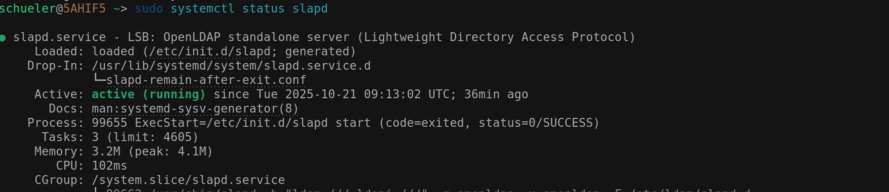
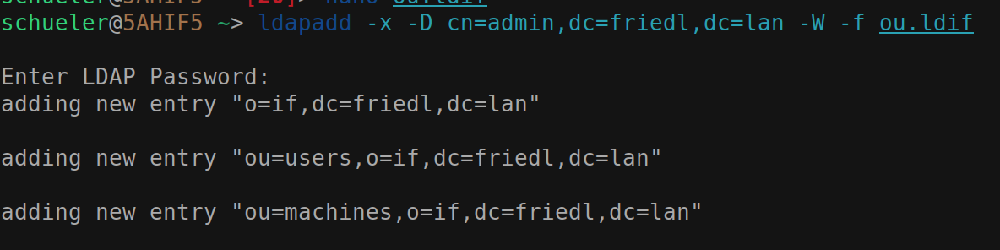

# LDAP - Übung

## Einrichtung eines LDAP-Servers

```bash
sudo apt update
sudo apt install slapd ldap-utils
```

### Konfiguration des LDAP-Servers

```bash
sudo dpkg-reconfigure slapd
```

Domainname: `friedl.lan`
Organisation: `if`
Admin-Passwort: `123456`

### Überprüfung des LDAP-Servers

```bash
sudo systemctl status slapd
```


### ou.idif

```ldif
dn: o=if,dc=friedl,dc=lan
o: if
objectclass: top
objectclass: organization

dn: ou=users,o=if,dc=friedl,dc=lan
ou: users
objectclass: top
objectclass: organizationalUnit

dn: ou=machines,o=if,dc=friedl,dc=lan
ou: machines
objectclass: top
objectclass: organizationalUnit
```

### Importieren der Datei ou.ldif

```bash
    ldapadd -x -D cn=admin,dc=friedl,dc=lan -W -f ou.ldif
```


user.ldif:

```ldif
dn: cn=Rudi Schueler, ou=users, o=if, dc=friedl,dc=lan
objectclass: top
objectclass: person
objectclass: organizationalPerson
objectclass: inetOrgPerson
objectclass: posixAccount
cn: Rudi Schueler
displayName: Rudi Schueler
sn: Schueler
givenName: Rudi
initials: RS
title: Dr
uid: rudi
mail: rudi.schueler@htlstp.ac.at
telephoneNumber: +43 2742 1234567
mobile: +43 676 12345678
roomNumber: N326
uidNumber: 5000
gidNumber: 5000
homeDirectory: /home/rudi
userPassword: {SSHA}xxx
loginShell: /bin/bash
```

### Importieren der Datei user.ldif

```bash
    ldapadd -x -D cn=admin,dc=friedl,dc=lan -W -f user.ldif
```


> TODO: laufender Server + Client verbinden

creds:

```yaml
ldap: 
  uri: ldap://friedl.lan
  binddn: cn=admin,dc=friedl,dc=lan
  bindpw: '******'
  basedn: dc=friedl,dc=lan
```


### Script to automatically create users

```bash
#! /usr/bin/bash

echo "Starting LDAP setup script..."

# need file path input
if [ "$#" -ne 1 ]; then
    echo "Usage: $0 <ldif_file_path>"
    exit 1
fi

LDIF_FILE="$1"

# creates a file for each line in the csv
while IFS= read -r line; do
    IFS=';' read -r class id surname firstname email <<< "$line"
    cat > "${id}.ldif" << EOF
dn: cn=${firstname} ${surname}, ou=users, o=if, dc=friedl,dc=lan
objectclass: top
objectclass: person
objectclass: organizationalPerson
objectclass: inetOrgPerson
objectclass: posixAccount
cn: ${firstname} ${surname}
displayName: ${firstname} ${surname}
sn: ${surname}
givenName: ${firstname}
initials: ${firstname:0:1}${surname:0:1}
title: Dr
uid: ${id}
mail: ${email}
roomNumber: N326
uidNumber: 5000
gidNumber: 5000
homeDirectory: /home/${id}
userPassword: {SSHA}xxx
loginShell: /bin/bash
EOF
done < "$LDIF_FILE"
echo "LDIF files created successfully."
```

to add all files:

```bash
for file in *.ldif; do
    ldapadd -x -D cn=admin,dc=friedl,dc=lan -w "123456" -f "$file"
done
```

and it worked:


to update all fields, for example to change the title

```bash
dn: cn=Rudi Schueler, ou=users, o=if, dc=friedl,dc=lan
changetype: modify
replace: title
title: Schueler
```

script to modify users:

```bash
#!/usr/bin/bash
echo "Starting LDAP modification script..."

# script.sh <ldif_file_path> --field <field_name> --value <new_value>
if [ "$#" -ne 5 ]; then
    echo "Usage: $0 <ldif_file_path> --field <field_name> --value <new_value>"
    exit 1
fi
LDIF_FILE="$1"
FIELD_NAME="$3"
NEW_VALUE="$5"
# modifies a file for each line in the csv
while IFS= read -r line; do
    IFS=';' read -r class id surname firstname email <<< "$line"
    cat > "mod_${id}.ldif" <<-EOF
dn: cn=${firstname} ${surname}, ou=users, o=if, dc=friedl,dc=lan
changetype: modify
replace: ${FIELD_NAME}
${FIELD_NAME}: ${NEW_VALUE}
EOF
done < "$LDIF_FILE"
echo "Modification LDIF files created successfully."
```

to run all modifications:

```bash
for file in mod_*.ldif; do
    ldapmodify -x -D cn=admin,dc=friedl,dc=lan -w "123456" -f "$file"
done
```




