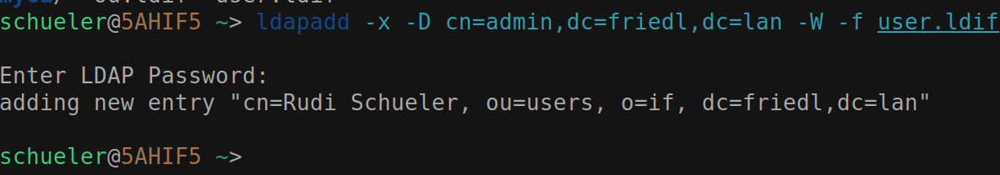

# LDAP - Übung

## Einrichtung eines LDAP-Servers

```bash
sudo apt update
sudo apt install slapd ldap-utils
```

### Konfiguration des LDAP-Servers

```bash
sudo dpkg-reconfigure slapd
```

Domainname: `friedl.lan`
Organisation: `if`
Admin-Passwort: `******`

### Überprüfung des LDAP-Servers

```bash
sudo systemctl status slapd
```


### ou.idif

```ldif
dn: o=if,dc=friedl,dc=lan
o: if
objectclass: top
objectclass: organization

dn: ou=users,o=if,dc=friedl,dc=lan
ou: users
objectclass: top
objectclass: organizationalUnit

dn: ou=machines,o=if,dc=friedl,dc=lan
ou: machines
objectclass: top
objectclass: organizationalUnit
```

### Importieren der Datei ou.ldif

```bash
    ldapadd -x -D cn=admin,dc=friedl,dc=lan -W -f ou.ldif
```


user.ldif:

```ldif
dn: cn=Rudi Schueler, ou=users, o=if, dc=friedl,dc=lan
objectclass: top
objectclass: person
objectclass: organizationalPerson
objectclass: inetOrgPerson
objectclass: posixAccount
cn: Rudi Schueler
displayName: Rudi Schueler
sn: Schueler
givenName: Rudi
initials: RS
title: Dr
uid: rudi
mail: rudi.schueler@htlstp.ac.at
telephoneNumber: +43 2742 1234567
mobile: +43 676 12345678
roomNumber: N326
uidNumber: 5000
gidNumber: 5000
homeDirectory: /home/rudi
userPassword: {SSHA}xxx
loginShell: /bin/bash
```

### Importieren der Datei user.ldif

```bash
    ldapadd -x -D cn=admin,dc=friedl,dc=lan -W -f user.ldif
```



> TODO: laufender Server + Client verbinden
