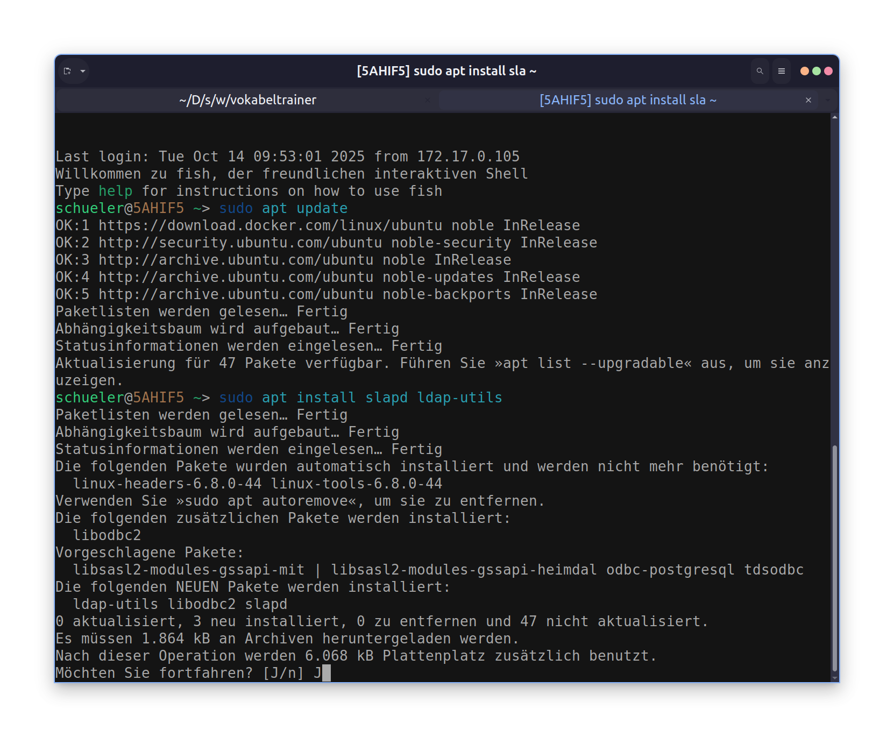

[htl-logo](htl-logo.png)

# **Titel: Managed VLAN**

| **AufgabenNr:** | 04 |
|---|:---|
| **Klasse:** | 4AHIF |
| **Name:** | Benjamin Friedl |
| **Gruppe:** | 1 |
| **Abgabetermin:** | X |
| **Abgabedatum:** | X |

## **Kurzbeschreibung:**


---
\
\
\
\
\
\
\
\
\
\
\
\
\
\
\
\
\
\
\
\
\
\
\
\
\
\
\
\

# Inhaltsverzeichnis


---
\
\
\
\
\
\
\
\
\
\
\
\
\
\
\
\
\
\
\
\
\
\
\
\
\
\
\
\
\

## Aufbau


### IP-Adressen configurieren

**Computer:**



**Switches:**

Die IP-Adressen der Switches werden wie folgt konfiguriert:

```bash
Switch>enable 
Switch>enable
Switch#conf t
Switch(config)#interface vlan 1
Switch(config-if)#ip address 192.168.0.201 255.255.255.0
Switch(config-if)#no shutdown
```


Das wird für alle Switches durchgeführt.

### ssh Zugang

- Domäne: `nvs.lan`
- User: `cisco`
- PW: `ciscossh`

```bash
Switch>
Switch>enable
Switch#conf t
Enter configuration commands, one per line.  End with CNTL/Z.
Switch(config)#
Switch(config)#ip domain-name nvs.lan
Switch(config)#username cisco password ciscossh
Switch(config)#hostname switch1
Switch1(config)#crypto key generate rsa general-keys modulus 2048
```


### SSH Zugriff

Auf einem Computer kann man sich jetzt mit den Switches verbinden:

```powershell
PS C:\Users\benja> ssh -l cisco 192.168.0.201
```


## Konfiguration eines Switches kopieren

```bash
Switch#show running-config
```
