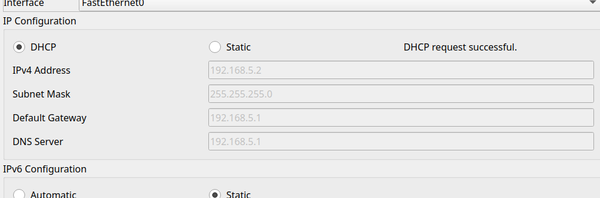

# Unternehmensnetzwerk

Anforderungen:

- Der interne Router soll für die internen Client's als DHCP Server fungieren (192.168.KNR.0/24)
- Die  DMZ soll die Adressen aus dem Netz 36.7.12.128/28 bekommen.
- Der interne Router soll das interne Netz per NAT nach außen verbinden
- Die Web und FTP Server sollen über ihren Namen erreichbar sein.
- Der Web und FTP Server soll vom Internet und vom LAN erreichbar sein.
- Die internen Clients sollen auf interne und externe Webserver (Port 80 und 443) zugreifen können.  Weiters sollen sie Zugriff auf den Firmen FTP-Server haben. Andere Ports sind zu sperren.
- Stellen Sie sicher, dass in der DMZ nur die notwendigen Ports erreichbar sind.

## Init

Zuerst müssen alle Ports auf den Routern konfiguriert werden.

```bash
Router(config)# interface F0/0
Router(config-if)# ip address 192.168.5.1 
Router(config-if)# no shutdown
Router(config-if)# exit
```

```bash
Router(config)# interface F0/1
Router(config-if)# ip address 192.168.5.1
Router(config-if)# no shutdown
Router(config-if)# exit
```

## DHCP Server

Der DHCP Server wird auf dem internen Router konfiguriert.

```bash
InternGw(config)# ip dhcp pool intern
InternGw(dhcp-config)# network 192.168.5.0 255.255.255.0
InternGw(dhcp-config)# default-router 192.168.5.1
InternGw(dhcp-config)# dns-server 192.168.5.1
InternGw(dhcp-config)# exit
```



## DMZ

Die  DMZ soll die Adressen aus dem Netz 36.7.12.128/28 bekommen.

> DMZ = Demilitarisierte Zone
>
> Demilitarisierte Zone (DMZ) ist ein Begriff aus der Militärstrategie und bezeichnet einen entmilitarisierten Raum zwischen zwei oder mehreren verfeindeten Staaten oder Militärblöcken.
> In der Informatik bezeichnet DMZ einen Bereich eines Netzwerks, der zwischen dem internen Netzwerk und dem Internet liegt und in dem Server und Dienste betrieben werden, die für das Internet zugänglich sein sollen.

Das Netz 36.7.12.128/28 hat folgende IP-Bereiche:

- Netzwerk-Adresse: 36.7.12.128
- Erste nutzbare IP: 36.7.12.129
- Letzte nutzbare IP: 36.7.12.142
- Broadcast-Adresse: 36.7.12.143
- Subnetzmaske: 255.255.255.240

### 2. IP-Konfiguration für ExtGW (DMZ-Gateway)

```bash
Router(config)# interface F0/1
Router(config-subif)# ip address 36.7.12.129 255.255.255.240
Router(config-subif)# exit
```

### 3. IP-Konfiguration für Webserver

| Gerät      | IP-Adresse  |
|------------|------------ |
| Web-Server | 36.7.12.130 |
| FTP-Server | 36.7.12.131 |

Auf den Servern müssen wir die IP-Adressen manuell konfigurieren und das Gateway auf 36.7.12.129 setzen.

### 4. NAT

```bash
IntGw(config)# access-list 1 permit 192.168.5.0 0.0.0.255
IntGw(config)# ip nat inside source list 1 interface f0/1 overload
IntGw(config)# interface f0/1
IntGw(config-if)# ip nat outside
IntGw(config-if)# exit
IntGw(config-if)# interface f0/0
IntGw(config-if)# ip nat inside
```

#### 4.1 NAT Testen

zum NAT testen können wir von einem Client (PC) den Externen Router anpingen.

Ip-Adresse des externen Routers:

```bash
ExternGw# show ip interface brief
```

```bash
C:\> ping 36.7.12.129
```
