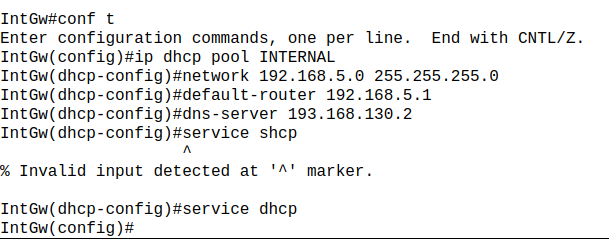
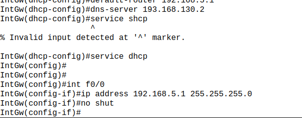
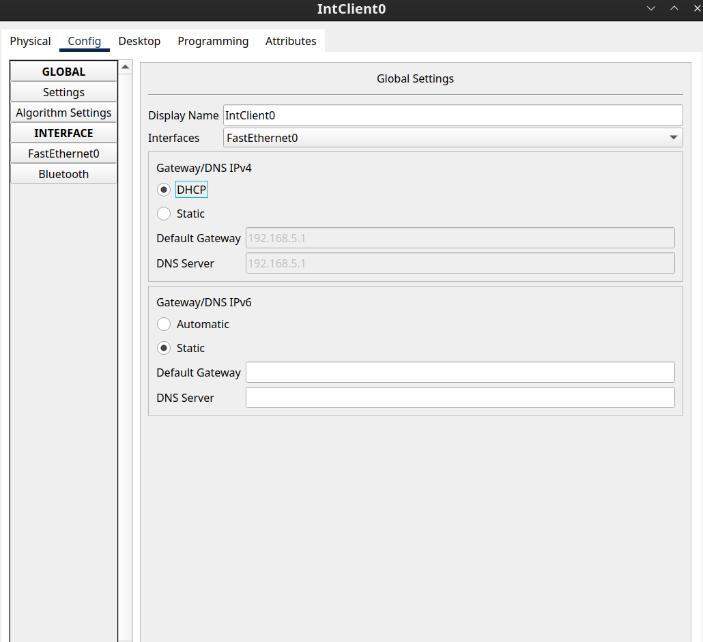
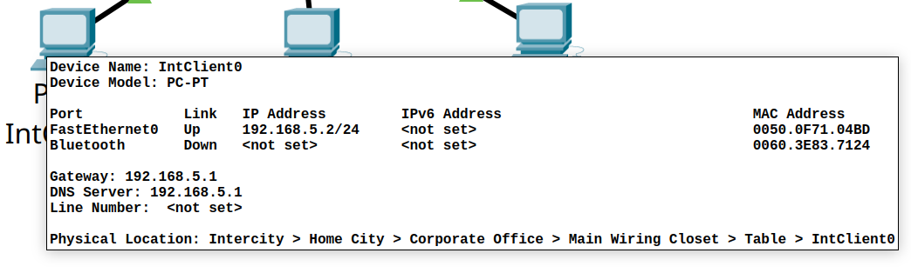
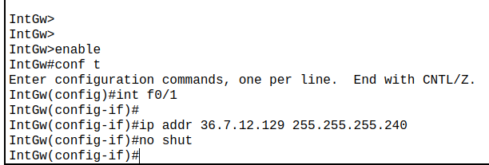
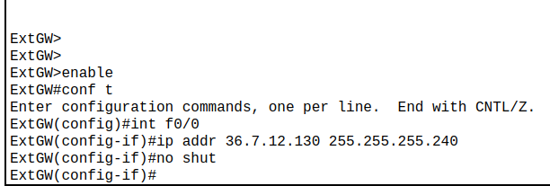
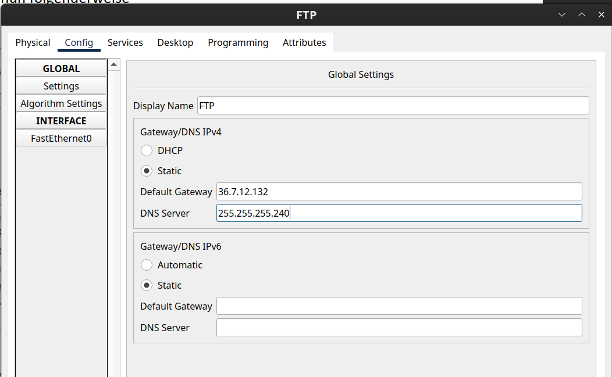
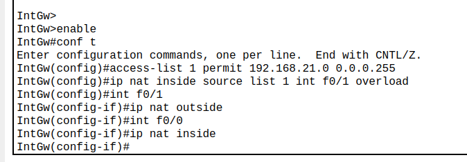
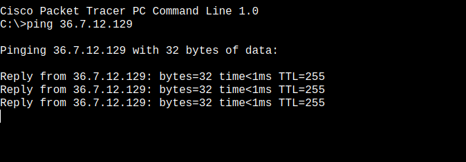

# Unternehmensnetzwerk

Anforderungen:

- Der interne Router soll für die internen Client's als DHCP Server fungieren (192.168.KNR.0/24)
- Die  DMZ soll die Adressen aus dem Netz 36.7.12.128/28 bekommen.
- Der interne Router soll das interne Netz per NAT nach außen verbinden
- Die Web und FTP Server sollen über ihren Namen erreichbar sein.
- Der Web und FTP Server soll vom Internet und vom LAN erreichbar sein.
- Die internen Clients sollen auf interne und externe Webserver (Port 80 und 443) zugreifen können.  Weiters sollen sie Zugriff auf den Firmen FTP-Server haben. Andere Ports sind zu sperren.
- Stellen Sie sicher, dass in der DMZ nur die notwendigen Ports erreichbar sind.

## Init

**DHCP** Pool erstellen:

*Dem Router eine IP-Adresse zuweisen*

Der `IntClient0` hat die Addresse `192.168.5.2` erhalten:

## 3. DMZ-Adresse

Der externe Router im Interface f0/1 bekommt die Adresse `36.7.12.129`:

Der externe Router im Interface f0/0 bekommt die Adresse `36.7.12.130`:

**Webserver** & **FTP Server** konfigurieren:

Der FTP Server bekommt die Adresse `36.7.12.132`, der Webserver die Adresse `36.7.12.131`

## 4. Interne Router per NAT nach außen

NAT aktivieren:

f0/1 ist für den outgoing Traffic verantwortlich, f0/0 für den incoming

### NAT Testen

Um NAT zu testen können wir von einem Client den externen Router anpingen:

## 5. DNS
