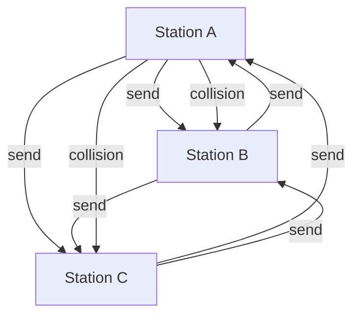

# Ethernet

## Specs

- IEEE 802.3
- 10BASE5 (Thicknet)
- 10BASE2 (Thinnet)

> Ethernet nach IEEE 802.3 kann die maximale Länge eines Segments auf 500m erhöhen, wenn die Übertragungsgeschwindigkeit 10 Mbit/s beträgt. Bei 100 Mbit/s beträgt die maximale Länge eines Segments 100 m.

## Kollisionen

Wenn 2 Stationen gleichzeitig/fast gleichzeitig senden, kommt es zu Kollisionen.

**Lösung:**

Collision Detection (CSMA/CD): Mindestens so lange senden, bis die Station sicher ereicht ist. Desshalb min. Framelänge 64 Byte.

## Physische Adressen (MAC)

Physische Adressen, sind weltweit eindeutig. Sie werden von der IEEE vergeben.

### Aufbau

48 Bit

## Frameformate

Es gibt hauptsächlich 2 Frameformate:

- Ethernet II /DIX ~ DIX bedeutet Digital Equipment Corporation, Intel und Xerox
- IEEE 802.3

### Ethernet II / DIX

**Problem:** kein Längenfeld
**Lösung:** Typ/Protokollfeld

---
