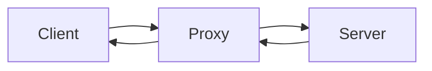
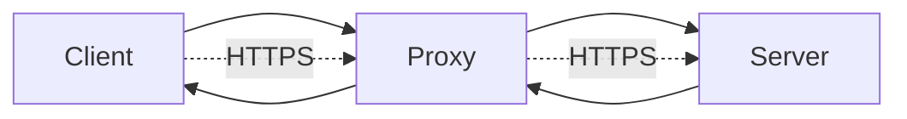

# Firewall / Proxy

| Firewall | Proxy |
| --- | --- |
| Layer 3-4 | Layer 7 |
| Packet filtering | Application filtering |
| Network-based | Application-based |
| Can block IP addresses, ports, protocols | Can block specific URLs, content types |
| Can be hardware or software | Typically software |
| udp, tcp, icmp | http, https, ftp, smtp |
| sehr schnell | großer Ressourcenbedarf |
| transparent | konfiguration notwendig |

> ## Problem
> Der Proxy-Server kann bei Verschlüsselung (z.B. HTTPS) den Datenverkehr nicht mehr analysieren, da er die Inhalte nicht mehr lesen kann. Dies führt dazu, dass der Proxy-Server nicht mehr in der Lage ist, bestimmte Sicherheitsfunktionen wie das Blockieren von schädlichen Inhalten oder das Überwachen von Datenverkehr effektiv auszuführen.

## Lösung

Früher war einfach der Datenverkehr zwischen dem Proxy und dem Server unverschlüsselt, sodass der Proxy die Inhalte analysieren konnte. Heute wird jedoch häufig HTTPS verwendet, wodurch der Datenverkehr verschlüsselt ist und der Proxy die Inhalte nicht mehr einsehen kann. Damit das funktioniert wird das Zertifikat des Proxy-Server auf dem Client installiert, damit der Proxy-Server als vertrauenswürdige Instanz fungieren kann. Der Proxy-Server entschlüsselt den Datenverkehr, analysiert ihn und verschlüsselt ihn dann erneut, bevor er ihn an den Server weiterleitet. Auf diese Weise kann der Proxy-Server weiterhin seine Sicherheitsfunktionen ausführen, auch wenn der Datenverkehr verschlüsselt ist.

## Reverse Proxy

examples: nginx, apache, haproxy

### Aufgaben

- Load Balancing
- SSL Termination
- Caching
- Security (DDoS Protection, Web Application Firewall)
- URL Rewriting
- Compression

## Firewall

Linux: auf kernelebene.

### VT/NT auf Kernelebene

Vorteile:
- sehr schnell

Nachteile:
- gefährlich: kann system zerstören

### Stateful vs Stateless

**Stateful Firewall**: behält den Zustand der Verbindungen im Auge, um zu entscheiden, ob ein Paket erlaubt oder blockiert werden soll. Sie analysiert den Datenverkehr und erkennt, ob es sich um eine legitime Verbindung handelt oder nicht.

Zustände:
- NEW: neue Verbindung
- ESTABLISHED: bestehende Verbindung
- RELATED: Verbindung, die mit einer bestehenden Verbindung in Zusammenhang steht
- INVALID: ungültige Verbindung

**Stateless Firewall**: trifft Entscheidungen basierend auf festen Regeln, ohne den Zustand der Verbindungen zu berücksichtigen. Sie ist einfacher und schneller, bietet jedoch weniger Sicherheit.
