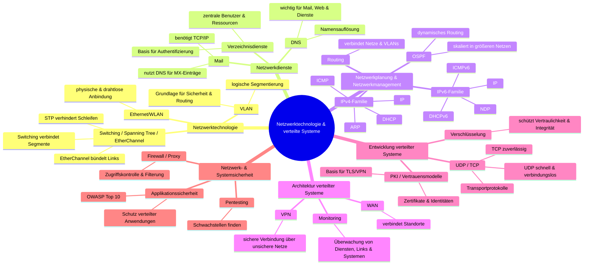

- Netzwerktechnologie 
    1. Ethernet/WLAN
    2. Switching/Spanning Tree/Etherchannel
    3. VLAN
- Netzwerkdienste 
    1. Mail
    2. Verzeichnisdienste
    3. DNS
- Netzwerkplanung und Netzwerkmanagement (skipp ich 😎)
    1. IPv4 Familie (IP, ICMP, ARP) + DHCP
    2. IPv6 Familie (IP, ICMP, NDP) + DHCP
    3. Routing
    4. OSPF
- Architektur verteilter Systeme 
    1. WAN
    2. VPN
    3. Monitoring
- Entwicklung verteilter Systeme
    1. Verschlüsselung
    2. PKI/Vertrauensmodelle
    3. UDP/TCP
- Netzwerk- und Systemsicherheit
    1. Firewall/Proxy
    2. Pentesting
    3. Applikationssicherheit (OWASP Top 10)

