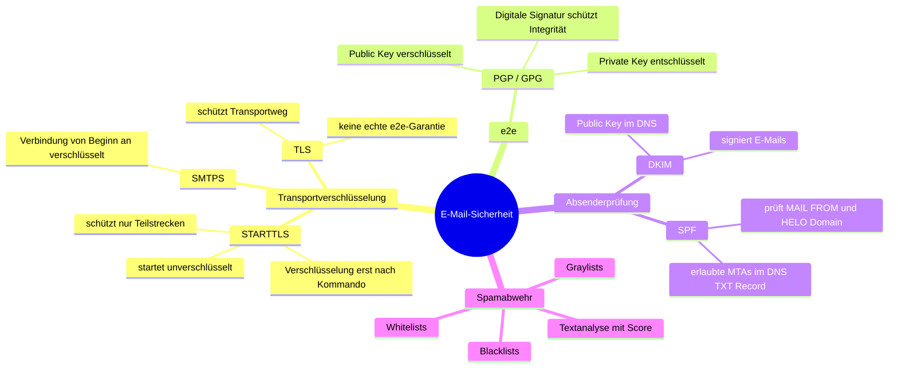

# Netzwerkdienste

## Mail

### Transportverschlüsselung

- STARTTLS: Beginnt unverschlüsselt, Verschlüsselung wird erst nach einem speziellen Kommando aktiviert. Schützt nur die Verbindung zwischen Mailservern, nicht die gesamte E-Mail.
- SMTPS: Verbindet von Anfang an verschlüsselt über TLS. Bietet besseren Schutz, da die Verbindung von Beginn an gesichert ist.
- TLS: Schützt den Transportweg, aber bietet keine echte End-to-End-Garantie, da die E-Mail auf den Servern unverschlüsselt vorliegen könnte.

### STARTTLS vs. SMTPS

STARTTLS verschlüssselt die Verbindung **erst nach einem speziellen Kommando (STARTTLS)**, während SMTPS die Verbindung von Anfang an verschlüsselt. STARTTLS ist anfälliger für Downgrade-Angriffe, bei denen ein Angreifer die Verschlüsselung verhindern könnte, während SMTPS eine sicherere Option darstellt.

## Verzeichnisdienste

Allgemein ist ein Verzeichnisdienst eine zentrale Datenbank, die Informationen über Benutzer, Gruppen, Ressourcen und andere Objekte in einem Netzwerk speichert. Er ermöglicht die Verwaltung von Zugriffsrechten, Authentifizierung und Autorisierung.

Ein Verzeichnis ist **nach ISO 9594 (X.500) baumartig** strukturiert (auch DIT für "Directory Information Tree" genannt).

### Vorteile der Baumstruktur:
- **Verteilte Administration:** Teile der Struktur können von verschiedenen Administratoren verwaltet werden.
- **Reale Abbildung:** Unternehmensstrukturen lassen sich 1:1 nachbauen.
- **Skalierbarkeit:** Die Struktur kann auf mehrere Server verteilt werden.
- **Effiziente Suche:** Suchvorgänge lassen sich gezielt auf bestimmte Bereiche einschränken.

Beispiele & Implementierungen:
- **LDAPv3** - Lightweight Directory Access Protocol (Basiert auf X.500, nutzt SASL/TLS, ist nicht abwärtskompatibel).
- **Microsoft Active Directory** (Nutzt LDAP als Grundlage).
- **DNS** - Domain Name System (Ebenfalls ein hierarchischer Verzeichnisdienst).
- **Weitere:** OpenLDAP, 389 Directory Server.

### Das LDAP-Datenmodell:
- **Objekt-Typen:** Man unterscheidet zwischen Containerobjekten (`ou`, `dc`, `o`) und Blattobjekten (`uid`, `cn`).
- **Namensgebung:** Objekte werden über den eindeutigen absoluten Pfad, den **Distinguished Name (DN)**, referenziert. Dieser setzt sich aus den **Relative Distinguished Names (RDNs)** zusammen. Bei Namenskonflikten können RDNs mit einem `+` kombiniert werden (z. B. `cn=Peter Müller+uid=123`).
- **Regelwerk:** Ein **Schema** definiert die erlaubten Attributtypen und Objektklassen. Die Zuweisung einer **ObjectClass** bestimmt, welche Attribute Pflicht (`MUST`) oder optional (`MAY`) sind.

### Datenmanipulation (LDIF):
- LDIF-Dateien nutzen Key-Value-Pairs für Änderungen (Befehle via `changetype: add / modify / delete`).
- **Wichtig:** Einzelne Einträge müssen in der Datei zwingend durch eine **Leerzeile** getrennt werden!

### Beispiel

Schüler Valentin (der einen 1er auf Matura hat) htlstp.ac.at:

`cn=Valentin,du=schueler,dc=htlstp,dc=ac,dc=at`

- **cn** ~ Common Name
- **du**: Domain Unit
- **dc**: Domain Component

## DNS

[Hilfreich: Labor DNS](https://lexica.fri3dl.dev/school/nscs_praxis/labor_dns)

### Die DNS-Hierarchie:

Die Struktur wird von rechts nach links gelesen und teilt sich wie folgt auf:

1. **Root-Zone (`.`):** Die oberste Wurzel, die im Alltag nicht ausgeschrieben wird.
2. **Top-Level-Domain (TLD):**
   - *Geografisch (ccTLD):* Einem Land oder einer Region zugeordnet (z. B. `.at` für Österreich, `.de` für Deutschland).
   - *Organisatorisch (gTLD):* Nach Verwendungszweck aufgeteilt (z. B. `.com` für kommerzielle Unternehmen, `.org` für nicht-kommerzielle Organisationen).
3. **Second-Level-Domain:** Der registrierte Name einer Organisation oder Firma (z. B. `wikipedia` in `wikipedia.org`).
4. **Subdomains (Third-Level-Domain etc.):** Unterteilungen, die der Inhaber selbst festlegen kann (z. B. `de` für die deutsche Sprachversion).

### Namensauflösung & Komponenten:

* **Client (Stub-Resolver):** Sucht zuerst in der lokalen **`hosts`-Datei** nach einem statischen Eintrag. Findet er dort nichts, schickt er eine unverschlüsselte Anfrage (meist via UDP) an den lokalen DNS-Server.
* **DNS-Resolver:** Übernimmt für den Client die Arbeit und arbeitet sich bei einer **rekursiven Abfrage** Schritt für Schritt von den Root-Servern über die TLD-Server bis zum zuständigen DNS-Server durch.
* **Caching & TTL:** Um das Netzwerk zu entlasten, speichern Resolver Antworten im Cache. Wie lange ein Eintrag dort gültig bleibt, bestimmt die vom Server mitgelieferte **TTL (Time To Live)** in Sekunden.
* **Reverse DNS (rDNS):** Löst eine IP-Adresse rückwärts in einen Namen auf. Die IP wird dafür umgedreht an die Spezialdomain `in-addr.arpa` angehängt (z. B. `1.1.1.1.in-addr.arpa`).

### Das DNS-Datenmodell (Zonendatei):

DNS-Server verwalten ihre Daten in Textdateien, den sogenannten Zonendateien. Wichtige Record-Typen (Einträge) sind:

| Eintragstyp | Funktion |
| --- | --- |
| **`@`** | Platzhalter für die Domain, für die die Zonendatei zuständig ist. |
| **`SOA`** | *Start Of Authority*: Definiert den Hauptserver, die Admin-E-Mail und Timing-Vorgaben für Slave-Server (Serial, Refresh, Retry, Expire). |
| **`A`** | Verknüpft eine Domain mit einer **IPv4**-Adresse. |
| **`AAAA`** | Verknüpft eine Domain mit einer **IPv6**-Adresse. |
| **`NS`** | Gibt die zuständigen **Nameserver** für diese Zone an. |
| **`MX`** | Bestimmt den zuständigen **Mail-Server** für die Domain. |
| **`PTR`** | *Pointer*: Liefert beim **Reverse DNS** den dazugehörigen Namen zu einer IP zurück. |
| **`CNAME`** | Definiert einen Alternativnamen ("Spitzname") für eine bestehende Domain. |

### DNS-Sicherheit & Verschlüsselung:

- **DNSSEC:** Eine Erweiterung, die mittels **asymmetrischer Kryptografie** (digitale Signaturen) die Authentizität und Integrität von DNS-Antworten garantiert, um Umleitungen (Spoofing) zu verhindern. Der öffentliche Schlüssel liegt im `DNSKEY`-Eintrag, die Signatur im `RRSIG`-Eintrag. *Achtung:* DNSSEC verschlüsselt die Daten nicht!
- **DoT (DNS over TLS):** Verschlüsselt DNS-Anfragen direkt mittels TLS über den dedizierten **Port 853**.
- **DoH (DNS over HTTPS):** Verpackt DNS-Anfragen in normalen HTTPS-Webtraffic über **Port 443**. Dadurch sind die Anfragen verschlüsselt und können von Firewalls kaum blockiert oder gefiltert werden.
