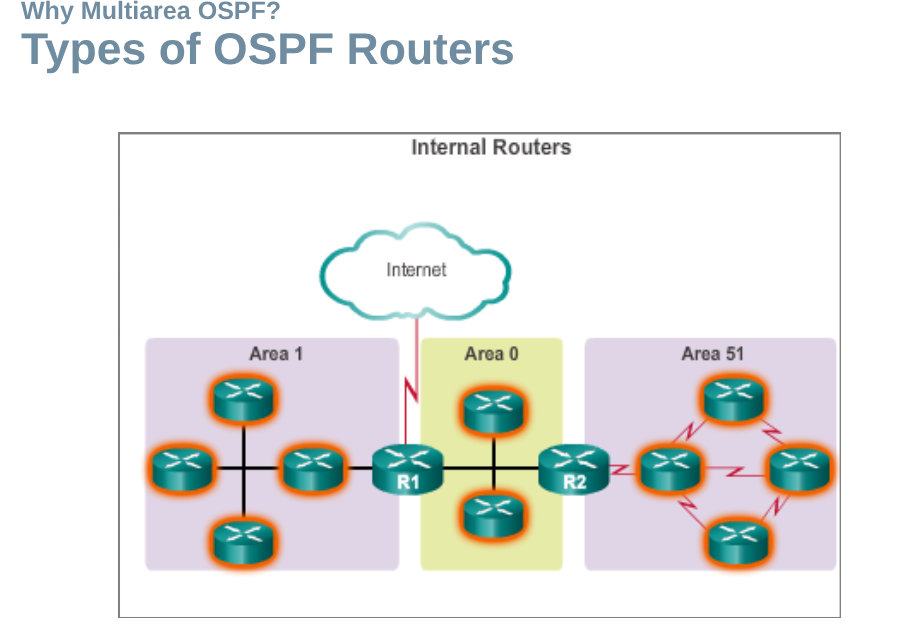

# 3. NSCS Test

## Stoff

Chapter 6 Multiarea OSPF
Ethernet v0.1

## Multiarea OSPF

<https://moodle.htlstp.ac.at/pluginfile.php/44457/mod_resource/content/0/ScaN_InstructorPPT_Chapter6_final_MultiareaOSPF.pptx>

## Probleme mit Single-Area OSPF

- große routing table
- große link-state database (LSDB)
- häufige SPF Berechnungen (SPF = Shortest Path First)

## OSPF Two-Layer Area Hierarchy

OSPF verwendet eine zweilagige Area-Hierarchie, um die Routing-Tabelle zu optimieren und die Last auf den Routern zu reduzieren.

- Backbone (transit) area: (area 0)
  - wichtigste funktion ist die schnelle und effiziente Verbreitung von IP Packeten
  - enthält Router, die direkt miteinander verbunden sind

- Regular (non-backbone) area: (area 1)
  - verbindet User mit Ressourcen
  - enthält Router, die nicht direkt miteinander verbunden sind
  <!-- todo: move image to correct folder -->

