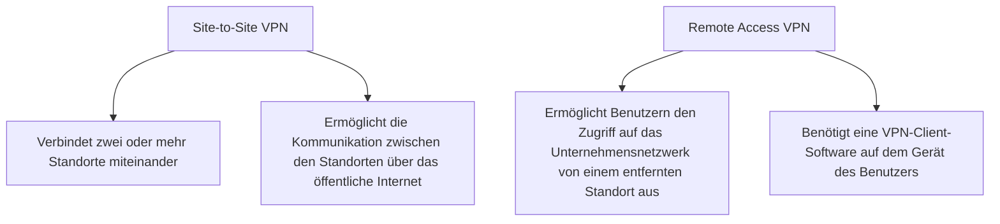

# VPNs (Virtual Private Networks)

## VPN Benefits

+ **viel günstiger** als eine dedizierte Verbindung
+ Sicherheit durch Verschlüsselung
+ **Scalability**: Es ist einfach, neue Standorte oder Benutzer hinzuzufügen, ohne dass physische Verbindungen hergestellt werden müssen.
+ **Compatibility**: VPNs können über das öffentliche Internet betrieben werden, was bedeutet, dass sie mit einer Vielzahl von Geräten und Netzwerken kompatibel sind.

## Site-to-Site and Remote Access VPNs

Site to site VPNs verbinden zwei oder mehr Standorte miteinander, indem sie eine sichere Verbindung über das öffentliche Internet herstellen. Dies ermöglicht es den Standorten, miteinander zu kommunizieren, als ob sie sich im selben Netzwerk befinden würden.

## Enterprise & Service Provider VPNs

- **Enterprise VPN**s: Diese VPNs werden von Unternehmen verwendet, um ihren Mitarbeitern den sicheren Zugriff auf das Unternehmensnetzwerk von entfernten Standorten aus zu ermöglichen. Sie bieten in der Regel Funktionen wie Authentifizierung, Verschlüsselung und Zugriffskontrolle, um die Sicherheit des Netzwerks zu gewährleisten.
- **Service Provider VPNs**: Diese VPNs werden von Internet Service Providern (ISPs) angeboten, um ihren Kunden die Möglichkeit zu geben, eine sichere Verbindung über das öffentliche Internet herzustellen. Sie bieten in der Regel Funktionen wie Verschlüsselung und Zugriffskontrolle, um die Sicherheit der Verbindung zu gewährleisten.

### SSL VPNs

SSL VPNs (Secure Sockets Layer Virtual Private Networks) verwenden das SSL-Protokoll, um eine sichere Verbindung zwischen dem Benutzer und dem Unternehmensnetzwerk herzustellen. Sie bieten in der Regel Funktionen wie Authentifizierung, Verschlüsselung und Zugriffskontrolle, um die Sicherheit des Netzwerks zu gewährleisten. SSL VPNs sind besonders nützlich für Remote Access VPNs, da sie es Benutzern ermöglichen, von jedem Gerät mit einem Webbrowser aus auf das Unternehmensnetzwerk zuzugreifen, ohne dass eine spezielle VPN-Client-Software installiert werden muss.

###  GRE over IPsec

GRE (Generic Routing Encapsulation) ist ein Protokoll, das verwendet wird, um Datenpakete über ein Netzwerk zu tunneln. Es ermöglicht es, dass Datenpakete von einem Netzwerk zu einem anderen Netzwerk übertragen werden können, indem sie in GRE-Pakete eingekapselt werden. IPsec (Internet Protocol Security) ist ein Protokoll, das verwendet wird, um die Sicherheit von Datenpaketen zu gewährleisten, indem es Funktionen wie Authentifizierung, Verschlüsselung und Zugriffskontrolle bereitstellt. GRE over IPsec ist eine Kombination aus beiden Protokollen, die es ermöglicht, dass Datenpakete sicher über ein Netzwerk getunnelt werden können. Es bietet eine sichere Verbindung zwischen zwei Netzwerken, indem es die Datenpakete in GRE-Pakete einkapselt und diese Pakete dann mit IPsec verschlüsselt und authentifiziert.

### GRE vs. SSL VPNs

| Feature | GRE over IPsec | SSL VPNs |
| --- | --- | --- |
| **Sicherheit** | Bietet starke Sicherheit durch die Kombination von GRE und IPsec | Bietet starke Sicherheit durch die Verwendung von SSL |
| **Kompatibilität** | Kann mit einer Vielzahl von Geräten und Netzwerken verwendet werden, erfordert jedoch möglicherweise spezielle Konfigurationen | Kann von jedem Gerät mit einem Webbrowser aus verwendet werden, ohne dass eine spezielle VPN-Client-Software erforderlich ist |
| **Leistung** | Kann eine höhere Leistung bieten, da es auf der Netzwerkebene arbeitet und nicht auf der Anwendungsebene | Kann eine geringere Leistung bieten, da es auf der Anwendungsebene arbeitet und möglicherweise mehr Overhead hat |
| **Einsatzszenarien** | Geeignet für Site-to-Site VPNs, bei denen eine sichere Verbindung zwischen zwei Netzwerken erforderlich ist | Geeignet für Remote Access VPNs, bei denen Benutzer von entfernten Standorten aus auf das Unternehmensnetzwerk zugreifen müssen |

## IPsec (Internet Protocol Security)

### PPTP (Point-to-Point Tunneling Protocol)

PPTP ist ein älteres VPN-Protokoll, das von Microsoft entwickelt wurde. Es bietet grundlegende Sicherheitsfunktionen, aber es ist anfällig für verschiedene Sicherheitslücken und wird daher nicht mehr empfohlen.

### L2TP (Layer 2 Tunneling Protocol)

L2TP ist ein VPN-Protokoll, das von Microsoft und Cisco entwickelt wurde. Es bietet eine bessere Sicherheit als PPTP, da es die Daten mit IPsec verschlüsselt. Es ist jedoch immer noch anfällig für einige Sicherheitslücken und wird daher nicht mehr empfohlen.

