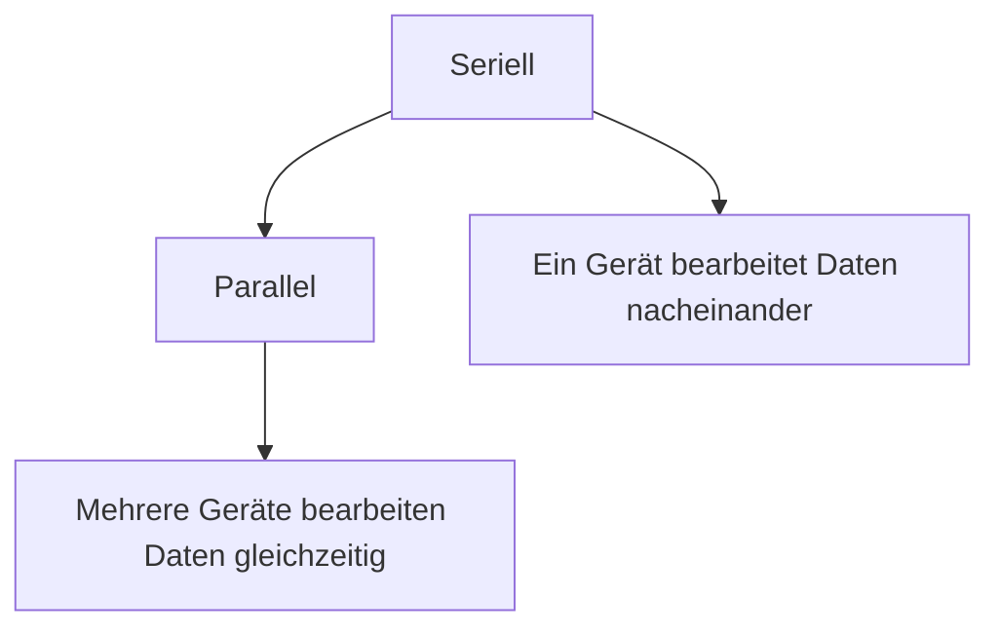

# WAN - Wide Area Network

WAN ist ein Netzwerk, das es ermöglicht, dass verschiedene Geräte miteinander kommunizieren können, auch wenn sie sich an verschiedenen Standorten befinden.Es ist eine Art von Netzwerk, das über große Entfernungen hinweg funktioniert und es ermöglicht, dass Daten zwischen verschiedenen Geräten ausgetauscht werden können. WANs werden oft verwendet, um Unternehmen und Organisationen miteinander zu verbinden, damit sie Informationen austauschen und zusammenarbeiten können.

## WAN vs LAN

LAN (Local Area Network) ist ein Netzwerk, das sich auf einen begrenzten geografischen Bereich beschränkt, z.B. ein Bürogebäude oder ein Campus. Es ermöglicht es den Geräten innerhalb dieses Bereichs, miteinander zu kommunizieren und Daten auszutauschen. WAN hingegen erstreckt sich über größere Entfernungen und ermöglicht es Geräten an verschiedenen Standorten, miteinander zu kommunizieren. WANs verwenden oft öffentliche oder private Netzwerke, um die Verbindung zwischen den Standorten herzustellen, während LANs in der Regel auf private Netzwerke beschränkt sind. WANs sind auch in der Regel langsamer als LANs, da sie über größere Entfernungen hinweg funktionieren und oft auf öffentliche Netzwerke angewiesen sind, die möglicherweise nicht so schnell sind wie private Netzwerke.

## WAN Topoligie

- Point-to-Point Topologie: Netzwerke werden direkt miteinander verbunden, z.B. durch ein Kabel oder eine Funkverbindung.

- Fully Meshed Topologie: Jedes Gerät ist mit jedem anderen Gerät verbunden, was eine hohe Redundanz und Ausfallsicherheit bietet.
- Partially Meshed Topologie: Einige Geräte sind miteinander verbunden, während andere nicht direkt verbunden sind, was eine geringere Redundanz bietet, aber auch weniger Kosten verursacht.

<!-- ## Evolving Networks -->

<!-- TODO -->

## Seriell vs. Parallel

> **Seriell ist schneller!** Warum? Weil das Synchronisieren von Daten zwischen mehreren Geräten in einem Parallel-Netzwerk Zeit kostet, während in einem Seriell-Netzwerk die Daten nacheinander bearbeitet werden und somit keine Synchronisation erforderlich ist.

## Circuit-Switched Communication

Es wird eine physische, elektrische Verbindung zwischen den Geräten hergestellt. Diese Verbindung bleibt während der gesamten Kommunikation bestehen, auch wenn keine Daten übertragen werden. Es ist wie eine Telefonleitung, die zwischen zwei Telefonen hergestellt wird und während des Gesprächs bestehen bleibt.

## Packet-Switched Communication

Daten werden in kleine Pakete aufgeteilt und über das Netzwerk gesendet. Diese Methode hat sich durchgesetzt, da sie effizienter ist als Circuit-Switched Communication, da sie die Ressourcen des Netzwerks besser nutzt und die Pakete unabhängig voneinander übertragen werden können. Es ist wie das Versenden von Briefen, bei dem jedes Paket ein Brief ist, der unabhängig voneinander gesendet wird und nicht auf eine physische Verbindung angewiesen ist.

## MPLS (Multiprotocol Label Switching)

MPLS ist ein Layer 2 Protokoll, welches, verglichen mit Ethernet, die Routen programmiert/hardcoded. Wenn ein Kunde eine Route braucht, erhält er ein Label welches die Route beschreibt.

MPLS ermöglicht es, dass Daten schneller und effizienter durch das Netzwerk geleitet werden können, da die Router nicht mehr die gesamte Routing-Tabelle durchsuchen müssen, sondern nur das Label lesen müssen, um die Route zu bestimmen. Es ist wie eine Autobahn, auf der die Fahrzeuge (Daten) mit einem speziellen Kennzeichen (Label) fahren, das ihnen erlaubt, schneller und effizienter ans Ziel zu kommen.

## Internet-Baded Connectivity

### DSL

DSL (Digital Subscriber Line) ist eine Technologie, die es ermöglicht, dass Daten über herkömmliche Telefonleitungen übertragen werden können. Es ist eine der am weitesten verbreiteten Technologien für den Internetzugang und bietet in der Regel Geschwindigkeiten von bis zu 100 Mbit/s.

DSL Leitungen sind untwisted und unshielded, was bedeutet, dass sie anfällig für Störungen und Interferenzen sind. 

Es wird einfach versucht, verschiedene Frequenzen zu nutzen. Dann schaut man, welche Frequenzen am besten funktionieren und nutzt diese. Es ist wie das Suchen nach einem freien Kanal auf einem Funkgerät, um eine klare Verbindung herzustellen.

### Cable Technology

Kabel waren ursprünglich für die Übertragung von Fernsehsignalen gedacht, aber sie wurden später auch für die Übertragung von Daten verwendet. Kabel bieten in der Regel höhere Geschwindigkeiten als DSL, da sie eine größere Bandbreite haben und weniger anfällig für Störungen sind.

### Optical Fiber = Glasfaser

beste Übertragungstechnologie, da sie eine sehr hohe Bandbreite und geringe Störanfälligkeit bietet. Ist jedoch teuer

### Andere Technologien

- Satelit: StarLink
- Wireless: 5G, WiFi, Bluetooth
- WiMAX: Wireless Metropolitan Area Network, eine Technologie, die es ermöglicht, dass Daten über größere Entfernungen hinweg drahtlos übertragen werden können. Es ist wie ein WLAN, das über eine größere Fläche hinweg funktioniert und es ermöglicht, dass Geräte in verschiedenen Gebäuden oder sogar in verschiedenen Städten miteinander kommunizieren können. Sie hatten keinen Erfolg, da sie teuer waren.
