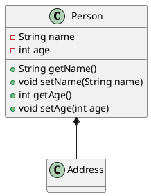

# Reflection

- **Reflection** ist die Fähigkeit eines Programms, seine Struktur zur Laufzeit zu analysieren und zu ändern.

```java
public class Main {
    public static void main(String[] args) {
        Class<?> clazz = Class.forName("com.example.MyClass");
        var constructor = clazz.getDeclaredConstructors();
        for Constroctor<?> c : constructor) {
            // TYPEs of params
            var paramTypes = c.getParameterTypes();
            // modifiers
            var modifiers = c.getModifiers(); // returns scalar value (int)
            // 1 - public 0001 | 2 - private 0010 | 4 - protected 0100 | 8 - static 1000
            // public modifier
            var isPublic = Modifier.isPublic(modifiers);
        }
    }
}
```

## Bitmask

- **Bitmask** ist eine Technik, um mehrere Flags in einer einzigen Zahl zu speichern.

```java
public class Main {
    public static void main(String[] args) {
        int flags = 0;
        int FLAG_A = 1; // 0001
        int FLAG_B = 2; // 0010
        int FLAG_C = 4; // 0100
        int FLAG_D = 8; // 1000

        flags |= FLAG_A; // 0001
        flags |= FLAG_B; // 0011
        flags |= FLAG_C; // 0111
        flags |= FLAG_D; // 1111

        boolean hasFlagB = (flags & FLAG_B) != 0; // true
        boolean hasFlagC = (flags & FLAG_C) != 0; // true

        // shift right by 1
        flags >>= 1; // 0111 -> 0011
    }
}
```

## Bean Standard

**JavaBeans** sind Java-Klassen, die bestimmte Konventionen befolgen:

- **Private Fields**: Alle Felder sind `private`.
- **Public Getter/Setter**: Alle Felder haben `public` Getter/Setter-Methoden.
- **Default Constructor**: Es gibt einen leeren Konstruktor.

```java
public class Person {
    private String name;
    private int age;

    public Person() {}

    public String getName() {
        return name;
    }

    public void setName(String name) {
        this.name = name;
    }

    public int getAge() {
        return age;
    }

    public void setAge(int age) {
        this.age = age;
    }
}
```

## PlantUML

- **PlantUML** ist ein Tool, um UML-Diagramme in Textform zu erstellen.


