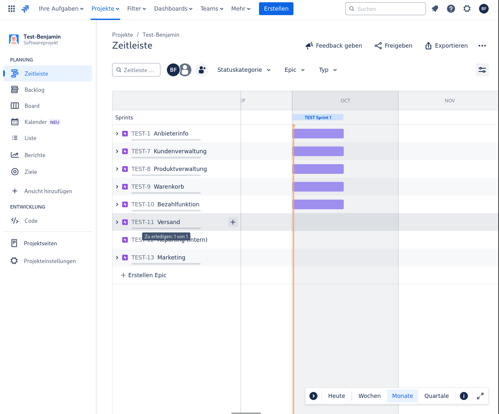
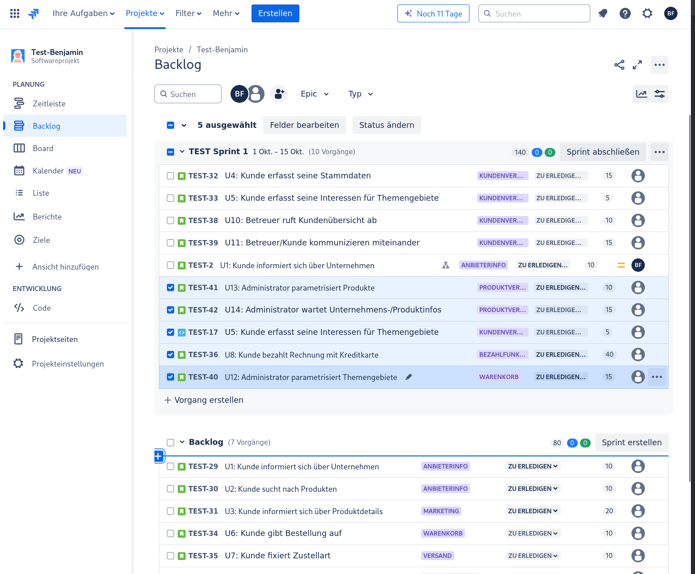
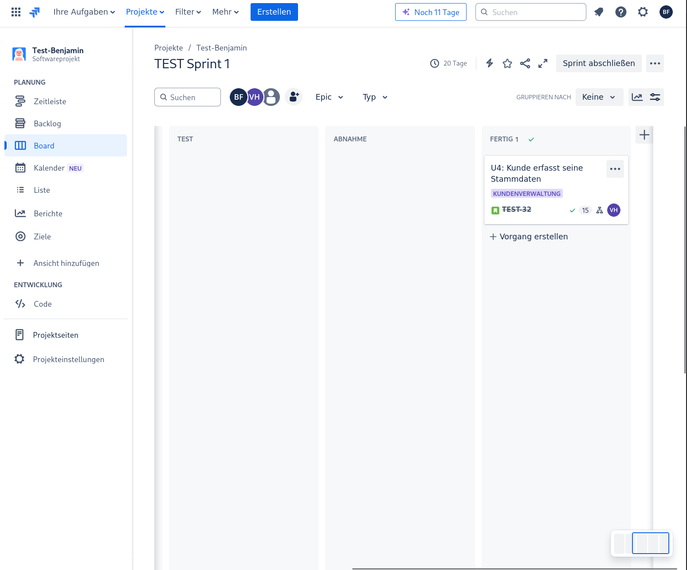
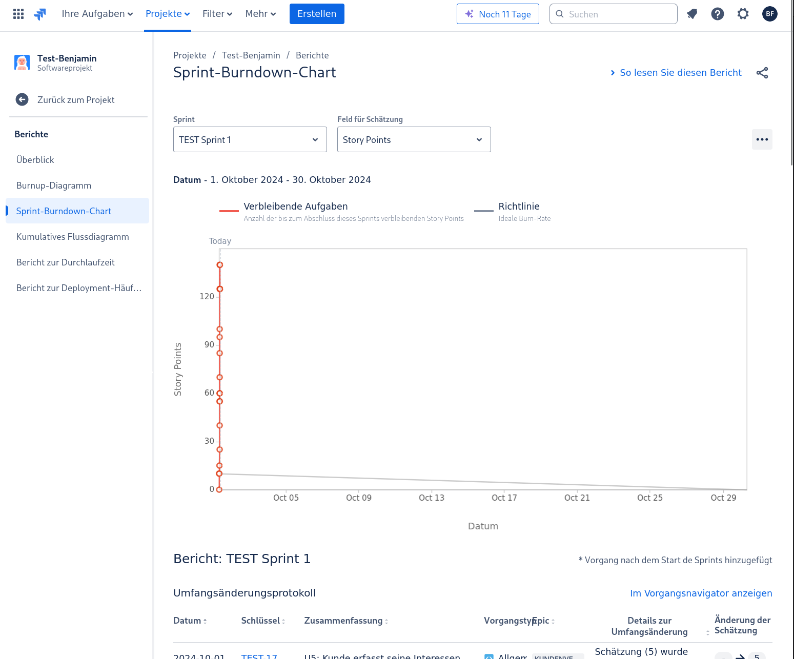

# **Titel: Jira**

| **AufgabenNr:** | 1 |
|---|:---|
| **Klasse:** | 4AHIF |
| **Name:** | Benjamin Friedl |
| **Gruppe:** | 1 |
| **Abgabetermin:** | 01.010.2024 |
| **Abgabedatum:** | 01.09.2024 |

## **Kurzbeschreibung:**

In dieser Übung geht es darum, die Grundlagen von Jira zu erlernen. Dazu gehören die Erstellung von Epics, User Stories, Sprints, Scrum Boards und Burn Down Charts.

---
\
\
\
\
\
\
\
\
\
\
\
\
\
\
\
\
\
\
\
\
\
\
\
\
\
\
\
\

## Proto

## Epics

Epics sind die groben Anforderungen, die in kleinere User Stories aufgeteilt werden können. Sie können als eine Art Container für User Stories gesehen werden. 

## User Story + Sprint 1

User Stories sind die kleineren Anforderungen, die in einem Sprint bearbeitet werden. Sie sind in der Regel so klein, dass sie in einem Sprint bearbeitet werden können. 

Sie sollten in der Form "Als [Rolle] möchte ich [Funktion], damit [Nutzen]" geschrieben werden.

## Scrum Board + U4 auf Done

Das Scrum Board ist ein Tool, um den Fortschritt des Teams zu visualisieren. Es zeigt die User Stories, die in einem Sprint bearbeitet werden, und den Status der einzelnen User Stories.

## Burn Down Chart

Das Burn Down Chart zeigt den Fortschritt des Teams im Sprint. Es zeigt, wie viele Story Points noch zu erledigen sind und wie viele Tage noch im Sprint verbleiben.

