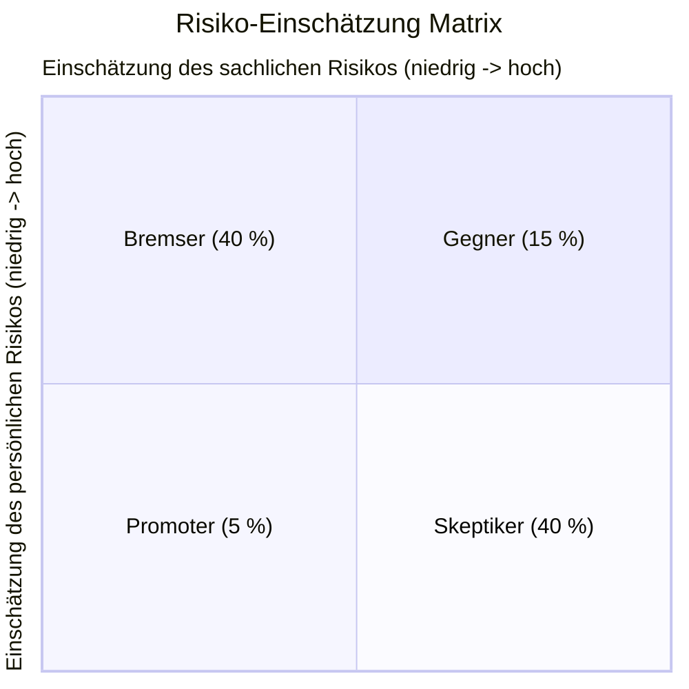

# SYP Change Management

## Worum geht es?

Wie geht man mit Veränderungen um?

## Veränderungsformel: Wann Veränderung?

- Positive Vision x
- Leidensdruck x
- Erste Schritte =
- ==> Kosten der Veränderung

## Verlauf nach J-Curve

[J Curve](/images/j-curve.png)

## Reaktion auf Veränderung

[Reaktion auf Veränderung](/images/7_phasen_der_veränderung.png)

Folgende 7 Phasen bei jeder Veränderung:

1. **Schock**: "Ui!"
2. **Ablehnungsphase**: "Das ist doch nicht wahr, das kann doch nicht sein, das ist doch nicht möglich"
3. **Rationale Einsicht**
4. **Emotionale Akzeptanz**
5. **Lernen**
6. **Erkenntnis**
7. **Integration**

> Die Phase kann mithilfe von Umfragen oder Gesprächen erkannt werden. Es ist wichtig, die Phase zu erkennen, um die richtigen Maßnahmen zu ergreifen. Wird zu früh in die nächste Phase gewechselt, kann es zu Rückschlägen kommen.

## Mitarbeitereinstellungen (Matrix)

## IT Roll Out Strategien (inkl V/Nt)

### Big Bang

Alle Systeme werden gleichzeitig umgestellt.

- **VT**: Schnell, da alle Systeme gleichzeitig umgestellt werden.
- **NT**: Hohe Risiken, da alle Systeme gleichzeitig umgestellt werden. Wenn etwas schief geht, kann es zu großen Problemen kommen.

### Lokaler Big Bang

Ein Teil der Systeme wird umgestellt, während der Rest weiterhin läuft. Nach einer gewissen Zeit wird der Rest umgestellt.

- **VT**: geringeres Risiko; 
- **NT**: erfordert dezentrale Organisation & umfangreiche Koordination

### Schrittweise funktionsorientierte Umstellung

Die Systeme werden schrittweise umgestellt, wobei jeweils eine Funktion umgestellt wird. Es wird sichergestellt, dass die Funktionen, die umgestellt werden, nicht voneinander abhängig sind.

- **VT**: geringeres Risiko, da die Funktionen nicht voneinander abhängig sind.
- **NT**: Doppelarbeiten von MA in der Übergangsphase; erheblicher Aufwand für temporäre Schnittstellen

### Schrittweise prozessorientierte Umstellung

Die Systeme werden schrittweise umgestellt, wobei jeweils ein Prozess umgestellt wird. Es wird sichergestellt, dass die Prozesse, die umgestellt werden, nicht voneinander abhängig sind.

- **VT**: geringeres Risiko, da die Prozesse nicht voneinander abhängig sind.
- **NT**: wie funktionsorientierte Umstellung; Ggf Redundanzen in der Stammdatenhaltung (z.B. Kundenstammdaten in beiden Systemen)

## CM-Maßnahmen für Kommunikation u. Monitoring

- Mail-Kommunikation
- Handbücher
- Chatbots
- Hilfsbücher
- Projektevents
- Projekt-internat
- Onine Hilfen
- usw