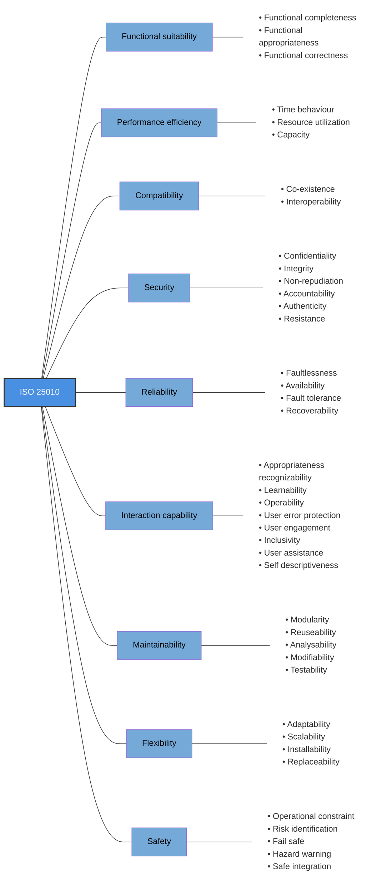

# 2. SYP Hoffmann Test - Summary

## Stoff

- SYP 05 Softwarelizenzen
- Softwarepatente
- Ausarbeitung Lizenzen - 5A (insbes.: GPLv3, MIT, Apache, BSD, Mozilla)
- Qualitätsmanagement
- Qualitätsmanagement 5A

## Softwarelizenzen

Eine Softwarelizenz ist eine **rechtliche Vereinbarung** zwischen dem Urheberrechtsinhaber und dem Benutzer einer Software. Sie stellt die **korrekte** und **vertragskonforme** Nutzung sicher und schützt die Rechte sowie das geistige Eigentum des Urhebers.

> **Abkürzungen:**
> - **SLA**: Service Level Agreement
> - **IP**: Intellectual Property
> - **EULA**: End User License Agreement

### Arten von Softwarelizenzen

- **Proprietäre Lizenzen**: Kostenpflichtig, Quellcode meist nicht zugänglich, z. B. Microsoft Windows, Adobe Photoshop
- **Freie Lizenzen**: Kostenlose Nutzung, Verbreitung und Modifikation erlaubt, evtl. Einschränkungen bei Weitergabe abgeleiteter Werke
- **Open-Source-Lizenzen**: Quellcode zugänglich, Nutzung, Modifikation und Weitergabe erlaubt, z. B. Linux, Apache HTTP Server

#### Proprietäre Lizenzierungsmodelle

- **Perpetual License**: Einmalige Zahlung, unbegrenzte Nutzung
- **Subscription License**: Regelmäßige Zahlungen, Nutzung für einen bestimmten Zeitraum
- **Single User License**: Nutzung durch eine Person
- **Multi User License**: Nutzung durch mehrere Personen oder Geräte
- **Site License**: Nutzung an einem bestimmten Standort oder innerhalb einer Organisation
- **Floating License**: Gleichzeitige Nutzung durch begrenzte Nutzerzahl, Lizenzserver erforderlich
- **OEM License**: Vorinstallierte Software, an das Gerät gebunden, z. B. Windows auf neuem Laptop

### FOSSL (Free and Open Source Software Licenses)

Die vier grundlegenden Freiheiten:

1. Das Programm für jeden Zweck **ausführen**
2. Die Funktionsweise **untersuchen** und anpassen (Quellcodezugang erforderlich)
3. Das Programm **weiterverbreiten**
4. Das Programm **verbessern** und der Öffentlichkeit bereitstellen (Quellcodezugang erforderlich)

### Copyleft vs. Copyright

- **Copyleft**: FOSS-Lizenz, erlaubt Modifikation und Weitergabe, solange die gleichen Freiheiten erhalten bleiben (z. B. GPLv3)
- **Copyright**: Traditionelles Urheberrecht, Nutzung/Modifikation/Verbreitung nur mit ausdrücklicher Erlaubnis

### Softwarepatente

Für ein Softwarepatent muss die Erfindung **neu**, **erfinderisch** und **gewerblich anwendbar** sein. In der Praxis oft schwierig, da viele Lösungen als **naheliegend** oder **allgemein bekannt** gelten.

- **Trivialpatente**: Patente ohne echten Innovationscharakter (z. B. 1-Click-Kauf), oft nicht haltbar, aber Kostenrisiko für kleine Firmen
- **Patent-Trolle**: Firmen, die Patente aufkaufen und gezielt Unterlassungsklagen anstrengen
- **U-Boot-Patente**: In Standards eingeschleuste, zunächst unbekannte Patente, Ansprüche erst bei breiter Nutzung geltend gemacht

---

## Lizenzen im Detail

*Ausarbeitung Lizenzen - 5A (insbes.: GPLv3, MIT, Apache, BSD, Mozilla)*

### GPLv3

- **Beispiele**: GIMP, Bash, WordPress, VLC Media Player
- **Viraler Effekt**: **Ja**, abgeleitete Werke müssen unter derselben Lizenz veröffentlicht werden
- **Erlaubte Nutzung**: Nutzung, Modifikation, Weitergabe – gleiche Freiheiten für alle Nutzer
- **Verpflichtungen**:
    - Quellcode offenlegen
    - Lizenz weitergeben
    - Copyright-Hinweise
    - Änderungen kennzeichnen
    - Installationsinformationen bereitstellen

### MIT License

- **Beispiele**: jQuery, React (früher), Node.js
- **Viraler Effekt**: **Nein**, abgeleitete Werke können unter anderer Lizenz stehen
- **Erlaubte Nutzung**: Nutzung, Modifikation, Weitergabe ohne Einschränkungen
- **Verpflichtungen**:
    - Copyright-Hinweis
    - Lizenztext beibehalten
    - Angabe des ursprünglichen Autors

### Apache License 2.0

- **Beispiele**: Apache HTTP Server, Docker (teilweise), Spring Framework, Log4j
- **Viraler Effekt**: **Nein**, abgeleitete Werke können unter anderer Lizenz stehen, Bedingungen der Apache License 2.0 müssen eingehalten werden
- **Erlaubte Nutzung**: Nutzung, Modifikation, Weitergabe mit Einschränkungen
- **Verpflichtungen**:
    - Lizenz beifügen
    - Lizenz- und Copyright-Hinweise beibehalten
    - Änderungen kennzeichnen
    - Keine Namensrechte (keine Rechte an Marken/Logos)

### BSD License

- **Beispiele**: FreeBSD, OpenBSD, NetBSD
- **Viraler Effekt**: **Nein**, sehr permissiv
- **Erlaubte Nutzung**: Nutzung, Modifikation, Weitergabe, auch in proprietärer Software
- **Verpflichtungen**:
    - Copyright-Hinweis und Lizenztext beibehalten
    - Keine Verwendung der Namen der Urheber für Werbung ohne Erlaubnis

### Mozilla Public License 2.0

- **Beispiele**: Mozilla Firefox, Thunderbird, LibreOffice
- **Viraler Effekt**: **Eingeschränktes Copyleft** – Änderungen am Quellcode unter MPL, neue Dateien können andere Lizenz haben
- **Erlaubte Nutzung**: Nutzung, Modifikation, Weitergabe, Änderungen am Quellcode unter MPL
- **Verpflichtungen**:
    - Quellcode-Verfügbarkeit
    - Informationspflicht (wie Quellcode erhältlich)
    - Copyright-Hinweise beibehalten
    - Dokumentation (LICENSE.txt)

## Qualitätsmanagement – ISO 25000

Der ISO-Standard für Qualitätsmanagement von Softwareprodukten definiert Qualitätsmerkmale, die ein Softwareprodukt erfüllen sollte, um als qualitativ hochwertig zu gelten.

### SQuaRE

SQuaRE (Software Product Quality Requirements and Evaluation) ist eine internationale Normenfamilie, die definiert, was Softwarequalität bedeutet und wie sie geprüft werden kann.

- Qualität definieren (Qualitätsmodell)
- Qualität konkretisieren (Submerkmale)
- Qualität messbar machen (Metriken)
- Qualität bewerten (Evaluierung)

### Produktqualität vs. Quality in Use

- **Produktqualität**: Eigenschaften der Software selbst (z. B. Wartbarkeit, Sicherheit)
- **Quality in Use**: Wirkung beim Anwender (z. B. Effizienz, Zufriedenheit)

> Eine Software kann technisch hochwertig sein, aber Nutzer frustrieren.

---

### ISO 25010 – Qualitätsmerkmale für Software

> NOTE: die folgende Erklärung der Punkte ist mit Gemini gemacht worden, hatte noch keine Zeit/Lust das selbst zu formulieren

1. **Functional Suitability (Funktionale Eignung)**  
   Erfüllt die Software die festgelegten Anforderungen?  
   - Functional completeness: Sind alle benötigten Funktionen vorhanden?
   - Functional appropriateness: Sind die Funktionen für die Aufgaben des Nutzers geeignet?
   - Functional correctness: Liefert die Software korrekte Ergebnisse?

2. **Performance Efficiency (Leistungseffizienz)**  
   Wie ist die Performance im Verhältnis zu den Ressourcen?  
   - Time behaviour: Antwortzeiten
   - Resource utilization: Ressourcenverbrauch (CPU, RAM, Netzwerk)
   - Capacity: Systemgrenzen (z. B. max. Nutzerzahl)

3. **Compatibility (Kompatibilität)**  
   Kann die Software mit anderen Systemen zusammenarbeiten?  
   - Co-existence: Effizientes Nebeneinander mit anderen Programmen
   - Interoperability: Datenaustausch mit anderen Systemen

4. **Security (Sicherheit)**  
   Schutz vor unbefugtem Zugriff und Manipulation  
   - Confidentiality: Zugriff nur für Berechtigte
   - Integrity: Schutz vor unbefugter Änderung
   - Non-repudiation: Handlungen können nicht geleugnet werden
   - Accountability: Handlungen sind zuordenbar
   - Authenticity: Identitätsbestätigung
   - Resistance: Widerstandsfähigkeit gegen Angriffe

5. **Reliability (Zuverlässigkeit)**  
   Funktioniert das System zuverlässig?  
   - Faultlessness: Fehlerfreiheit
   - Availability: Verfügbarkeit
   - Fault tolerance: Fehlertoleranz
   - Recoverability: Wiederherstellbarkeit

6. **Interaction Capability (Interaktionsfähigkeit/Usability)**  
   Wie benutzerfreundlich ist die Software?  
   - Appropriateness recognizability: Eignung erkennbar?
   - Learnability: Leicht erlernbar?
   - Operability: Leicht bedienbar?
   - User error protection: Schutz vor Fehlbedienung
   - User engagement: Nutzererlebnis
   - Inclusivity: Barrierefreiheit
   - User assistance: Hilfestellung
   - Self descriptiveness: Selbsterklärend?

7. **Maintainability (Wartbarkeit)**  
   Wie leicht lässt sich die Software ändern?  
   - Modularity: Modulare Struktur
   - Reuseability: Wiederverwendbarkeit
   - Analysability: Fehleranalyse
   - Modifiability: Änderbarkeit
   - Testability: Testbarkeit

8. **Flexibility (Flexibilität)**  
   Anpassungsfähigkeit der Software  
   - Adaptability: Anpassbar an verschiedene Umgebungen
   - Scalability: Skalierbarkeit
   - Installability: Installierbarkeit
   - Replaceability: Austauschbarkeit

9. **Safety (Betriebssicherheit)**  
   Schutz vor Gefahren durch Fehlfunktionen  
   - Operational constraint: Einhaltung von Sicherheitsgrenzen
   - Risk identification: Risikoerkennung
   - Fail safe: Sicherer Zustand bei Fehlern
   - Hazard warning: Warnung vor Gefahren
   - Safe integration: Sichere Integration in größere Systeme