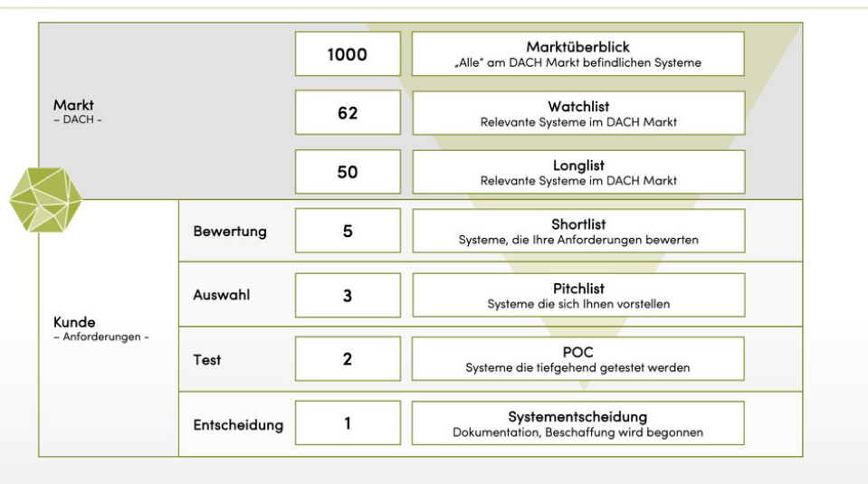

# Fragen zu Systemauswahl und Beschaffung

## Bewertung/Auswahl

### 1. Verbaler Vergleich

**Durchführung:**

Bewertung der Systeme durch verbale Einschätzung (z.B. sehr gut, gut, befriedigend, ausreichend, mangelhaft)

**Vorteile:**

Einfach und schnell durchführbar

**Nachteile:**

Subjektiv, keine klare Entscheidungsgrundlage

### 2. Mindestansprüche/Paarweiser Vergleich

Festlegung von Mindestanforderungen, die jedes System erfüllen muss. Systeme, die diese Anforderungen nicht erfüllen, werden ausgeschlossen.

Danach werden die verbleibenden Systeme paarweise verglichen, um das beste System zu ermitteln.

**Beispiel**:

| Kriterium         | System A | System B |
|-------------------|----------|----------|
| Benutzerfreundlichkeit |   Ja     |   Nein   |
| Funktionsumfang   |   Ja     |   Ja     |
| Preis             |   Nein   |   Nein     |

In diesem Beispiel würde System A System B in 2 von 3 Kriterien übertreffen und somit als besser bewertet werden.

### 3. Punktwertmethode/Scoring

Jedes Kriterium wird mit einer Gewichtung versehen und die Systeme werden anhand dieser Kriterien bewertet. Die Gesamtpunktzahl wird berechnet, um eine Rangfolge der Systeme zu erstellen.

### 4. Übersicht Systemauswahlkriterien

#### Produkt Systemauswahlkriterien

**kurzfristige Kriterien:**

- Funktionale Kriterien (1-n)
- Technische Kriterien (1-n)
- QS-Kriterien/Noremn (1-n) (Qualitätsstandards)
- Kosten (Investition)
- Know-how Verfügbarkeit (bei Anwender)

**langfristige Kriterien:**

- Produktweiterentwicklung
- Flexibilität Architektur
- Laufende Zertifizierung
- Preismodell/Lizenz

#### Anbieter

- Marktstellung/Unternehmengröße
- Supportverfügbarkeit/Infozugang
- Branchenerfahrung
- Referenzinstallationen

oder langfristig kann auch der **Wirtschaftliche Ausblick**, sprich die Stabilität des Anbieters betrachtet werden.

### 5. Marktüberblick - Auswahlebenen

#### Erklärung

Ziel ist es, aus der riesigen Anzahl an Anbietern eine Auswahl zu treffen, bis eine Lösung übrig bleibt.

1. Markt-Phase:
    - Marktüberblick: 1000 verfügbare Systeme
    - Watchlist: es wird grob gefiltert, welche Systeme seriös sind / interessant
    - Longlist: welche Systeme passen zur Anforderung
2. Kunde
    - Bewertung -> Shortlist: nach Kriterien/Anforderungen bewertet
    - Pitchlist -> Verkauferpräsentation, Menschen kennenlernen
    - Test -> POC (Proof of Concept): die zwei besten Systeme werden getestet
    - Entscheidung -> Gewinner steht fest und ein Vertrag wird abgeschlossen

## Angebot

### 6. Preisarten

- **Einheitspreis**: Preis pro Stück/Einheit
- **Pauschalpreis**: Gesamtpreis für die gesamte Leistung
- **Regiepreis**: Abrechnung nach tatsächlichem Aufwand (Stunden, Material etc.)
- **Festpreis**: Preis wird für eine bestimmte Zeit festgelegt und ändert sich nicht während dieser Zeit (z.B. bei Wartungsverträgen)

### 7. Zuschlagsarten

- **niedrigster Preis** (<mark>Billigsbieterprinzip</mark>)
- **technisch** und **wirtschaftlich** günstigstes Angebot (<mark>Bestbieterprinzip</mark>).
Im letzteren Fall sind alle Zuschlagskriterien in der Reihenfolge ihrer Bedeutung anzugeben.

### 8. Sicherheiten

4 Arten von Sicherheiten:

- **Vadium**: Wenn Bieter während Zuschlagsfrist zurückzieht, wird das Vadium einbehalten
- **Kaution**: Sicherheit für Vertragserfüllung#
- **Deckungsrücklass**: Geld, das zurückbehalten wird, um Überzahlungen zu vermeiden, wenn Rechnungen nur ungefähr den erbrachten Leistungen entsprechen. Es sichert außerdem die Vertragserfüllung des Auftragnehmers, falls keine Kaution besteht. Die Rückgabe erfolgt mit der Schlussrechnung.
- **Haftungsrücklass**: Sicherstellung für den Fall, dass Auftragnehmer seine Pflichten nicht ordnungsgemäß erfüllt.

### 9. Fristen

- **Bewerbung Teilnahme**: Frist zur Abgabe der Teilnahmebewerbung bei nicht-offenen Verfahren oder Verhandlungsverfahren
- **Angebotsfrist**
- **Zuschlagsfrist**: Frist, innerhalb derer der Auftraggeber den Zuschlag erteilen muss, Angebote sind in dieser Zeit bindend
- **Stillhaltefrist**: 2 Wochen vor Erteilung des Zuschlags, in der kein Vertrag abgeschlossen werden darf. Während der Stillhaltefrist können Bieter Einspruch gegen die Vergabeentscheidung einlegen.

## Vergabeverfahren

.jpeg>)

### 10. Vergabeverfahren: Offenes Verfahren (öffentliche Ausschreibung)

- Öffentliche Ausschreibung
- **Jeder kann teilnehmen**
- Befähigungsnachweis

### 11. Vergabeverfahren: Nicht Offenes Verfahren (beschränkte Ausschreibung)

#### 2 Arten

- mit vorheriger Bekanntmachung: mindestens 5 Anbieter, Erkundigungsschritt
- ohne vorheriger Bekanntmachung

### 12. Vergabeverfahren: Verhandlungsverfahren

Verhandlungsverfahren werden genutzt, um Angebote zu erhalten, die den Anforderungen besser entsprechen als bei offenen oder nicht-offenen Verfahren. Es wird versucht, Bieter dazu zu bringen sich gegenseitig zu überbieten.

- Bewerbersuche -> min. 3 Anbieter einladen

> Ohne vorherige Bekanntmachung nur in Ausnahmefällen zulässig:
>
> - Monopop
> - Gefahr in Verzug
> - Ergänzungsaufträge
> - Wertgrenzen
>

### 13. Vergabeverfahren: E-Auktion

### 14. Vergabeverfahren: Direktvergabe

### 15. Vergabeverfahren: Rahmenvereinbarung (Sonderfall)

### 16. Vergabeverfahren: Verfahrensauswahl
