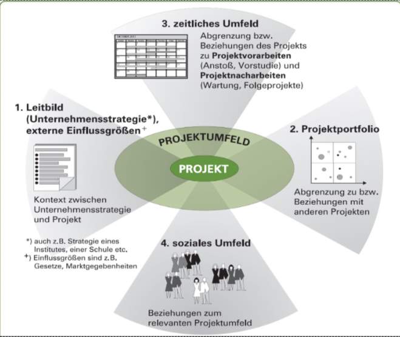
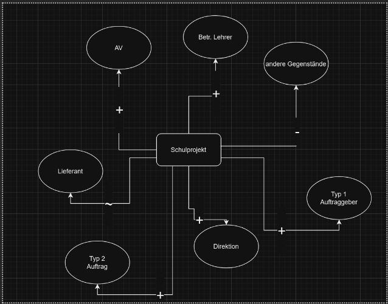

# SYP Schönbichler

## Themen

1. [ ] [Projektabgrenzung](#projektabgrenzung)
2. [ ] [Kontextanalyse](#kontextanalyse)
3. [ ] [Grafische Darstellung der sozialen Projektumweltbeziehungen](#grafische-darstellung-der-sozialen-projektumweltbeziehungen)
4. [ ] [Meilensteine](#meilensteine)
5. [ ] [Kick-off-Meeting](#kick-off-meeting)
6. [ ] [Projekt-Start-up Workshop](#projekt-start-up-workshop)
7. [ ] [Projektorganisationsformen](#projektorganisationsformen)
8. [ ] [Auswahl der geeigneten Projektorganisationsform](#auswahl-der-geeigneten-projektorganisationsform)
9. [ ] [Projektteam](#projektteam)
10. [ ] [Aufgaben Projektleiter](#aufgaben-projektleiter)
11. [ ] [Anforderungen Projektleiter](#anforderungen-projektleiter)
12. [ ] [Phasen Teambildung - Tuckman](#phasen-teambildung---tuckman)
13. [ ] [Teamgröße](#teamgröße)
14. [ ] [Projektstrukturpläne](#projektstrukturpläne)
15. [ ] [Arbeitspaktete](#arbeitspakete)
16. [ ] [Arbeitspakete u. Verantwortungsmatrix](#arbeitspakete-u-verantwortungsmatrix)
17. [ ] [Zeitplanung](#zeitplanung)
18. [ ] [Aufgaben des Projektcontrollings](#aufgaben-des-projektcontrollings)

## Projektabgrenzung

**Zeitlich, sachlich, sozial:**
- Projektzielen und -inhalten (sachlich)
- Anfang- und Endereignis des Projektes (zeitlich)
- Rollen u. Werten (sozial)

## Kontextanalyse

**Ziel:** Definiert die Projektziele und -inhalte

**Projektumfeld:**
- **Leitbild**: Unternehmensstrategie, 
- **Projektportfolio**: Abhängigkeiten zu anderen Projekten
- **zeitliches Umfeld**: Abgrenzungen bzw. Beziehungen zu Projektvorarbeiten (Vorstudie ec) und -nacharbeiten (Folgeprojekte, Wartung)
- **soziales Umfeld**: Rollen, Werte, Normen, Konflikte,

## Grafische Darstellung der sozialen Projektumweltbeziehungen

**Ziel:** Visualisierung der Beziehungen zwischen dem Projekt und den *Stakeholdern*. Positive Einflüsse mit `+`, negative Einflüsse mit `-`.

*Bei `-` Maßnahmen ergreifen: zB. Kommunikation wechseln...*

## Meilensteine

Ein Meilenstein ist ein **überprüfbares Zwischenergebnis**, welches inhaltlich und terminlich genau definiert ist.

**Ziel:** Definition von Zwischenzielen**

## Kick-off-Meeting

**Ziel:** Startschuss für das Projekt. Alle Beteiligten werden informiert und motiviert. Ohne inhaltichen/org. Details.

## Projekt-Start-up Workshop

- kann mehrere Tage dauern
- idealerweise **extern** (zB. in Seminarhotel)
- **Ziel:** 
    - informeller Meinungsaustausch, 
    - Teambildung, 
    - Projektziele, -inhalte - abgrenzung, -organisation
    - Projektkommunikation einrichten
    - Rollen u. Verantwortlichkeiten klären
- **max. 15 der wichtigsten Stakeholder**
- externe Moderation

## Projektorganisationsformen

- **Reine Projektorganisation**: 
    - **Vorteile**: klare Struktur, klare Verantwortlichkeiten
    - **Nachteile**: hohe Kosten, ev Probleme bei der Rückkehr in die Linienorganisation
- **Einflussorganisation**: 
    - **Vorteile**: geringe Kosten, schnelle Umsetzung
    - **Nachteile**: unklare Verantwortlichkeiten, langsamer Informationsfluss
- **Matrixorganisation**:
    - **Vorteile**: Kombination der beiden anderen Formen
    - **Nachteile**: hoher Koordinationsaufwand, Konflikte

## Auswahl der geeigneten Projektorganisationsform

- **Projektgröße**: Je größer, desto eher reine Projektorganisation
- **Projektdauer**: Je länger, desto eher reine Projektorganisation
- **Projektart**: Je komplexer, desto eher reine Projektorganisation
- **Projektumfeld**: Je dynamischer, desto eher Einflussorganisation

## Projektteam

???

## Aufgaben Projektleiter

- **Projektziele definieren**
- **Projektplanung** erstellen u. aktualisieren
- **Projektdurchführung** kontrollieren u. steuern
- **Informationsaustausch** sicherstellen
- **Projektgruppe** führen
- **Projektentscheidungen** vorbereiten u. treffen
- **Erfüllung des Projektziels** sicherstellen
- **Projektrückschau** durchführen

## Anforderungen Projektleiter

- **Fachwissen** = fachliche Kenntnisse zum Projektinhalt
- **Methodenwissen** = Beherschung der Methoden des PMs
- **soziale Kompetenz** = Authorität
- **Führungskompetenz** = zielgerichtetes Leiten des Teams

## Phasen Teambildung - Tuckman

Bruce Wayne Tuckman (1965) beschreibt die 5 hasen der Teambildung:

- **Forming:** Teammitglieder lernen sich kennen
- **Storming:** Konflikte entstehen
- **Norming:** Regeln und Normen werden festgelegt
- **Performing:** Team arbeitet effektiv
- **Adjourning:** Projektende, Team löst sich auf

## Teamgröße

- Kommt auf die Projektaufgabe an
- Untergrenze: 3-4 Personen
- Obergrenze: 8-12 Personen

## Projektstrukturpläne

- **OSP**: Organisationsstrukturplan, beschreibt die Projektorganisation (Wer macht was?)\
Darstellung:
    - Graphisch: in Bauform
    - Tabelle

- **PSP**: Projektstrukturplan, beschreibt die Projektstruktur (Was wird gemacht?)\
Darstellung:
    - Objektorientiert
    - Tätigkeitsorientiert
    - Phasenorientiert
    - Gemischt

## Arbeitspaktete

- **Arbeitspaket**: kleinste Einheit der Projektstrukturplanung
- **Merkmale**:
    - **klare Verantwortlichkeit**
    - **autonome Durchführung**
    - **Überschneidungsfreiheit mit anderen APs**

- **Richtlinien bei der bildung von APs**:
    - **genau 1 Verantwortlicher**
    - **klar abgegrenzt**
- **Vorteile**:
    - **Aufwandschätzung**
    - **Fortschrittskontrolle**
    - **Vorgangsplanung für Projektablauf- u. Terminplanung**

## Arbeitspakete u. Verantwortungsmatrix

Die **Funktionenmatrix** zeigt die *Verantwortlichkeiten* der Projektmitglieder für die Arbeitspakete. 

Die **Verantwortungsmatrix** ist eine **Erweiterung der Funktionenmatrix** und zeigt die *Zuständigkeiten* der Projektmitglieder für die Arbeitspakete. Buchstabenkürzel:
- **I** = informiert
- **M** = mitarbeit
- **V** = verantwortlich

## Zeitplanung

- Meilensteine: **überprüfbare Zwischenergebnisse** [MS](#meilensteine)
- **Terminliste**: Auflistung aller geplanten Aktivitäten eines Projekts mit Start- und Endtermin
- **Balldiagramm**: Darstellung der zeitlichen Abfolge von Aktivitäten
- **Netzplan**: Darstellung der logischen Abhängigkeiten von Aktivitäten
    - **Vorteile**: 
        - **Übersichtlichkeit**
        - **Kritischer Pfad** erkennbar
        - **Ressourcenplanung** möglich
    - **Nachteile**:
        - **Komplexität**
        - **Änderungen** schwer möglich

## Aufgaben des Projektcontrollings

- **Aufgaben:**
    - **Planungsabweichungen** erkennen
    - **Tendenzen** erkennen u. frühzeitig gegensteuern

- **Voraussetzungen**:
    - Geeignetes **Projektreporting

- **Maßnahmen**:
    - Mobilisierung **zusätzlicher Ressourcen**
    - Erhöhung der **Arbeitszeit**(Überstunden)
    - Erhöhung der **Produktivität**
    - Outsourcing/Outtasking

- **Kostenkontrolle**: Sollte nicht isoliert betrachtet werden, sondern in Zusammenhang mit **Qualität** und **Zeit**

- **Sachvortschrittskontrolle**: Überprüfung des Arbeitsfortschritts

- **Earned-Value-Analyse**: Analysiert die im Projekt **verstrichene Zeit**, die **geleistete Arbeit** u. die **entstandenen Kosten**
<!-- 
## Trendanalyse

Ermöglicht die **Prognose** von **Projektentwicklungen**, um **frühzeitig** gegensteuern zu können.

**Meilensteintrendanalyse**: Vergleich von **geplanten** und **tatsächlichen** Meilensteinen.

## Projektdokumentation

- **Projekthandbuch**: gegliederte Zusammenfassung der organisatorischen Regeln dür die Durchführund von Projekten
- sollte enthalten:
    - Projektorganisationsplan
    beteiligte Stellen mit Aufgabenbeschreibung
    - Projektleitung u. Berichtswesen
    - Sitzungskonzept
    - Funktionen- und Verantwortungsmatrix
    

Wichtige Bestandteile der Projektdokumentation sind: 

● Vorstudie und deren Ergebnisse 

● Zieldokument 

● Projektauftrag 

● Kontext- und Stakeholderanalyse 

● Organisation, Rollen im Team (falls nicht im Projekthandbuch enthalten) 

● Projektstrukturplan (grafisch und in Listenform) 

● Beschreibung der Arbeitspakete und Zuordnung der Verantwortlichen 

● Ablauf- und Terminplan 

● Kosten- und Finanzierungsplan 

● Risikoanalyse 

● Verträge und Bestellungen 

● Abnahmen 

● Controlling-Information, Berichte und Protokolle 

● Schriftverkehr 

## Protokolle

- **Besprechungsprotokoll**: Protokoll über Besprechung mit PT oder Auftraggeber:
    - Art der Besprechung
    - Ord, Datum u. Uhrzeit
    - Anlass u. Liste der Tagesordnungspunkte (TOP)
    - Teilnehmer
    - Protokollführer
    - ...

- **Arbeitsprotokoll:** Arbeitsvortschritte u. Ergebnisse im Projekt. Basis für Abrechnung nach Leistung oder Arbeitszeit
- **Telephonprotokoll:** Telefonate mit Auftraggeber oder PT

## 24

## Projektabschluss

Erforderliche Aktivitäten:

- <mark>Inhaltlich-fachliche Aufgaben:</mark>
    - **Übergabe** der Projektergebnisse an Kunden
    - **Nachkalukation** des Projektes
    - **Evaluierung des Projektverlaufs**, der "Projektperformance"
    
- <mark>Organisatorische Aufgaben:</mark>
    - Auflösung des Projektteams
    - Aufläsen der Beziehungen zu externen Partnern
    - **Projektabschlussbericht**
    - Know-How Transfer

- <mark>Emotional-soziale Aufgaben:</mark>
    - Auflösen der Projektorganisation
    - **Prämien**
    - emotionale **Abschlussfeier**

--- -->