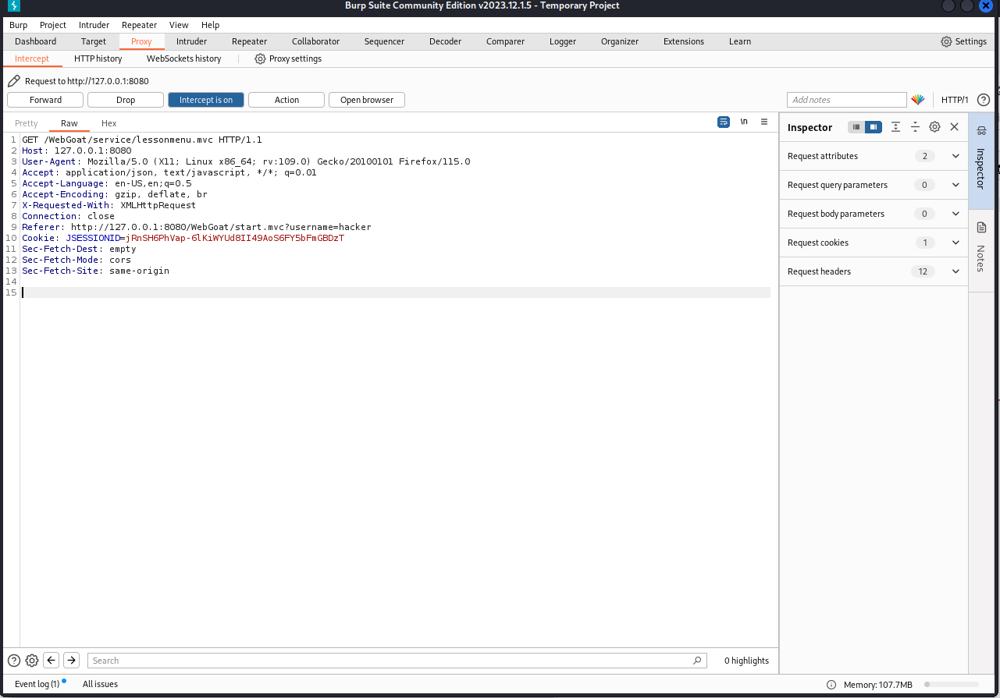
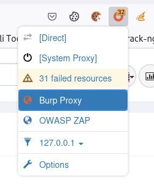

# SYP Schönbichler

## Themen

1. [ ] [Projektabgrenzung](#projektabgrenzung)

## Projektabgrenzung

**Zeitlich, sachlich, sozial:**
- Projektzielen und -inhalten (sachlich)
- Anfang- und Endereignis des Projektes (zeitlich)
- Rollen u. Werten (sozial)

## Kontextanalyse

**Ziel:** Definiert die Projektziele und -inhalte

**Projektumfeld:**
- **Leitbild**: Unternehmensstrategie, 
- **Projektportfolio**: Abhängigkeiten zu anderen Projekten
- **zeitliches Umfeld**: Abgrenzungen bzw. Beziehungen zu Projektvorarbeiten (Vorstudie ec) und -nacharbeiten (Folgeprojekte, Wartung)
- **soziales Umfeld**: Rollen, Werte, Normen, Konflikte,

## Grafische Darstellung der sozialen Projektumweltbeziehungen

**Ziel:** Visualisierung der Beziehungen zwischen dem Projekt und den *Stakeholdern*. Positive Einflüsse mit `+`, negative Einflüsse mit `-`.

*Bei `-` Maßnahmen ergreifen: zB. Kommunikation wechseln...*

## Meilensteine

Ein Meilenstein ist ein **überprüfbares Zwischenergebnis**, welches inhaltlich und terminlich genau definiert ist.

**Ziel:** Definition von Zwischenzielen**

## Kick-off-Meeting

**Ziel:** Startschuss für das Projekt. Alle Beteiligten werden informiert und motiviert. Ohne inhaltichen/org. Details.

## Projekt-Start-up Workshop

- kann mehrere Tage dauern
- idealerweise **extern** (zB. in Seminarhotel)
- **Ziel:** 
    - informeller Meinungsaustausch, 
    - Teambildung, 
    - Projektziele, -inhalte - abgrenzung, -organisation
    - Projektkommunikation einrichten
    - Rollen u. Verantwortlichkeiten klären
- **max. 15 der wichtigsten Stakeholder**
- externe Moderation

## Projektorganisationsformen

- **Reine Projektorganisation**: 
    - **Vorteile**: klare Struktur, klare Verantwortlichkeiten
    - **Nachteile**: hohe Kosten, ev Probleme bei der Rückkehr in die Linienorganisation
- **Einflussorganisation**: 
    - **Vorteile**: geringe Kosten, schnelle Umsetzung
    - **Nachteile**: unklare Verantwortlichkeiten, langsamer Informationsfluss
- **Matrixorganisation**:
    - **Vorteile**: Kombination der beiden anderen Formen
    - **Nachteile**: hoher Koordinationsaufwand, Konflikte

## Auswahl der geeigneten Projektorganisationsform

- **Projektgröße**: Je größer, desto eher reine Projektorganisation
- **Projektdauer**: Je länger, desto eher reine Projektorganisation
- **Projektart**: Je komplexer, desto eher reine Projektorganisation
- **Projektumfeld**: Je dynamischer, desto eher Einflussorganisation

## Projektteam

???

## Aufgaben Projektleiter

- **Projektziele definieren**
- **Projektplanung** erstellen u. aktualisieren
- **Projektdurchführung** kontrollieren u. steuern
- **Informationsaustausch** sicherstellen
- **Projektgruppe** führen
- **Projektentscheidungen** vorbereiten u. treffen
- **Erfüllung des Projektziels** sicherstellen
- **Projektrückschau** durchführen

## Anforderungen Projektleiter

- **Fachwissen** = fachliche Kenntnisse zum Projektinhalt
- **Methodenwissen** = Beherschung der Methoden des PMs
- **soziale Kompetenz** = Authorität
- **Führungskompetenz** = zielgerichtetes Leiten des Teams

## Phasen Teambildung - Tuckman

Bruce Wayne Tuckman (1965) beschreibt die 5 hasen der Teambildung:

- **Forming:** Teammitglieder lernen sich kennen
- **Storming:** Konflikte entstehen
- **Norming:** Regeln und Normen werden festgelegt
- **Performing:** Team arbeitet effektiv
- **Adjourning:** Projektende, Team löst sich auf

## Teamgröße

- Kommt auf die Projektaufgabe an
- Untergrenze: 3-4 Personen
- Obergrenze: 8-12 Personen

## Projektstrukturpläne

- **OSP**: Organisationsstrukturplan, beschreibt die Projektorganisation (Wer macht was?)\
Darstellung:
    - Graphisch: in Bauform
    - Tabelle

- **PSP**: Projektstrukturplan, beschreibt die Projektstruktur (Was wird gemacht?)\
Darstellung:
    - Objektorientiert
    - Tätigkeitsorientiert
    - Phasenorientiert
    - Gemischt

## Arbeitspaktete

- **Arbeitspaket**: kleinste Einheit der Projektstrukturplanung
- **Merkmale**:
    - **klare Verantwortlichkeit**
    - **autonome Durchführung**
    - **Überschneidungsfreiheit mit anderen APs**

- **Richtlinien bei der bildung von APs**:
    - **genau 1 Verantwortlicher**
    - **klar abgegrenzt**
- **Vorteile**:
    - **Aufwandschätzung**
    - **Fortschrittskontrolle**
    - **Vorgangsplanung für Projektablauf- u. Terminplanung**

## Arbeitspakete u. Verantwortungsmatrix
Thema 18, S. 13